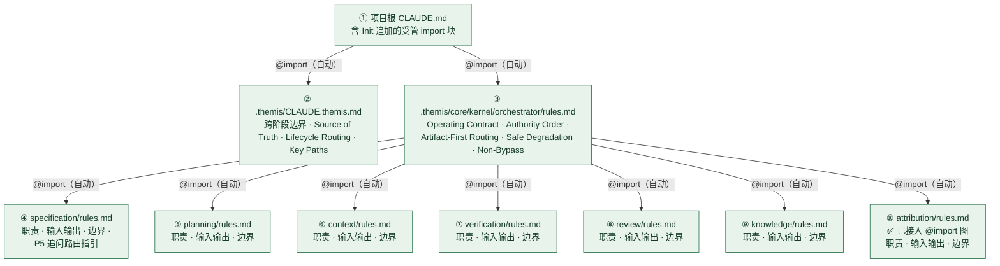
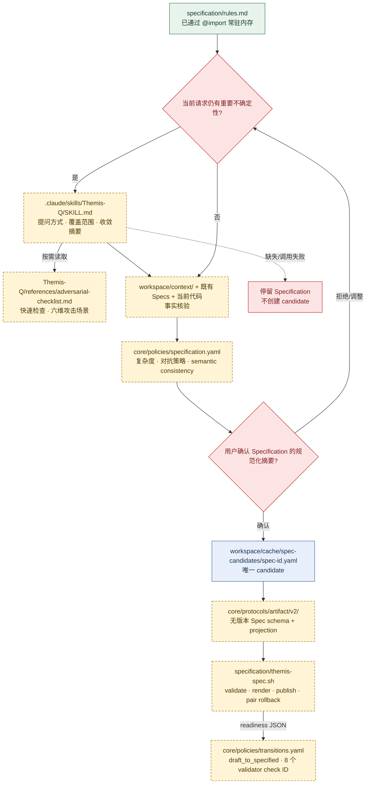
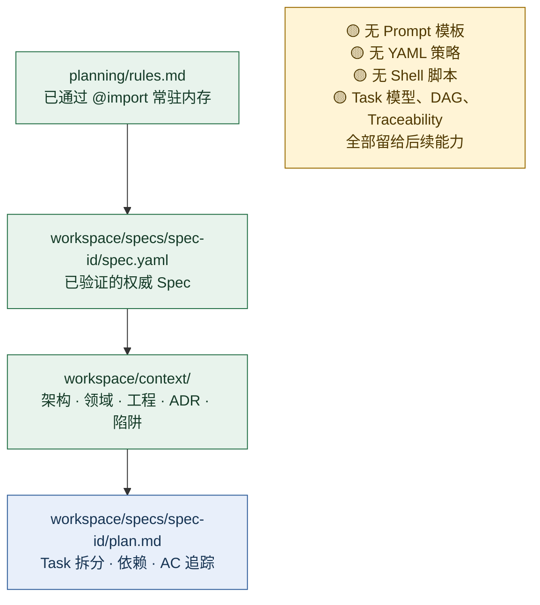
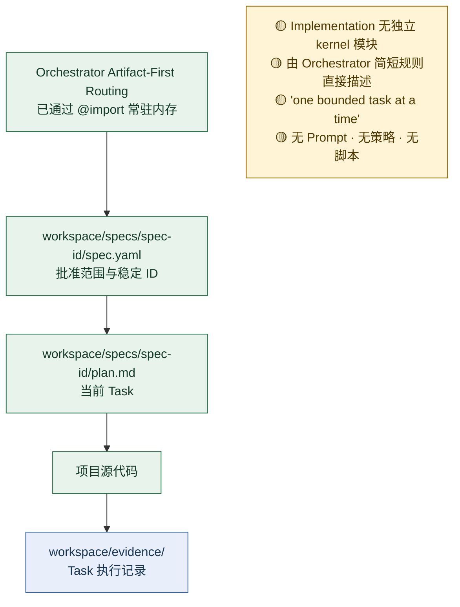
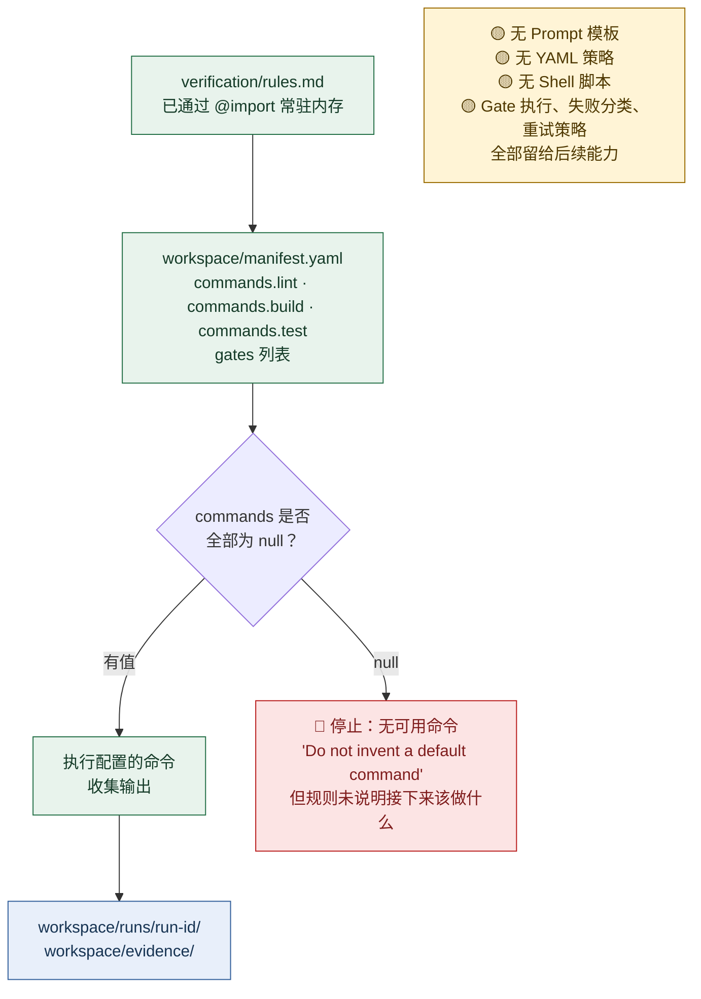
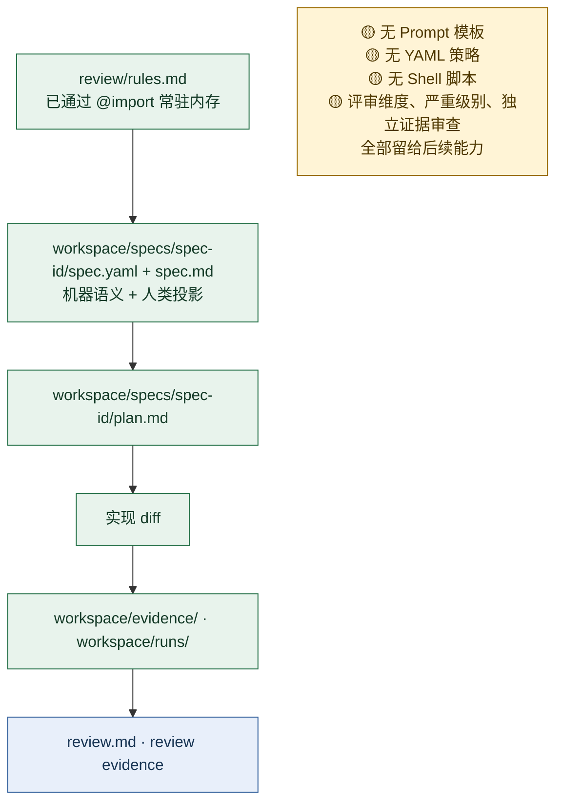
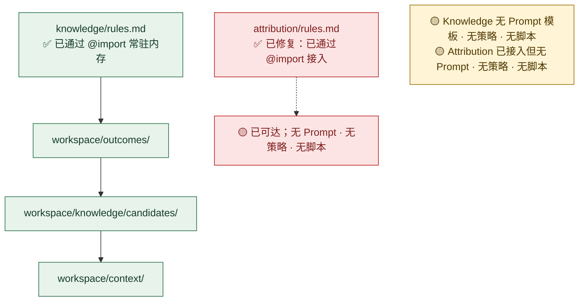
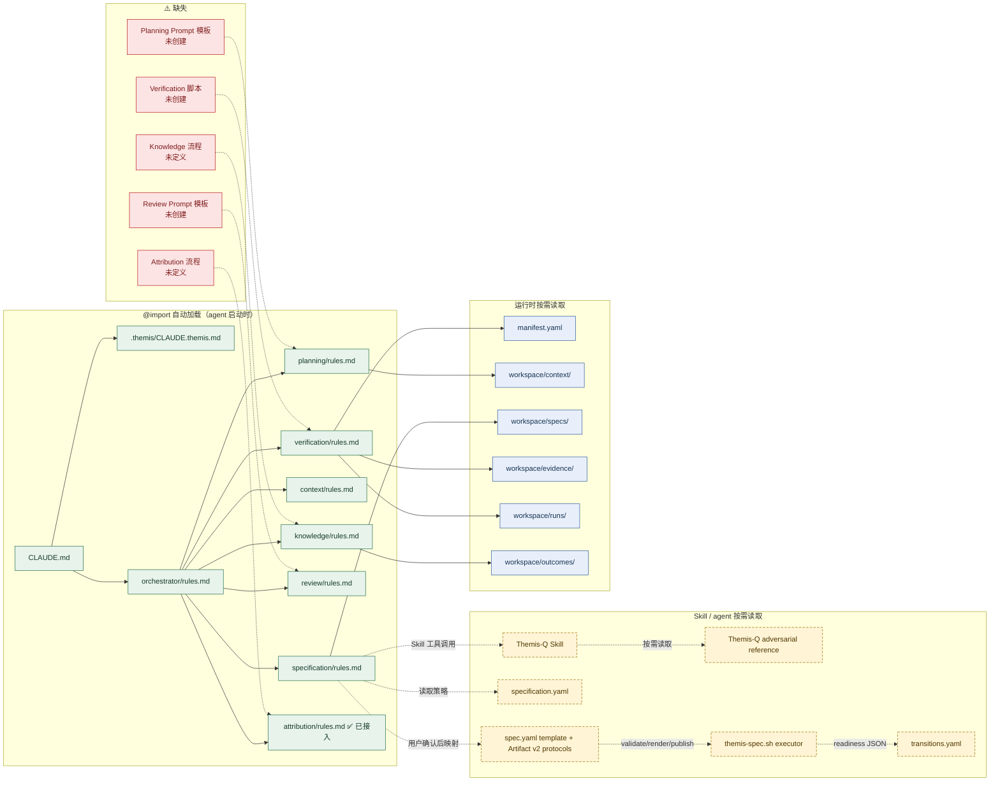

# Themis 加载链与阶段资产映射分析

> **2026-07-28 更新说明**：本文的启动、Planning 及后续阶段分析继续有效；Specification 章节已按 P5.3 更新为 Project Skill `Themis-Q` 的提问方法、Specification 工作流与无版本 Spec 最终语义链。旧 `spec-questioning.md` / `spec-adversarial-checklist.md` 已退役。

本文以项目 agent 视角，追踪 Themis 从启动到各 SDD 阶段的完整 Prompt、YAML、Shell 脚本读取顺序，并标记结构性问题与增强建议。

> 分析基准：Themis 0.4.0（P5.3 `Themis-Q`、Artifact v2 下无版本 Spec 双视图与最终语义 readiness 已落地；P6/P8 状态执行层及后续能力尚未实施）。

## 图例

| 符号 | 含义 |
|---|---|
| `@import` 实线 | 启动时自动加载，agent 无需主动读取 |
| `Read` 虚线 | agent 必须显式读取，依赖规则中的文本指引 |
| `Write` 点线 | agent 输出工件 |
| 🔴 | 结构性缺陷 |
| 🟡 | 设计上需注意 |
| 🟢 | 已满足要求 |

---

## 一、Agent 启动：基线加载

**关键事实**：启动阶段全部 9 个文件通过 `@import` 链一次性加载。这是唯一有结构性保证的加载层。之后每个阶段的 Prompt、YAML 策略、脚本都需要 agent 显式 `Read`。

---

## 二、Specification（Draft）：Themis-Q 与 Spec 加载链

这是当前 Themis 唯一具有 Project Skill + YAML 策略 + 确定性 executor 的阶段。

### 已修复：软 Prompt 依赖与边追问边持久化

Specification 不再读取 Core questioning Prompt。`rules.md` 要求在当前请求需要澄清时通过 Skill 工具调用精确名称 `Themis-Q`；Skill 缺失或调用失败时 fail closed，不创建 candidate。

`Themis-Q` 只提供一次一问、适应性深度、需求覆盖、假设挑战、Acceptance Criteria 和对抗问题指导。Specification 读取 `specification.yaml`、相关 Context、既有 Specs 与必要代码，负责复杂度、收敛、规范化摘要、用户确认和唯一 candidate 创建；Skill 不定义执行上下文、持久化或 handoff。

| 资产 | 加载方式 | 边界 |
|---|---|---|
| `Themis-Q/SKILL.md` | Specification 通过 Skill 工具调用 | 提问方法与覆盖范围；不定义流程或 artifact |
| `specification.yaml` | Specification 与 executor 显式读取 | 复杂度、攻击深度、semantic consistency |
| `references/adversarial-checklist.md` | Skill 按需读取 | quick/focused/comprehensive 场景库 |
| Context/既有 Specs/代码 | Specification 核验 | 需求证据，不提升 Context |
| `spec-schema.yaml` / `spec-projection.yaml` | Specification/executor 读取 | 无版本 Spec 字段、稳定引用、Human 投影与漂移 |
| `themis-spec.sh` | 用户确认后调用 | candidate 验证、渲染、事务发布；不进行追问 |
| `transitions.yaml` | validator JSON 消费方读取 | 八个稳定 transition evidence ID |

---

## 三、Planning 加载链

---

## 四、Implementation 加载链

---

## 五、Verification 加载链

---

## 六、Review 加载链

---

## 七、Knowledge + Attribution 加载链

---

## 八、完整加载全景图

---

## 九、各阶段资产覆盖矩阵

| 阶段 | @import 规则 | Prompt 模板 | YAML 策略 | Shell 脚本 | 完整性 |
|---|---|---|---|---|---|
| **启动** | ✅ 9 文件自动加载 | — | — | — | 🟢 完整 |
| **Specification** | ✅ rules.md | ✅ `Themis-Q` Project Skill + adversarial reference | ✅ specification.yaml + transitions.yaml + 无版本 Spec schema/projection | ✅ themis-spec.sh | 🟢 Skill 提问方法、Specification 单 candidate 流程与双视图发布完整；持久状态迁移仍属 P8 |
| **Planning** | ✅ rules.md | ❌ | ❌ | ❌ | 🔴 只有边界声明 |
| **Implementation** | ❌ 无独立模块 | ❌ | ❌ | ❌ | 🔴 靠 Orchestrator 三句话 |
| **Verification** | ✅ rules.md | ❌ | ❌ | ❌ | 🔴 manifest 命令为 null 时阻塞 |
| **Review** | ✅ rules.md | ❌ | ❌ | ❌ | 🔴 只有边界声明 |
| **Knowledge** | ✅ rules.md | ❌ | ❌ | ❌ | 🔴 只有边界声明 |
| **Attribution** | ✅ rules.md（已接入） | ❌ | ❌ | ❌ | 🟡 已可达但无流程 |

---

## 十、问题分级与建议

### 🔴 结构性缺陷（阻碍正确执行）

| # | 问题 | 影响范围 | 状态 |
|---|------|---------|------|
| **A1** | Specification 的追问能力仅靠软文本指引，agent 可能跳过或自行复刻 | Specification | ✅ 已修复：`rules.md` 必须通过 Skill 工具调用精确名称 `Themis-Q`；缺失或失败时 fail closed |
| **A2** | `attribution/rules.md` 未被任何文件 @import，完全不可达 | Attribution | ✅ 已修复：Orchestrator 末尾追加 `@import ../attribution/rules.md` |
| **A3** | Planning、Verification、Review、Knowledge、Attribution 只有职责声明，无操作流程 | P5 之后的所有阶段 | ⏳ 待后续模块补充 |
| **A4** | `manifest.yaml` 的 commands 全部为 null，Verification 无回退路径 | Verification | ⏳ 待后续模块补充 |

### 🟡 设计加固（当前可用但应加强）

| # | 问题 | 状态 |
|---|------|------|
| **B1** | 详细攻击库可能被 Agent 凭记忆替代 | ✅ 已修复：`Themis-Q` 在风险需要时读取 sibling adversarial reference，模板契约验证 quick checks 与六个维度 |
| **B2** | 复杂度和攻击阈值可能被复制到多份 Prompt | ✅ 已修复：确定性阈值只保存在 `specification.yaml`，由 Specification 读取；Skill 只保留提问方法 |
| **B3** | `workspace/context/` 子目录多，agent 无工具发现有哪些可用 | ⏳ 后续添加 `themis-context-list` 脚本 |
| **B4** | Implementation 无阶段入口，路由靠 Orchestrator 三条规则 | ⏳ 后续拆分独立 `implementation/rules.md` |

### 🟢 已满足要求

| # | 说明 |
|---|------|
| **C1** | 启动 @import 链一层加载全部领域规则，浅层图、无嵌套 |
| **C2** | Core/Workspace 所有权边界在每个规则文件中一致声明 |
| **C3** | Safe Degradation 规则完整禁止虚构不存在的能力 |
| **C4** | P5/P5.2/P5.3 的 YAML 策略、`Themis-Q` Skill、无版本 Spec protocol/template、攻击场景库和确定性 executor 已形成完整资产链 |

---

## 十一、specification.yaml 的读取时机（精确追踪）

以一次 **medium 复杂度需求追问** 为例：

| 时刻 | 动因 | 读取的文件 | 读取的 Section |
|---|---|---|---|
| Agent 启动 | @import 链 | `specification/rules.md` | 全文；识别 Skill 调用、职责分离和 fail-closed 边界 |
| 进入 Specification | 当前请求仍有重要不确定性 | `.claude/skills/Themis-Q/SKILL.md` | 一次一问、适应性深度、需求覆盖和收敛指导 |
| 风险追问 | 变更需要对抗检查 | `.claude/skills/Themis-Q/references/adversarial-checklist.md` | quick/focused/comprehensive 场景与六个攻击维度 |
| 复杂度判定 | Specification 组织流程 | `specification.yaml` | `.questioning.complexity` 的 precedence、forced triggers 与 flow |
| Context 核验 | medium/high 需要事实依据 | `workspace/context/`、既有 Specs 与相关代码/配置 | 收集证据并形成最终 `context_basis` |
| 需求收敛 | Specification 使用 Skill 指导 | 当前对话 | 方案、取舍、Requirements、Contracts、Invariants 与分段 AC |
| 对抗处置 | policy 决定 attack mode | `specification.yaml` | dispositions、max_iterations、critical defer 与 limitation 规则 |
| 最终确认 | Specification 已展示规范化摘要 | 当前对话 | 用户确认是否生成 Draft Spec；未确认则继续澄清 |
| 创建 candidate | 用户已确认 | `spec.yaml` template + Artifact v2 下的无版本 Spec protocol | 一次性创建 `workspace/cache/spec-candidates/<spec-id>.yaml` |
| 发布与 readiness | candidate 已完整 | `themis-spec.sh` + `transitions.yaml` | validate/render/publish，输出八个稳定 check；保持 `status: draft`，不写 transition history |

---

## 十二、相关文件

| 文件 | 角色 |
|---|---|
| `templates/.themis/CLAUDE.themis.md` | 跨阶段边界与路由入口 |
| `templates/.themis/core/kernel/orchestrator/rules.md` | 总调度 + 领域 @import 图 |
| `templates/.themis/core/kernel/specification/rules.md` | Specification 边界 + P5 路由指引 |
| `templates/.themis/core/kernel/planning/rules.md` | Planning 边界声明 |
| `templates/.themis/core/kernel/context/rules.md` | Context 边界声明 |
| `templates/.themis/core/kernel/verification/rules.md` | Verification 边界声明 |
| `templates/.themis/core/kernel/review/rules.md` | Review 边界声明 |
| `templates/.themis/core/kernel/knowledge/rules.md` | Knowledge 边界声明 |
| `templates/.themis/core/kernel/attribution/rules.md` | ✅ 已接入 @import 图 |
| `templates/.themis/core/policies/specification.yaml` | 复杂度、flow、攻击处置与 semantic consistency 策略 |
| `templates/.themis/core/policies/transitions.yaml` | draft_to_specified 八项稳定证据契约 |
| `templates/.claude/skills/Themis-Q/SKILL.md` | 一次一问、适应性深度、需求覆盖、对抗问题与收敛摘要 |
| `templates/.claude/skills/Themis-Q/references/adversarial-checklist.md` | quick/focused/comprehensive 攻击场景库 |
| `templates/.themis/core/templates/spec.yaml` | 无版本 Spec authoritative candidate 模板 |
| `templates/.themis/core/protocols/artifact/v2/spec-schema.yaml` | Artifact v2 下当前唯一 Spec 结构、ID、引用和 readiness 契约 |
| `templates/.themis/core/protocols/artifact/v2/spec-projection.yaml` | Human 投影顺序与漂移契约 |
| `templates/.themis/core/kernel/specification/themis-spec.sh` | validate/render/publish 确定性执行器 |
| `templates/.themis/core/core.yaml` | Core 版本与兼容性元数据 |
| `templates/.themis/workspace/manifest.yaml` | 项目配置与 Gate 命令 |
