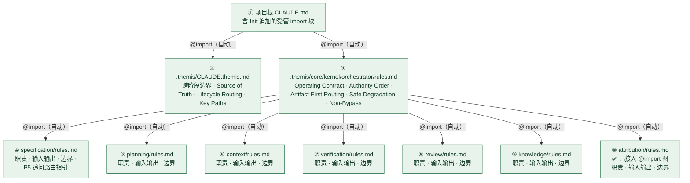
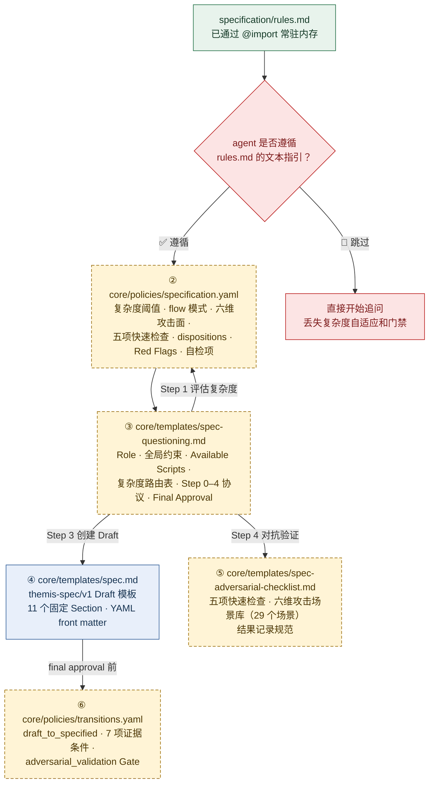
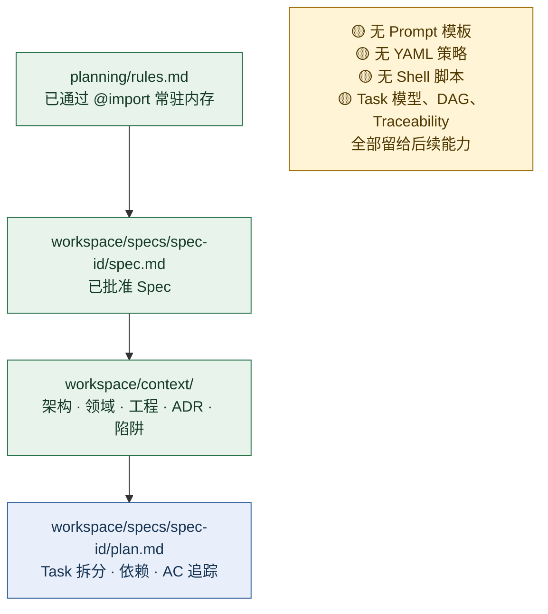
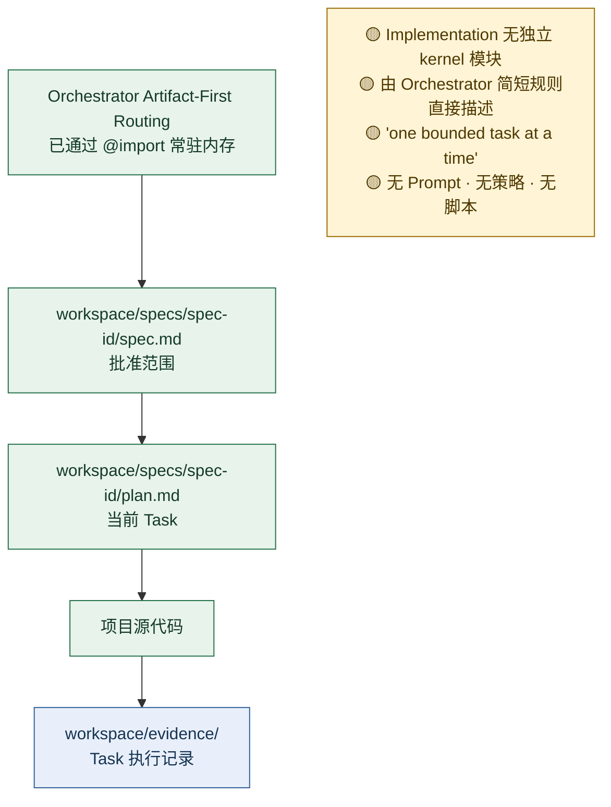
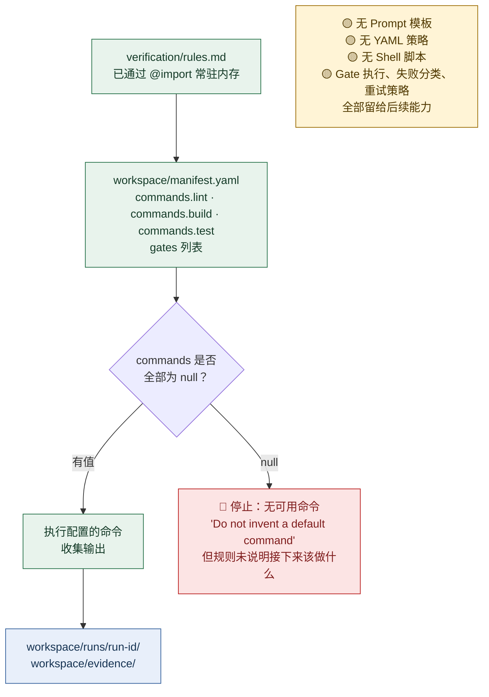
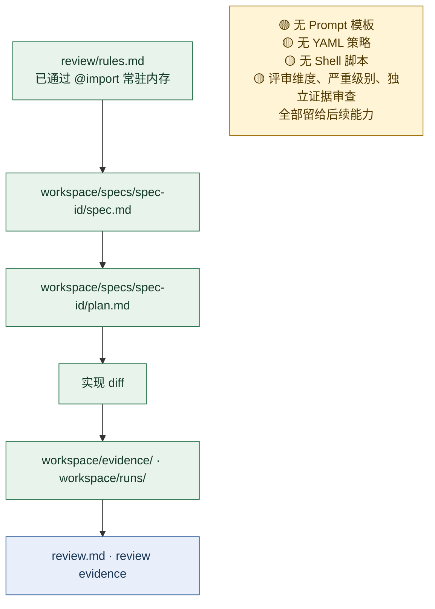
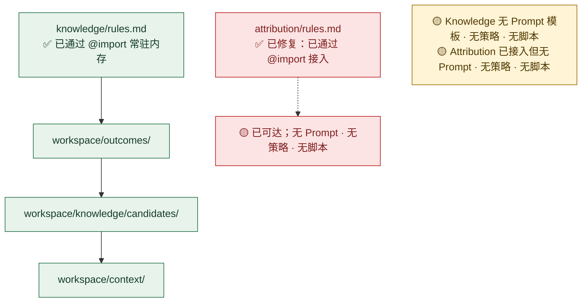
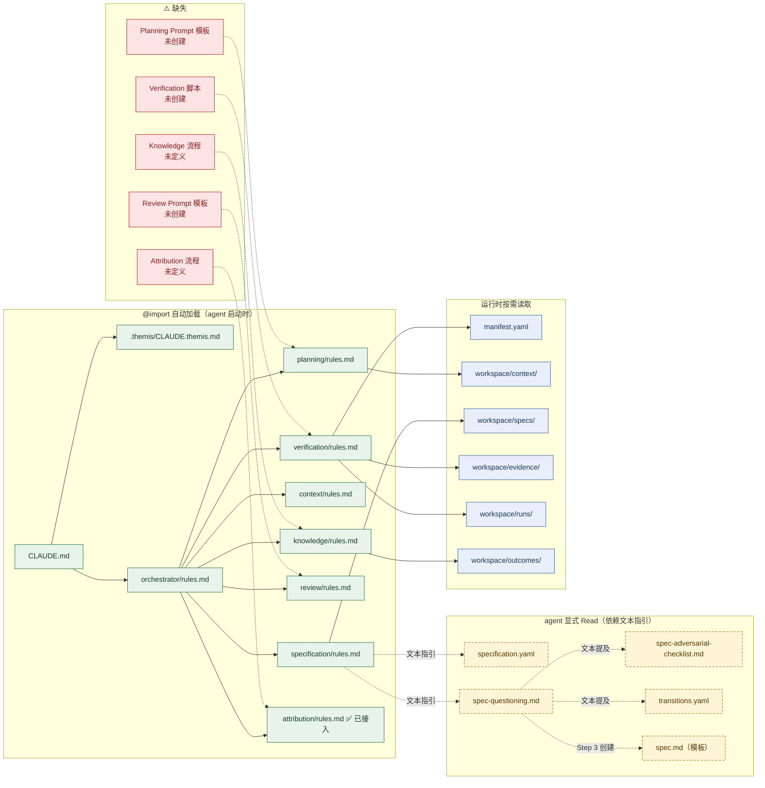

# Themis 加载链与阶段资产映射分析

本文以项目 agent 视角，追踪 Themis 从启动到各 SDD 阶段的完整 Prompt、YAML、Shell 脚本读取顺序，并标记结构性问题与增强建议。

> 分析基准：Themis 0.2.0（P5 已落地，P6/P8 及后续能力尚未实施）。

## 图例

| 符号 | 含义 |
|---|---|
| `@import` 实线 | 启动时自动加载，agent 无需主动读取 |
| `Read` 虚线 | agent 必须显式读取，依赖规则中的文本指引 |
| `Write` 点线 | agent 输出工件 |
| 🔴 | 结构性缺陷 |
| 🟡 | 设计上需注意 |
| 🟢 | 已满足要求 |

---

## 一、Agent 启动：基线加载

**关键事实**：启动阶段全部 9 个文件通过 `@import` 链一次性加载。这是唯一有结构性保证的加载层。之后每个阶段的 Prompt、YAML 策略、脚本都需要 agent 显式 `Read`。

---

## 二、Specification（Draft）：需求追问加载链

这是当前 Themis 唯一具有完整 Prompt + YAML 策略的阶段。

### 🔴 核心问题：软依赖链（已部分修复）

specification/rules.md 中的**旧**原文是：

> "Before Spec validation, follow the Step 0–4 flow in `core/templates/spec-questioning.md`. Use `core/policies/specification.yaml` for complexity modes..."

这是**描述性指引**（"follow the flow"），不是**命令性指令**（"you MUST Read"）。

**修复后 (A1)**：

> "You MUST Read these files before any Specification work:
> 1. `core/templates/spec-questioning.md` — the Step 0–4 protocol.
> 2. `core/policies/specification.yaml` — complexity thresholds and flow modes.
> 3. `core/policies/transitions.yaml` — the `draft_to_specified` evidence contract.
> Do not begin Step 0, assess complexity, or create a Draft Spec until all three files have been read."

此外：
- **B1**：spec-questioning.md Step 4 首行新增 "开始 Step 4 前，你必须 Read `core/templates/spec-adversarial-checklist.md`。不要凭记忆或通用知识即兴攻击。"
- **B2**：复杂度判定伪代码从 Prompt 移入 specification.yaml 注释段，Prompt 只保留路径引用。agent 可能：

1. 凭训练记忆直接开始追问，跳过 `specification.yaml` 的复杂度判定；
2. 凭通用知识做对抗验证，跳过 `spec-adversarial-checklist.md` 的标准化场景库；
3. 在 low 复杂度时完全跳过 Step 4（而策略要求至少完成五项快速检查）。

### 读取链路脆弱性量化

| 文件 | 加载方式 | 被跳过的可能性 | 后果 |
|---|---|---|---|
| `specification.yaml` | rules.md 文本指引 → agent 主动 Read | **中高** | 丢失复杂度分类、强制 high 信号、flow 模式 |
| `spec-questioning.md` | 同上 | **中** | 丢失 Step 0 Five Whys、Step 4 对抗验证协议、Red Flags |
| `spec-adversarial-checklist.md` | questioning.md Step 4 的文本提及 | **高** | 对抗验证退化为 agent 即兴发挥，场景覆盖不完整 |
| `transitions.yaml` | questioning.md Final Approval 文本提及 | **高** | 丢失 7 项证据条件的具体定义 |

---

## 三、Planning 加载链

---

## 四、Implementation 加载链

---

## 五、Verification 加载链

---

## 六、Review 加载链

---

## 七、Knowledge + Attribution 加载链

---

## 八、完整加载全景图

---

## 九、各阶段资产覆盖矩阵

| 阶段 | @import 规则 | Prompt 模板 | YAML 策略 | Shell 脚本 | 完整性 |
|---|---|---|---|---|---|
| **启动** | ✅ 8 文件自动加载 | — | — | — | 🟢 完整 |
| **Specification** | ✅ rules.md | ✅ spec-questioning.md | ✅ specification.yaml | — | 🟡 Prompt/策略靠软依赖 |
| | | ✅ spec-adversarial-checklist.md | ✅ transitions.yaml | | |
| | | ✅ spec.md（Draft 模板） | | | |
| **Planning** | ✅ rules.md | ❌ | ❌ | ❌ | 🔴 只有边界声明 |
| **Implementation** | ❌ 无独立模块 | ❌ | ❌ | ❌ | 🔴 靠 Orchestrator 三句话 |
| **Verification** | ✅ rules.md | ❌ | ❌ | ❌ | 🔴 manifest 命令为 null 时阻塞 |
| **Review** | ✅ rules.md | ❌ | ❌ | ❌ | 🔴 只有边界声明 |
| **Knowledge** | ✅ rules.md | ❌ | ❌ | ❌ | 🔴 只有边界声明 |
| **Attribution** | ✅ rules.md（已接入） | ❌ | ❌ | ❌ | 🟡 已可达但无流程 |

---

## 十、问题分级与建议

### 🔴 结构性缺陷（阻碍正确执行）

| # | 问题 | 影响范围 | 状态 |
|---|------|---------|------|
| **A1** | Specification Prompt 与 Policy 依赖软文本指引加载，agent 可能跳过 | Specification | ✅ 已修复：`rules.md` 改为命令式 "You MUST Read these files before any Specification work. Do not begin Step 0... until all three files have been read." |
| **A2** | `attribution/rules.md` 未被任何文件 @import，完全不可达 | Attribution | ✅ 已修复：Orchestrator 末尾追加 `@import ../attribution/rules.md` |
| **A3** | Planning、Verification、Review、Knowledge、Attribution 只有职责声明，无操作流程 | P5 之后的所有阶段 | ⏳ 待后续模块补充 |
| **A4** | `manifest.yaml` 的 commands 全部为 null，Verification 无回退路径 | Verification | ⏳ 待后续模块补充 |

### 🟡 设计加固（当前可用但应加强）

| # | 问题 | 状态 |
|---|------|------|
| **B1** | `spec-adversarial-checklist.md` 仅在 questioning Prompt Step 4 文本提及，agent 可能凭记忆即兴攻击 | ✅ 已修复：Step 4 首行新增 "你必须 Read，不要凭记忆或通用知识即兴攻击" |
| **B2** | 复杂度分类逻辑分散在 YAML（阈值）和 Prompt（判定流程）两处 | ✅ 已修复：判定伪代码写入 YAML 注释段，Prompt 只保留路径引用 |
| **B3** | `workspace/context/` 子目录多，agent 无工具发现有哪些可用 | ⏳ 后续添加 `themis-context-list` 脚本 |
| **B4** | Implementation 无阶段入口，路由靠 Orchestrator 三条规则 | ⏳ 后续拆分独立 `implementation/rules.md` |

### 🟢 已满足要求

| # | 说明 |
|---|------|
| **C1** | 启动 @import 链一层加载全部领域规则，浅层图、无嵌套 |
| **C2** | Core/Workspace 所有权边界在每个规则文件中一致声明 |
| **C3** | Safe Degradation 规则完整禁止虚构不存在的能力 |
| **C4** | P5 的 YAML 策略、Prompt 模板、Draft Spec 模板、攻击场景库四层资产齐全 |

---

## 十一、specification.yaml 的读取时机（精确追踪）

以一次 **medium 复杂度需求追问** 为例：

| 时刻 | 动因 | 读取的文件 | 读取的 Section |
|---|---|---|---|
| Agent 启动 | @import 链 | `specification/rules.md` | 全文（29 行） |
| 进入 Specification | rules.md 指引 | `spec-questioning.md` | Role、约束、Complexity Routing 表 |
| Step 0 | 无 | — | 从对话上下文获取用户请求 |
| Step 1 开始 | questioning.md Step 1 指引 | `specification.yaml` | `.questioning.complexity`（low/medium/high 阈值 + forced_triggers） |
| Step 1 判定 | YAML 阈值 | — | 比对请求特征得出复杂度 |
| Step 2 | questioning.md Step 2 指引 | `workspace/context/` | 相关架构、领域、工程文件 |
| Step 3 创建 Draft | questioning.md Step 3 指引 | `spec.md`（模板） | 全文，基于模板创建实例 |
| Step 4 开始 | questioning.md Step 4 指引 | `spec-adversarial-checklist.md` | 按 medium → focused 模式选择场景 |
| Step 4 处置 | specification.yaml | `.adversarial_validation` | dispositions、max_iterations、deferral 规则 |
| Final Approval | questioning.md Final Approval | `transitions.yaml` | `.transitions.draft_to_specified` 条件清单 |
| 批准后 | P5 边界 | — | 保持 `status: draft`，不写 transition history |

---

## 十二、相关文件

| 文件 | 角色 |
|---|---|
| `templates/.themis/CLAUDE.themis.md` | 跨阶段边界与路由入口 |
| `templates/.themis/core/kernel/orchestrator/rules.md` | 总调度 + 领域 @import 图 |
| `templates/.themis/core/kernel/specification/rules.md` | Specification 边界 + P5 路由指引 |
| `templates/.themis/core/kernel/planning/rules.md` | Planning 边界声明 |
| `templates/.themis/core/kernel/context/rules.md` | Context 边界声明 |
| `templates/.themis/core/kernel/verification/rules.md` | Verification 边界声明 |
| `templates/.themis/core/kernel/review/rules.md` | Review 边界声明 |
| `templates/.themis/core/kernel/knowledge/rules.md` | Knowledge 边界声明 |
| `templates/.themis/core/kernel/attribution/rules.md` | ✅ 已接入 @import 图 |
| `templates/.themis/core/policies/specification.yaml` | 复杂度、flow、攻击维度、门禁 |
| `templates/.themis/core/policies/transitions.yaml` | draft_to_specified 证据契约 |
| `templates/.themis/core/templates/spec-questioning.md` | Step 0–4 Prompt |
| `templates/.themis/core/templates/spec-adversarial-checklist.md` | 攻击场景库 |
| `templates/.themis/core/templates/spec.md` | Draft Spec 模板 |
| `templates/.themis/core/core.yaml` | Core 版本与兼容性元数据 |
| `templates/.themis/workspace/manifest.yaml` | 项目配置与 Gate 命令 |
