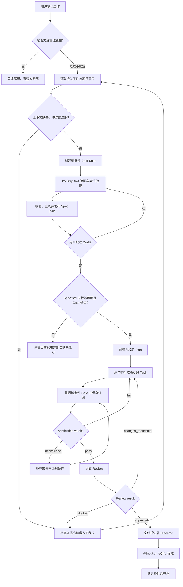

# Themis 完整工作流程

> 规范状态：正式设计。实现状态：部分实现；P5 Draft Spec 双视图、Init、Upgrade 与显式 Migration 框架已落地，完整 lifecycle state、Planning、Implementation、Verification、Review、Attribution 和 Knowledge 执行器尚未实现。

本文定义 Themis 从需求进入到归档的唯一生命周期、阶段门禁和返工路由。事实与证据优先级见 [设计治理](governance.md)，领域所有权见 [总体架构](architecture.md)。

## 生命周期

```text
Draft → Specified → Planned → Implemented → Verified → Reviewed → Archived
```

- 阶段顺序固定为 Verification 在前、Review 在后。
- 用户批准、Prompt 输出和生成的 Human Spec 投影可以成为 Gate evidence，但不是 machine transition。
- 只有持久状态或确定性执行器可以记录 transition。
- 当前确定性 lifecycle executor 尚未实现；缺少执行器时必须停留在当前机器状态并明确报告。

## 项目事实与 Context

受治理 `workspace/context/` 描述项目应当表达的业务与工程含义，当前代码、配置与 Schema 描述当前实现；两者不存在全局覆盖顺序。Spec/Plan、State、Run/Evidence、Outcome、Core 规则、对话与 Cache 不能替代这两个项目事实根。

每次进入 Specification 或 Planning 时，优先解析显式 Context ID，再按 Scope 通过 Catalog 和 L1→L2→L3 渐进装配，并按需核验当前代码。Context 缺失、过期、相互冲突或与代码漂移时必须持久化 Signal，并停留当前阶段补充证据或请求裁决；Context Bundle 只是可重建快照。完整合同见 [设计治理](governance.md#项目事实可信模型) 与 [Context](core/kernel/context.md)。

## 阶段合同

| 阶段 | Owner | 必需输入 | 主要输出与门禁 | 实现状态 |
|---|---|---|---|---|
| Draft | Specification、Context | 用户目标、已确认 Context | `spec.yaml` 权威 Draft、生成 `spec.md`、稳定 AC/ADV、攻击处置、用户批准证据 | P5/P5.2 已实现 |
| Specified | Orchestrator | 完整且 current 的 Spec pair、transition policy 与 validator JSON | 记录 `draft → specified` | 状态执行器未实现 |
| Planned | Planning | 已批准 `spec.yaml`、Context、代码事实 | `plan.md`、Task DAG、AC traceability、证据要求 | 未实现 |
| Implemented | Implementation | 当前依赖就绪 Task、Plan scope lock | 代码/文档变更、Task evidence、全部 Task 完成 | 未实现 |
| Verified | Verification | 实现结果、manifest commands、effective policy | runs、evidence、`pass/fail/inconclusive` verdict | 未实现 |
| Reviewed | Review | Spec pair、Plan、diff、Verification evidence | `approved/changes_requested/blocked`、结构化 findings | 未实现 |
| Archived | Orchestrator、Knowledge | Outcome、Attribution、知识处置完成 | 归档 transition 与可追溯历史 | 未实现 |

## 端到端路由



## Draft → Specified

Specification 按以下顺序收敛 Draft：

1. Step 0 — Intent Discovery：确认目标与根因。
2. Step 1 — Scope Assessment：确认范围、复杂度、风险和 Pre-mortem。
3. Step 2 — Context Gathering：对 medium/high 收集约束、量化标准、证据与 Option Zero。
4. Step 3 — Design Convergence：确认取舍、需求和分段 Acceptance Criteria。
5. Step 4 — Adversarial Validation：攻击边界、并发、状态、安全、依赖和数据完整性。

P5 只修改 `workspace/cache/spec-candidates/<spec-id>.yaml`，再经 `themis-spec.sh publish` 将有效 candidate 发布为 `workspace/specs/<spec-id>/{spec.yaml,spec.md}`。YAML 是唯一机器真源；Markdown 是带 OID 的确定性审阅投影，不能反向同步或作为 transition evidence。

`core/policies/transitions.yaml` 声明八个 validator-backed `draft_to_specified` 条件；P5 记录相应 evidence 并保持 `status: draft`。执行这些条件并持久化 transition 的 P8 脚本尚未实现。

## Specified → Planned

Planning 创建或更新 `workspace/specs/<spec-id>/plan.md`，并定义：

- 会话级 Task 及其稳定 ID；
- Task 依赖 DAG；
- AC → Task → 代码位置 → Gate 的 traceability；
- 每个 Task 的范围、完成标准和预期 evidence；
- Plan 校验结果。

Planning 不修改项目源码，不执行 Task，也不把 Task 标记为完成。它只从已验证的 `spec.yaml` 与 validator JSON 读取机器输入；`spec.md` 仅供人类展示。Behavior Map 可以提供事实锚点；当前仅有目录占位，缺失时回退到源码检查，不得把低置信度推断写成事实。

## Planned → Implemented

Implementation 一次只执行一个依赖就绪 Task：

1. 只加载当前 Task 的 AC、约束、Context 和相关代码。
2. 将 Plan 声明的文件与行为边界作为持续 scope lock。
3. 变更前检查是否越界；Plan 不足但仍在 Spec 内时返回 Planning，超出 Spec 时返回 Specification。
4. 保存 Task ID、覆盖 AC、变更文件、摘要、偏差和完成证据。
5. 不混入无关重构或其他 Task。

Implementation 不修改 Spec/Plan 的所有权内容，不计算 Verification verdict，也不写 lifecycle transition。

## Implemented → Verified

Verification 从 `workspace/manifest.yaml` 和 effective policy 读取 Gate。manifest command 为 `null` 时不得发明命令。

Gate execution status 使用：

```text
pending | running | passed | failed | skipped | error
```

多个 Gate 聚合为 Verification verdict：

```text
pass | fail | inconclusive
```

- `pass`：所有 blocking Gate 通过并有充分 evidence。
- `fail`：至少一个 blocking Gate 失败。
- `inconclusive`：证据缺失、不可访问或不足以判断。

Verification 保存精确命令、输出、状态、失败分类和不可用检查。任何代码变更都会使受影响 evidence 失效。

## Verified → Reviewed

Review 只读检查已验证的 `spec.yaml`、当前 `spec.md` 投影、Plan、implementation diff 和 Verification evidence。结果只使用：

```text
approved | changes_requested | blocked
```

- 未解决的 `critical` 或 `major` finding 阻止 `approved`。
- 缺失或不可解释的 evidence 产生 `blocked`，不能批准。
- `changes_requested` 返回 Implementation；代码变化后必须重新 Verification。
- Review 不能运行主观替代 Gate，也不能把 Verification verdict 改写为另一个事实。

未来若要允许 major finding waiver，必须先定义独立、可审计的 disposition 合同；当前不得以“已知债务”绕过普通 approval 条件。

## Outcome、Attribution 与 Knowledge

Verification verdict 描述一次 Run；Outcome 描述交付后的真实结果，两者不能混用。Outcome 可以是 success、rework、defect、incident 或 rollback。

Attribution 建立 Spec、Plan、Task、commit、run、deployment 与 outcome 的可追溯关联，并区分测量相关性与因果解释。

知识治理流程为：

```text
execution/review/outcome
        ↓
candidate → dedup + conflict check → governed review
        ├─ promote → workspace/context/
        ├─ reject  → workspace/knowledge/rejected/
        └─ revise  → candidate
```

正式知识只有 `workspace/context/` 一个权威位置。自动候选提取、审核、提升和废弃执行器尚未实现。

## Init、Upgrade 与 Migration

- Init 校验 Bash、Git 和 mikefarah/yq v4，安装 `.themis/`，写入 manifest，并向项目 `CLAUDE.md` 追加可逆 import；失败时回滚。
- Upgrade 只替换 `.themis/workspace/` 外的 Themis 管理内容，保持 Workspace 与项目 guidance 字节不变。
- Migration 与 Upgrade 分离，是唯一允许转换 Workspace/Artifact Schema 的机制；分步入口、policy、Prompt、Kernel rule 和测试已实现，但确认/备份/失败回滚尚未由脚本端到端强制，且当前模板没有具体 descriptor 或转换脚本。

详见 [Init Environment](runtime-environment.md) 与 [Migrations](core/migrations.md)。

## 当前能力摘要

| 能力 | 状态 |
|---|---|
| P0 Init 环境校验 | 已实现 |
| P1 模板、版本与目录契约 | 已实现 |
| P2 顶层 Guidance 与领域 rules import | 已实现 |
| P3 Init | 已实现 |
| P4 Upgrade | 已实现 |
| P4.5 显式 Migration 框架 | 部分实现；分步入口已落地，安全顺序未由脚本强制，且无具体转换 descriptor/script |
| P5 Requirement Questioning 与 Draft Spec | 已实现；Specified state executor 未实现 |
| P5.2 Spec 双视图 | 已实现；原生 `themis-artifact/v2` / `themis-spec/v2`、executor 与 pair drift 检查已落地 |
| P5.4 Context Trust | 已确认但未实现；Catalog、L1/L2/L3、Bundle、Signal 与 Migration 尚未落地 |
| Behavior Map | 已确认但未实现，仅目录占位 |
| Planning / Implementation / Verification / Review 增强 | 已确认但未实现 |
| Attribution / Knowledge 自动执行器 | 已确认但未实现 |
| 专用 Agent、Command、Skill 与通用 lifecycle scripts | 已确认但未实现 |

## 相关设计

- [Orchestrator](core/kernel/orchestrator.md)
- [Specification](core/kernel/specification.md)
- [Planning](core/kernel/planning.md)
- [Context](core/kernel/context.md)
- [Verification](core/kernel/verification.md)
- [Review](core/kernel/review.md)
- [Attribution](core/kernel/attribution.md)
- [Knowledge](core/kernel/knowledge.md)
- [Workspace](workspace/overview.md)
