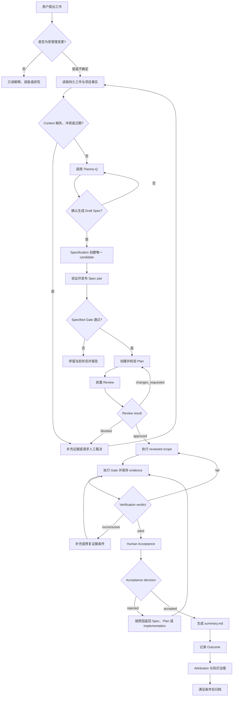

# Themis 完整工作流程

> 规范状态：正式设计。实现状态：部分实现；Themis-Q Spec 前追问、P5 Draft Spec 双视图、P5.4 Context Trust 与 fresh Init 已落地，完整 lifecycle state、Planning、Review、Implementation、Verification、Acceptance、Summary、Attribution 和 Knowledge 执行器尚未实现。

本文定义 Themis 从需求进入到归档的唯一生命周期、阶段门禁和返工路由。事实与证据优先级见 [设计治理](governance.md)，领域所有权见 [总体架构](architecture.md)。

## 生命周期

机器 lifecycle status：

```text
Draft → Specified → Planned → Reviewed → Implemented → Verified → Archived
```

完整阶段顺序：

```text
Draft → Specified → Planned → Reviewed → Implemented → Verified
      → Human Acceptance → Summary → Archived
```

- Review 固定在 Implementation 前，用于批准 Spec、Plan、设计、风险、实施边界与验收方案。
- Verification 固定在 Implementation 后，只记录命令驱动的可重复事实。
- Human Acceptance 与 Summary 是 `verified → archived` 的强制门禁，不新增 lifecycle status。
- 用户批准、Prompt 输出和 Human projection 可以成为 Gate evidence，但不是 machine transition。
- 只有持久状态或确定性执行器可以记录 transition；执行器缺失时必须停留当前机器状态并明确报告。

## 项目事实与 Context

受治理 `workspace/context/` 描述项目应当表达的业务与工程含义，当前代码、配置与 Schema 描述当前实现；两者不存在全局覆盖顺序。Spec/Plan、State、Run/Evidence、Outcome、Core 规则、对话与 Cache 不能替代这两个项目事实根。

进入 Specification、Planning 或 Review 时优先解析显式 Context ID，再按 Scope 通过 Catalog 和 L1→L2→L3 渐进装配，并直接核验当前代码。Context 缺失、过期、冲突或与代码漂移时记录 Signal，并停留当前阶段补充证据或请求裁决。

## 阶段合同

| 状态/门禁 | Owner | 必需输入 | 主要输出与门禁 | 实现状态 |
|---|---|---|---|---|
| Draft | Specification、Context | 用户目标、已确认 Context | `spec.yaml` Draft、生成 `spec.md`、稳定 AC/ADV、攻击处置、用户批准 evidence | P5/P5.2 已实现 |
| Specified | Orchestrator | 完整 current Spec pair、policy 与 validator JSON | `draft → specified` | 执行器未实现 |
| Planned | Planning | approved `spec.yaml`、Context、当前代码事实 | `plan.md`、Task DAG、AC traceability、证据与验收要求 | 未实现 |
| Reviewed | Review | current Spec/Plan、设计、风险、scope lock、验收方案 | `approved/changes_requested/blocked` 与 Implementation authorization | 未实现 |
| Implemented | Implementation | approved Review、依赖就绪 Task、Plan scope lock | 代码/文档变更、Task evidence、全部 Task 完成 | 未实现 |
| Verified | Verification | 实现 revision、approved artifacts、manifest commands、effective policy | runs、evidence、`pass/fail/inconclusive`、`verify.md` | 未实现 |
| Human Acceptance | 用户/验收者 | current Spec/Plan/Review、passing Verification、人工步骤 | `accepted/rejected` evidence | 未实现 |
| Summary | deterministic renderer | accepted evidence 与来源 digests | `summary.md` final delivery projection | 未实现 |
| Archived | Orchestrator、Knowledge | Acceptance、Summary、Outcome 与知识处置完成 | 归档 transition 与可追溯历史 | 未实现 |

## 端到端路由



Acceptance rejection 的实际返工必须回到所属阶段；只要实现发生变化，就必须重新 Verification，不能直接沿图跳回 Acceptance。

## Draft → Specified

Specification 在需要澄清当前请求时调用 Project Skill `Themis-Q`，使用其聚焦、渐进式提问方法覆盖 intent、scope、context、options、acceptance 与风险。Specification 自己读取 policy 与项目依据、判断复杂度和收敛、展示规范化摘要并请求是否生成 Draft Spec 的明确确认。确认后，Specification 创建唯一 `workspace/cache/spec-candidates/<spec-id>.yaml`，再经 `themis-spec.sh publish` 发布 canonical `spec.yaml`/`spec.md` pair；Skill 不定义流程、确认 gate、handoff 或 artifact。

`core/policies/transitions.yaml` 声明八个 validator-backed `draft_to_specified` 条件；P5 保持 `status: draft`。执行 transition 的通用脚本尚未实现。

## Specified → Planned

Planning 创建 `plan.md`，定义 Task ID、依赖 DAG、scope lock、AC → Task → code location → Gate → human acceptance traceability、预期 evidence、风险和回滚。代码位置必须直接核验当前源码并记录 revision/digest。

Planning 不修改项目源码，不执行 Task，也不授权 Implementation。

## Planned → Reviewed

Review 在任何项目实现变更前只读检查 Spec、Plan、Context/源码依据、设计、接口与状态、安全/数据风险、实施边界、回滚和验收方案。

```text
approved | changes_requested | blocked
```

- `approved` 绑定 current Spec/Plan revision，并成为 Implementation authorization。
- `changes_requested` 返回 Specification 或 Planning；修改后必须重新 Review。
- `blocked` 表示事实、设计或验收 evidence 无法核验，不能开始 Implementation。
- 未解决的 `critical` 或 `major` finding 阻止 `approved`。

Review 不读取已完成 implementation diff，不执行 Verification Gate，也不充当实现后的代码评审。

## Reviewed → Implemented

Implementation 一次只执行一个依赖就绪 Task：

1. 加载当前 Task 的 AC、约束、Context、相关代码和 approved Review。
2. 持续执行 Plan/Review 的 scope lock。
3. Plan 不足但仍在 Spec 内时返回 Planning 并重新 Review；超出 Spec 时返回 Specification。
4. 保存 Task ID、覆盖 AC、变更文件、摘要、偏差和完成 evidence。
5. 不混入无关重构或其他 Task。

Implementation 不修改 Spec/Plan/Review 的所有权内容，不计算 Verification verdict，也不写 lifecycle transition。

## Implemented → Verified

Verification 从 manifest 和 effective policy 读取 Gate；`null` command 不得被替代。每个 Run 绑定 Spec/Plan/Review 和 implementation revision，并保存 AC/Gate 覆盖、环境、精确命令、exit code、stdout/stderr refs、时间、失败分类、repair/rerun、不可用检查和残余限制。

Gate execution status：

```text
pending | running | passed | failed | skipped | error
```

Verification verdict：

```text
pass | fail | inconclusive
```

代码或相关工件变化使受影响 evidence 失效。

## Verification 失败修复循环

```text
Gate failure → classify → repair handoff → external repair → resume → affected Gate rerun
```

- Blocking Gate 首个失败即停。
- Verification 只分类、持久化 attempt、生成 bounded handoff 和重跑 Gate，不直接修改代码。
- 失败分类至少包含 `transient`、`code_failure`、`configuration_failure`、`policy_conflict`、`evidence_insufficient`、`assumption_violated` 与 `unknown`。
- 初次失败后默认最多 3 个 repair/rerun cycle；attempt 跨进程保持。
- 代码或配置修复后只重跑受影响 Gate，并失效旧 evidence。
- 预算耗尽写 escalation、返回稳定机器结果并以 exit `2` 结束；Knowledge recorder 不可用时保留 `candidate_pending`。

该 runner、Protocol、Prompt 与投影尚未实现。

## Verified → Human Acceptance → Summary → Archived

Verification `pass` 后，由用户或指定验收者依据 current Spec/Plan/Review、`verify.md` 与原始 evidence 执行人工验收。Acceptance decision 只使用：

```text
accepted | rejected
```

Acceptance evidence 至少记录 actor、time、引用 revisions/digests、执行的人工步骤、结果、接受的残余风险和拒绝原因。`rejected` 必须返回对应领域；若修改实现，重新 Verification。

只有 `accepted` 后才能生成 `summary.md`。Summary 确定性汇总：

- 最终交付范围与实际变更；
- accepted Spec/Plan/Review/Verification/Acceptance 引用；
- AC 与证据摘要；
- 相对 Spec/Plan 的批准偏差；
- 残余风险、限制和后续事项。

`summary.md` 是 Human projection，不是 acceptance decision、Verification verdict、Outcome 或 lifecycle state。归档还需要 Outcome、Attribution 和知识处置门禁完成。

## Outcome、Attribution 与 Knowledge

Verification verdict 描述一次 Run；Acceptance 描述用户是否接受当前交付；Outcome 描述交付后的真实结果，三者不能混用。Attribution 建立 Spec、Plan、Review、Task、commit、run、deployment、Acceptance 与 Outcome 的可追溯关联。

知识治理保持 `candidate → validation → governed review → human decision`，正式知识只有 `workspace/context/` 一个权威位置。

## Init 与当前更新边界

- Init 校验 Bash、Git 和 mikefarah/yq v4，安装全新的 `.themis/`，安全合并 `.claude/skills/Themis-Q/`，写入 manifest 并追加可逆 guidance import；任一步失败都回滚本次创建内容。
- 已存在 `.themis/` 时 Init 在写入前失败并保留 Workspace。
- 当前版本不提供 Core 原地更新或 Workspace/Artifact Schema 转换能力；unsupported schema fail closed。

## 当前能力摘要

| 能力 | 状态 |
|---|---|
| P0 Init 环境校验 | 已实现 |
| P1 模板、版本、固定 allow-list 与目录契约 | 已实现 |
| P2 顶层 Guidance 与领域 rules import | 已实现 |
| P3 fresh Init | 已实现 |
| Upgrade / Migration | 当前产品已退役，未来重新设计 |
| P5 Requirement Questioning 与 Draft Spec | `Themis-Q` Skill、无版本 Spec candidate/publisher 和最终语义 readiness 已实现；Specified state executor 未实现 |
| P5.2 Spec 双视图 | 已实现 |
| P5.4 Context Trust | 已实现；五项无版本 Protocol、Catalog/Search/Bundle/Freshness/Signal/Navigation 执行器与 bootstrap 布局保持当前 Workspace schema |
| Planning / Review / Implementation / Verification | 已确认但未实现 |
| Human Acceptance / Summary | 已确认但未实现 |
| Attribution / Knowledge 自动执行器 | 已确认但未实现 |
| Themis-Q Project Skill | 已实现；聚焦、适应性提问方法、需求覆盖与对抗问题指导 |
| 专用 Agent、其他 Command/Skill 与通用 lifecycle scripts | 已确认但未实现 |

## 相关设计

- [Orchestrator](core/kernel/orchestrator.md)
- [Specification](core/kernel/specification.md)
- [Planning](core/kernel/planning.md)
- [Context](core/kernel/context.md)
- [Review](core/kernel/review.md)
- [Verification](core/kernel/verification.md)
- [Attribution](core/kernel/attribution.md)
- [Knowledge](core/kernel/knowledge.md)
- [Workspace](workspace/overview.md)
