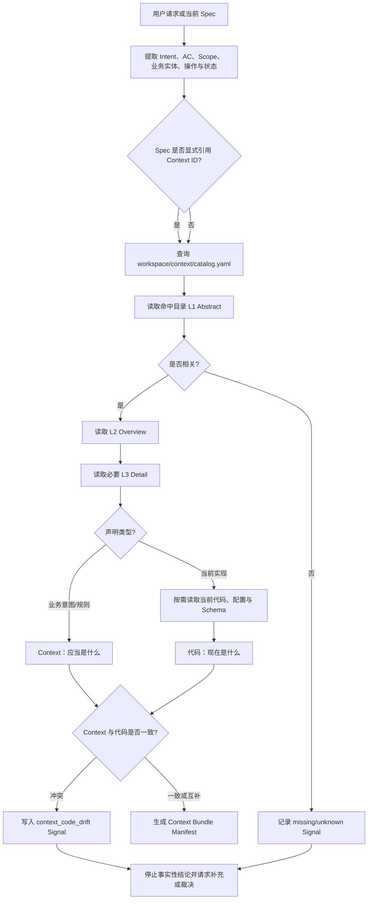
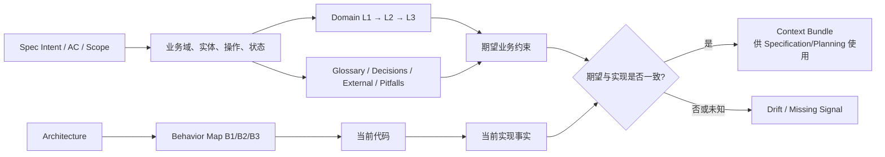
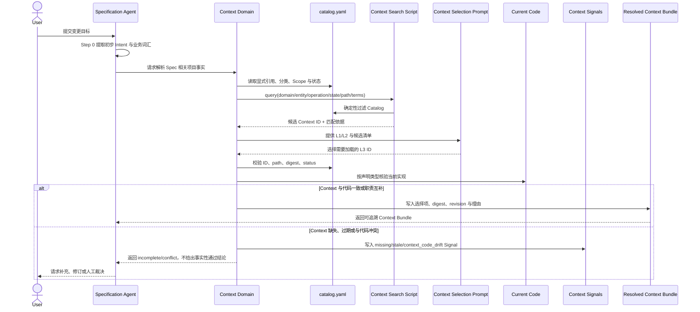
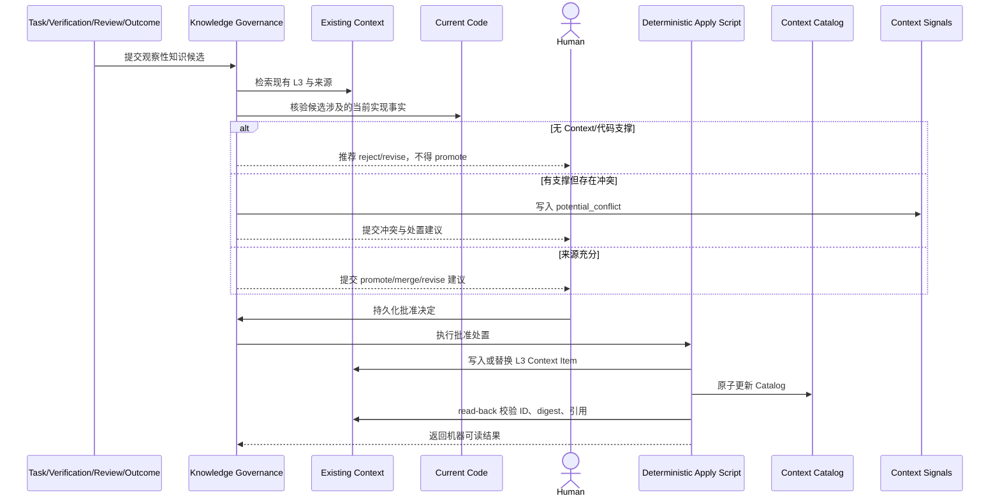

# P5.4 — Context Restructure（Repo-local Knowledge System）

**优先级**：P5.4
**依赖**：[P1 Template Contract](../10-template-contract/README.md)、[P2 Top-level Guidance](../20-top-level-guidance/README.md)、[P4.5 Explicit Migration](../45-explicit-migration/README.md)、[P5 Requirement Questioning](../50-requirement-questioning/README.md)
**状态**：设计完成，待用户主动发起

## 背景

Themis 已经规定 `workspace/context/` 是正式项目知识的唯一位置，并规划了 Knowledge Governance 与 Behavior Map，但现有设计仍存在四类系统性问题：

1. 事实来源层级把代码、Workspace 状态、Evidence、Core Policy、Prompt 和对话放进同一个权威序列，混淆了“项目事实”“期望契约”“流程状态”和“Gate 证据”；
2. Context 缺少业务知识的渐进披露层级，Agent 查找某个 Spec 相关知识时主要依赖目录扫描和自由推断；
3. `context-map.yaml`、缓存索引、解析快照、目录 README 和 Behavior Map Anchor Index 的角色没有统一，容易形成多套事实入口；
4. Context、Knowledge Governance 与 Behavior Map 都计划实现冲突、新鲜度和索引更新，实施 P5.5/P6 后会产生重复控制逻辑。

P5.4 在不引入 SQLite、向量数据库、Embedding、Tree-sitter、LSP 或常驻服务的条件下，重构 Context 的可信源、分层文件、唯一 Catalog、确定性检索、按需装配、冲突信号及跨模块规则。

## 核心决策

### 1. 项目事实只有两个可信源

```text
受治理的 workspace/context/  → “项目应当是什么”
当前代码、配置与 Schema       → “项目现在是什么”
```

- **Context 权威**：业务概念、规则、不变量、术语、决策、外部约束和工程约定；
- **代码权威**：当前实现路径、配置值、Schema、静态结构和实际存在的行为；
- Context 与代码不存在全局高低顺序，而是分别对不同声明类型负责；
- 当 Context 描述与当前代码冲突时，结果是 `context_code_drift`，不能静默选择任意一方；
- Context 缺失时，代码只能证明当前实现，不能自动证明业务意图；
- 代码缺失或不可访问时，Context 不能证明某项行为已经实现。

以下内容不是项目事实来源：

- Spec 只定义已批准的期望变化和 Acceptance Criteria；
- Plan 只定义任务组织、范围与证据要求；
- State 只记录机器生命周期和任务状态；
- Run/Evidence 只证明命令、Gate 和观察结果；
- Outcome 只记录交付后的测量结果；
- Core Policy、Prompt 和 `rules.md` 只定义 Themis 控制规则；
- Workspace Knowledge 只保存候选和治理记录；
- 对话、模型记忆、搜索排名、摘要和 Agent 推断都不能独立建立项目事实。

State、Run 和 Evidence 仍是**流程事实**与 **Gate 事实**的权威来源，但不得被提升为业务知识，除非其观察经 Context/代码核验并通过 Knowledge Governance。

### 2. 双维分层

Context 使用两个正交维度：

```text
知识类别：domain / glossary / decisions / architecture / engineering / pitfalls / external
披露层级：L1 Abstract → L2 Overview → L3 Detail
```

- 类别回答“这是什么知识”；
- L1/L2/L3 回答“当前需要读取多深”；
- Spec 不拥有独立知识目录；它引用长期 Context Item；
- Behavior Map 改用 `B1/B2/B3`，避免与知识披露层混淆。

### 3. 一个持久 Catalog，其他索引全部可重建

- `workspace/context/catalog.yaml` 是 Context Item 的唯一持久注册表；
- `.abstract.md` 和 `.overview.md` 是导航投影，不是独立事实源；
- `workspace/cache/context-index/` 仅保存可重建 TSV/文本索引；
- `workspace/cache/resolved-context/` 仅保存任务级 Context Bundle；
- Behavior Map Anchor Index 只索引代码事实，不替代 Catalog；
- Cache 丢失不得造成事实、批准、冲突裁决或来源证据丢失。

### 4. 不增加运行时依赖

P5.4 只使用 Themis 已有前置能力：

- Markdown/YAML 保存权威内容和协议实例；
- Git 提供 revision、tracked-file 范围和内容 digest；
- Bash 3.2 执行确定性检索、校验和装配；
- mikefarah/yq v4 解析结构化元数据；
- Prompt 只执行语义查询生成、候选排序和冲突建议。

## 目标 Workspace 结构

```text
workspace/
├── context/
│   ├── catalog.yaml
│   ├── .abstract.md
│   ├── .overview.md
│   ├── architecture/
│   │   └── behavior-map/
│   │       ├── manifest.yaml
│   │       ├── system/       # B1
│   │       ├── units/        # B2
│   │       ├── evidence/     # B3 Anchors 与受支持关系
│   │       └── navigation/   # 可重建语义说明
│   ├── domain/
│   ├── engineering/
│   ├── decisions/
│   ├── pitfalls/
│   ├── glossary/
│   └── external/
├── state/
│   └── context-signals/
├── knowledge/
│   ├── candidates/
│   ├── reviews/
│   ├── actions/
│   ├── rejected/
│   └── archive/
└── cache/
    ├── context-index/
    └── resolved-context/
```

`context-signals/` 保存可审计的缺失、冲突、过期和 Context/代码漂移信号。信号不是项目事实，也不负责裁决；Knowledge Governance 或当前 SDD 阶段读取并处置它。

## L1/L2/L3 文件契约

### L1 Abstract

目录级 `.abstract.md`：

- 50–150 tokens；
- 描述主题、Scope、可用知识类别及主要 Context ID；
- 只用于快速过滤；
- 不得引入 L3 中不存在的新事实；
- 必须声明其派生来源。

### L2 Overview

目录级 `.overview.md`：

- 500–1500 tokens；
- 描述领域结构、主要规则、不变量和继续读取路径；
- 每项事实性陈述必须引用 L3 Context ID 或 current B3 Anchor；
- 属于导航投影，不得覆盖 L3 内容。

### L3 Detail

现有分类下的正式 Context Item：

```yaml
---
context_item_schema: themis-context-item/v1
id: CTX-refund-cancellation-rule
layer: L3
category: domain
knowledge_kind: rule
authority: governed
status: active
scope:
  domains: [refunds]
  entities: [refund_request]
  operations: [cancel]
  states: [approved]
  paths: []
tags: [refund, cancellation, financial-approval]
source_refs: []
source_revision: null
verified_at: null
depends_on: []
supersedes: null
content_digest: ""
---
```

最小 `authority` 枚举：

- `declared`：项目人工直接维护并确认；
- `governed`：由 Knowledge Governance 批准提升；
- `external_reference`：纳入 Context 管理的外部来源；
- `derived_fact`：由当前代码确定性派生且可重新验证；
- `derived_navigation`：L1/L2/Behavior Map 说明性投影，不能独立支撑事实。

## Spec 相关业务知识查找

业务知识主入口固定为：

```text
workspace/context/domain/<bounded-context>/
```

建议按需使用以下子分类，不要求预建空目录：

```text
concepts/       业务实体、值对象和角色
rules/          条件式业务规则
invariants/     不可破坏约束
processes/      跨步骤和跨角色流程
state-machines/ 状态、事件、迁移和非法迁移
```

查找优先级：

1. Spec 显式引用的 Context ID；
2. `domain/` 中匹配 domain/entity/operation/state 的 L1/L2/L3；
3. `glossary/` 消除术语歧义；
4. `decisions/` 确认已选方案与理由；
5. `external/` 获取已纳入治理的外部约束；
6. `pitfalls/` 获取已验证失败模式；
7. `architecture/` 理解系统边界；
8. Behavior Map 和当前代码定位实现。

直接 Web 内容、对话陈述或未纳入 Context 的外部文档不能作为项目业务事实；需要先以 `external_reference` 进入 Context，或只作为待确认候选。

## Context Resolution 流程图



## Spec 业务知识装配流程图



## Context Resolution 时序图



## 知识写入与治理时序图



## Context 与代码冲突规则

| 情况 | 结论 | 后续动作 |
|---|---|---|
| Context 有规则，代码符合 | 规则与实现一致 | 可进入后续阶段 |
| Context 有规则，代码不符合 | `context_code_drift` | Spec 将差异定义为变更目标，或请求裁决 |
| Context 无规则，代码有行为 | 仅能陈述当前实现 | 在 Spec 中标为待确认；可生成知识候选 |
| Context 有规则，代码无法读取 | 实现状态 `unknown` | 不得声明已实现 |
| Context 相互冲突 | `context_conflict` | 停止依赖该事实的阶段并进入治理 |
| Behavior Map 非 `current` | 仅可导航 | 必须读取当前代码核验 |

## 无额外依赖的本地索引

`workspace/cache/context-index/` 首版使用可重建文本：

```text
items.tsv       ID、category、kind、authority、status、path
tags.tsv        tag → Context ID
scopes.tsv      domain/entity/operation/state → Context ID
paths.tsv       source/code path → Context ID
references.tsv  Context ID → Context/Anchor ID
```

- `yq` 从 Catalog 和 Front Matter 提取结构字段；
- `git hash-object` 计算内容 digest；
- `git rev-parse HEAD` 记录代码 revision；
- Git tracked-file 查询和确定性文本搜索补充召回；
- Prompt 只在 Shell 返回的候选集合内进行语义选择；
- Prompt 返回 ID 后，Shell 必须再次校验 ID 和文件，防止越界加载。

## Context Bundle

按需装配结果保存到：

```text
workspace/cache/resolved-context/<bundle-id>/
├── manifest.yaml
└── context.md
```

Manifest 至少记录：

- intent、Spec/Task 引用和 Scope；
- source revision 与 token budget；
- 选中的 Context ID、path、digest、freshness 和选择理由；
- 已读取的代码路径和 revision；
- 排除项及原因；
- unresolved signals；
- `complete`、`partial`、`conflict` 或 `unavailable` 状态。

Bundle 是派生快照，不是第三个事实源。需要审计时，Run/Evidence 只持久引用 Bundle Manifest、源 ID 和 digest。

## Behavior Map 关系

P5.4 统一命名与可信边界，P6 继续负责具体 Behavior Map 实现：

| 层 | 新名称 | 权威性质 |
|---|---|---|
| B1 System | 系统边界、入口与生命周期导航 | `derived_navigation`，引用 B3 |
| B2 Behavior Unit | 行为单元、职责与关系导航 | `derived_navigation`，引用 B3 |
| B3 Evidence | 文件、符号、精确文本和受支持关系 Anchor | `derived_fact`，仅在 `current` 时可使用 |

P5.4 不新增语言解析依赖。没有 Adapter 时，B3 最低只支持 Git 文件事实、内容 digest、Manifest/配置事实和可重复定位的精确文本 Anchor；调用图、动态分派和跨语言数据流必须为 `unsupported`。

## `rules.md` 与流程修改设计

P5.4 实施时必须修改以下规则；当前 README 只确认设计，不直接改动安装模板：

| 规则文件 | 必须新增或修改的规则 |
|---|---|
| `core/kernel/orchestrator/rules.md` | 将 Authority Order 拆为项目事实与流程事实；任何项目事实必须追溯到 Context 或当前代码；冲突时停留当前阶段 |
| `core/kernel/context/rules.md` | MUST Read Context Policy、Resolution Prompt 和 Protocol；执行 L1→L2→L3；输出 Bundle/Signal；禁止把摘要和缓存当事实 |
| `core/kernel/specification/rules.md` | Step 0 后、完成需求/AC 前解析相关业务 Context；Spec 不得自证业务事实；缺失项成为假设或问题 |
| `core/kernel/planning/rules.md` | 只使用已批准 Spec 定义目标，并以 Context + 当前代码确定任务事实与位置；Bundle 不完整时不得假装定位完成 |
| `core/kernel/verification/rules.md` | Spec 定义检查目标，Context/代码定义项目事实，命令 Evidence 定义 Gate 事实；不得相互替代 |
| `core/kernel/review/rules.md` | 每项项目事实发现必须引用 Context ID 或当前代码位置；Spec/Plan 只用于范围与符合性判断 |
| `core/kernel/knowledge/rules.md` | Task/Review/Outcome 仅触发候选；Promote 前必须由 Context 或代码核验并有持久批准 |
| `core/kernel/attribution/rules.md` | 只关联流程记录，不从关联关系推导新的项目事实 |
| `.themis/CLAUDE.themis.md` | 顶层 Source of Truth 改为“双轴项目事实 + 独立流程事实”摘要 |

未来 P5.9 的 Implementation rules 必须遵循同一约束：只以 Plan 限定工作，以 Context 和当前代码判断项目事实，不把 Plan prose 或对话当实现事实。

所有 imported domain `rules.md` 继续保持 50 行预算；详细流程放入按需 Prompt 和 YAML Policy。

## 规划中的 Core 资产

| 类型 | 源模板资产 | 用途 |
|---|---|---|
| Protocol | `core/protocols/context/v1/context-item-schema.yaml` | L3 Context Item、authority、scope、provenance、freshness |
| Protocol | `core/protocols/context/v1/catalog-schema.yaml` | 唯一持久 Catalog |
| Protocol | `core/protocols/context/v1/bundle-schema.yaml` | Context Bundle Manifest |
| Protocol | `core/protocols/context/v1/signal-schema.yaml` | missing/stale/conflict/drift Signal |
| Policy | `core/policies/context.yaml` | 检索顺序、可信规则、状态、限制和回退 |
| Prompt | `core/templates/context-resolution.md` | 查询生成、L1/L2/L3 选择与语义冲突分析 |
| Prompt | `core/templates/context-summary.md` | 仅基于引用生成 L1/L2 导航投影 |
| Executor | `core/bin/themis-context-lint.sh` | 校验 Item、Catalog、引用和 authority |
| Executor | `core/bin/themis-context-catalog.sh` | build/lint/query Catalog |
| Executor | `core/bin/themis-context-search.sh` | 确定性召回 Context 候选 |
| Executor | `core/bin/themis-context-assemble.sh` | 校验所选 ID 并生成 Bundle |
| Executor | `core/bin/themis-context-freshness.sh` | digest/revision 新鲜度和 Signal |
| Migration | `core/migrations/...` | 已安装 Workspace 从 context-map/旧结构显式迁移 |

脚本必须 Bash 3.2 兼容、使用中文注释、输出机器可读 JSON，并在缺少文件或能力时返回明确的 `unavailable`/`unsupported`，不得由 Agent 手工模拟结果。

## 与 P5.5/P6 的依赖重排

- P5.4 必须先于 P5.5 和 P6 实施；
- P5.5 只管理候选、审核、批准、处置和 L3/Catalog 原子写入，不再拥有独立索引或 Freshness 算法；
- P6 只管理 B1/B2/B3、Anchor 和代码事实 Freshness，不经过 Knowledge Promotion；
- P5.5/P6 的现有 `README.md` 与 `impl*.md` 已按 P5.4 同步为 `catalog.yaml`、B1/B2/B3 命名和统一冲突职责；后续实施不得重新定义并行 Catalog、索引、Freshness 或冲突机制；
- P5.4 若改变 Workspace Schema，已有安装必须通过 P4.5 Migration，Upgrade 不得直接创建、改名或重写 Workspace 文件。

## 实施范围

1. 重构仓库级和安装后可信源规则；
2. 定义 Context Item、Catalog、Bundle 和 Signal Protocol；
3. 定义 L1/L2/L3 渐进披露及业务域查找流程；
4. 定义无额外依赖的 Catalog、TSV 索引、检索和装配脚本；
5. 修改 Context 及各生命周期领域 `rules.md`；
6. 修改 Specification、Planning、Knowledge、Behavior Map 和端到端工作流；
7. 为新安装更新 Workspace 模板；
8. 为已有 Workspace 提供显式 Migration 描述符、备份、验证与回滚；
9. 更新模板契约、隔离回归和 Init/Upgrade/Migration 测试。

## 非范围

- SQLite、向量数据库、Embedding、GraphRAG 或常驻服务；
- 新增语言 Parser、Tree-sitter 或 LSP；
- 自动把代码行为提升为业务规则；
- 自动裁决 Context/代码漂移；
- 将 Spec、Plan、Evidence、Outcome 或对话变成项目知识源；
- 实现完整 P5.5 Knowledge Governance 或 P6 Behavior Map；
- 自动修改既有项目 Workspace，除非用户显式授权 Migration。

## 验收条件

1. 仓库级与安装后规则明确：项目事实只能由受治理 Context 或当前代码支撑；
2. State/Evidence 被明确限制为流程/Gate 事实，不再位于项目知识权威序列中；
3. Spec 可按 domain/entity/operation/state 找到相关业务知识，并按 L1→L2→L3 渐进加载；
4. `catalog.yaml` 是唯一持久注册表，缓存索引和 Bundle 可全部删除重建；
5. Context Item 记录 authority、scope、provenance、digest、freshness、dependencies 和 supersession；
6. Context/代码不一致会生成持久 `context_code_drift` Signal，而不是静默选边；
7. 所有项目事实输出能关联 Context ID 或当前代码 path + revision/digest；
8. L1/L2 不含无来源事实，每项事实性摘要都能追溯 L3/B3；
9. Behavior Map 使用 B1/B2/B3，非 current B3 只能导航并必须回退当前代码；
10. P5.5/P6 边界不再重复拥有 Catalog、索引、冲突检测或 Freshness；
11. 运行时不增加 Bash、Git、mikefarah/yq v4 之外的依赖；
12. Workspace Schema 变化仅通过显式 Migration 应用到已安装项目；
13. 更新后的 imported `rules.md` 继续满足 50 行预算；
14. 模板、Init、Upgrade、Migration、Context 模块测试及 `git diff --check` 全部通过。

## 风险与处置

- **Context 被误认为永远正确**：通过 Context/代码双轴和 drift 信号阻止全局优先级覆盖；
- **L1/L2 摘要漂移**：摘要标记为 `derived_navigation`，引用 L3/B3，并通过 digest 校验；
- **Catalog 合并冲突**：使用稳定 ID、排序输出和确定性重建降低冲突；
- **纯文本检索召回不足**：优先依赖显式 Scope/Tag/引用，Prompt 只对候选做语义选择；后续索引只能作为可选 Adapter；
- **Workspace 迁移造成数据损坏**：必须完整备份、dry-run、引用校验、read-back 验证和可执行回滚；
- **旧 P5.5/P6 设计继续并行发展**：计划索引将 P5.4 设为前置依赖，各自 `impl.md` 获批前先完成契约对齐。

## 执行前置步骤

计划文档不是实现授权。用户明确发起 `impl P5.4` 后，第一步必须创建本目录的 `impl.md`，详细确定：

1. 四个 Context Protocol Schema 的完整字段；
2. `catalog.yaml` 的确定性生成、排序和原子更新算法；
3. L1/L2 生成与来源覆盖 lint；
4. Search/Assemble/Freshness 脚本 CLI 和 JSON 结果；
5. 每个 `rules.md` 在 50 行预算内的精确修改；
6. Context Signal 生命周期及 Knowledge Governance 交接；
7. P5/P5.5/P6/P5.8/P5.9 的集成修改；
8. Workspace Schema 版本与 P4.5 Migration 方案；
9. 测试夹具、回归矩阵和回滚验证。

`impl.md` 经用户确认前，不得修改上述 Core 模板、Workspace 模板、脚本、协议或流程实现文件。
