# Plan 35 Core Prompt Flow 设计

## 1. 目标

Plan 35 建立 Themis 的 Prompt-first 交付主流程，使全局控制面能够按需调用独立语义能力，并通过明确门禁完成从需求追问到交付摘要的完整生命周期。

设计必须同时保证：

- 所有需求在进入 Specification 前完成 Why 与抽象 What 的追问；
- Specification 与 Planning 各自拥有完整且不重叠的能力边界；
- Plan 是首个完整、持久化的语义工件；
- 人类通过从 Plan 生成的精简 `review.md` 评审，而不是直接承担完整 Plan 的阅读压力；
- Review 必须发生在实现前；
- Verify 由实现和独立验证组成；
- Summary 只能在技术验证通过且人工验收接受后生成；
- 知识沉淀只能形成候选，并进入独立治理流程。

## 2. 核心原则

### 2.1 Rule 管流程，Skill 管语义

全局控制 Rule 常驻上下文，负责生命周期、路由、门禁、失效和恢复。语义能力由按需加载的 Skills 提供。

Rule 不改写需求、补充 Specification、选择实现方案、判断设计质量或给出验证结论。Skill 不直接调用其他 Skill，也不拥有全局生命周期。

### 2.2 单一语义权威

不同工件承担不同职责：

- Specification Sources 保存可追溯来源，不是执行合同；
- Specification handoff 是控制面内的临时交接，不独立持久化；
- Plan 是首个完整、持久化的语义工件，也是唯一执行语义来源；
- `review.md` 是只读人工评审投影；
- Approval、Verification evidence、Human Acceptance 和 Summary 是治理或结果记录，不产生新的需求与设计权威；
- Lifecycle Record 只保存状态和引用，不复制阶段语义。

### 2.3 不通过隐式推断跨越边界

未知事实不能静默转成假设，Planning 不能静默补齐 Specification 缺口，Review Dialogue 不能在解释过程中创造 Plan 外语义，Impl 不能降低验收要求，Summary 不能把未完成内容表述为已交付。

### 2.4 revision 只服务治理追溯

来源、Plan、投影和批准通过 revision 或 digest 建立绑定。这里的 revision 只表示工件修订和追溯关系，不表示功能版本，也不引入模块版本概念。

## 3. 总体架构

```mermaid
flowchart TD
    R[Global Control Rule]
    Q[themis-q]
    G[Context Grounding Skill]
    S[themis-spec]
    P[Planning Skill]
    PC[Plan Check Skill]
    RP[Review Projection Skill]
    RC[Review Check Skill]
    RD[Review Dialogue Skill]
    I[Impl Skill]
    V[Verification Skill]
    H[Human Acceptance]
    AD[Acceptance Dialogue Skill]
    FL[Failure Learning Skill]
    SU[Summary Skill]
    K[受治理的知识流程]

    R --> Q
    R --> G
    R --> S
    R --> P
    R --> PC
    R --> RP
    R --> RC
    R --> RD
    R --> I
    R --> V
    R --> H
    R --> AD
    R --> FL
    R --> SU
    R --> K
```



Global Control Rule 负责：

- 检查阶段进入与完成条件；
- 确定性组装来源；
- 校验状态、revision、digest 和负载合同；
- 根据显式 Skill 状态路由；
- 传播工件失效；
- 管理返工与恢复；
- 绑定 Review Approval；
- 阻止任何阶段绕过前置门禁；
- 为适合隔离执行的能力创建受限 Agent，并绑定输入、Skill、工具权限和结果合同。

### 3.1 Agent 的架构定位

Agent 是 Skill 的临时执行载体，不是新的能力层、流程 owner 或语义权威。

```text
Global Control Rule
→ 选择 capability
→ 创建受限 Agent execution
→ Agent 加载对应 Skill
→ Agent 返回统一 Skill Result
→ Control Rule 校验并路由
```

语义架构仍然是 `Rule → Skill`。是否通过独立 Agent 执行，只影响上下文隔离、工具权限和独立性，不改变能力归属：

- Rule 仍拥有生命周期和最终路由权；
- Skill 仍定义能力方法、输入、状态和输出；
- Agent 不得直接调用其他 Skill 或 Agent；
- Agent 不得持久保存跨阶段语义或成为恢复检查点；
- Agent 执行失败不是新的语义状态，控制面保持当前阶段并按运行合同报告失败；
- 缺少有效 Skill Result 时不得推断成功或进入下一阶段。

### 3.2 Agent 类型与能力分配

#### 前台交互 Agent

以下能力需要持续理解用户当前回复，应在承载 Global Control Rule 的当前交互 Agent 中按需加载对应 Skill：

- `themis-q`；
- Review Dialogue；
- Acceptance Dialogue。

前台交互 Agent 可以进行语义对话，但仍必须把结果转换为能力声明的 Skill Result。它不能因为同时承载控制 Rule 而绕过路由、门禁或工件绑定。

#### 隔离语义 Worker Agent

以下能力适合在独立上下文中执行，避免完整项目资料、技术设计和生成过程持续膨胀主上下文：

- Context Grounding；
- `themis-spec`；
- Planning；
- Review Projection；
- Impl；
- Failure Learning；
- Summary。

每次调用只创建一个临时 Worker，接收完成当前能力所需的最小输入包。Worker 返回结构化语义结果或工件内容，由控制面校验并持久化；除 Impl 外，Worker 不直接修改项目实现文件。

#### 独立 Checker Agent

以下能力必须与被检查内容的生成过程隔离：

- Plan Check；
- Review Check；
- Verification。

Checker 只接收待检查工件、对应来源合同和必要证据，不接收生成者的自由推理、完整对话或自我评价。Checker 必须优先尝试发现违反合同的具体失败路径，不能因为生成者声明完成而降低检查标准。

### 3.3 Agent 权限矩阵

| 能力 | 执行方式 | 项目读取 | 项目写入 | 命令执行 | 主要输出 |
|---|---|---:|---:|---:|---|
| `themis-q` | 前台交互 | 否 | 否 | 否 | Why 与抽象 What 收敛结果 |
| Context Grounding | 隔离 Worker | 是 | 否 | 仅允许只读核验命令 | 已核验事实与来源 |
| `themis-spec` | 隔离 Worker | 否 | 否 | 否 | 临时 Specification handoff |
| Planning | 隔离 Worker | 是 | 否 | 仅允许只读调查命令 | 完整 Plan 候选 |
| Plan Check | 独立 Checker | 是 | 否 | 仅允许只读核验命令 | Plan 检查结论 |
| Review Projection | 隔离 Worker | 仅读取 Plan | 否 | 否 | `review.md` 候选与投影映射 |
| Review Check | 独立 Checker | 仅读取 Plan 与投影 | 否 | 否 | 投影检查结论 |
| Review Dialogue | 前台交互 | 仅读取当前 Plan | 否 | 否 | Review 反馈分类 |
| Impl | 隔离 Worker | 是 | 仅限批准 Plan 的实现范围 | 允许实现与测试所需命令 | 实现结果与变更引用 |
| Verification | 独立 Checker | 是 | 否 | 允许批准的验证命令 | 验证 verdict 与证据 |
| Acceptance Dialogue | 前台交互 | 仅读取验收视图与证据 | 否 | 否 | 人工验收结果分类 |
| Failure Learning | 隔离 Worker | 仅读取失败记录、相关工件与后续结果 | 否 | 否 | 经验候选或不沉淀结论 |
| Summary | 隔离 Worker | 仅读取批准 Plan、结果和证据 | 否 | 否 | 交付 Summary 与知识候选 |

“项目写入”只指代码、配置和其他交付文件。Plan、投影、检查结果、Approval、证据和 Summary 等治理工件均由控制面按照 Agent 返回内容确定性保存，Agent 不通过通用文件写入绕过工件合同。

### 3.4 Agent Invocation Contract

控制面创建 Agent 时必须固定：

```text
Agent Invocation
├── capability
├── task / lifecycle identity
├── input revision 与 artifact digests
├── 要加载的 Skill
├── 最小输入包
├── 允许工具与命令类别
├── 可读取范围
├── 可写入范围
├── Skill Result Schema
└── 停止与失败条件
```

执行约束：

- Agent 只能处理一个 capability invocation；
- 输入包不得包含该能力不需要的完整历史对话；
- Agent 返回结果必须绑定调用时的输入 revision/digest；
- 超出工具或路径权限、返回未知状态、缺失绑定或结果不符合 Schema 时，整个调用失败；
- 控制面不得在 Agent 失败后改用自由文本或主 Agent 隐式补完；
- 同一能力的重试必须使用相同输入绑定，输入变化则创建新的 invocation；
- Checker 不继承生成者的临时上下文；
- Impl 与 Verification 必须使用不同 invocation，且 Verification 无实现写权限。

### 3.5 与 Plan 80 的边界

Plan 35 只建立“控制面按需创建一个受限 Agent 执行一个 Skill”的基础模型，不包含：

- 多个 Agent 并行完成同一能力；
- Agent 投票、竞争或共识；
- Agent 之间直接通信或委派；
- 持久 Agent、共享 Agent memory 或自治后台循环；
- 跨任务的 Agent 调度和资源优化；
- 多 Agent 冲突合并与归因分析。

这些能力属于 Plan 80。Plan 35 的 Worker 和 Checker 默认串行地返回控制面，不能以“独立检查”为由提前引入复杂多 Agent 拓扑。

### 3.6 失败次数控制

控制面为每个可执行任务维护确定性的失败预算。同一任务最多允许三次计数失败；第三次失败后必须立即终止该任务，不能继续重试、切换 Agent 后重置计数或通过改写状态绕过限制。

任务身份由以下内容共同确定：

```text
Task Execution Identity
├── lifecycle identity
├── capability
├── Plan task identity（适用时）
└── authoritative input revision / digests
```

相同任务在 Agent 重启、模型切换、工具重试或会话恢复后仍使用同一失败计数。只有所属语义能力基于新的权威输入生成了替代任务，才形成新的 Task Execution Identity；已终止任务本身不能恢复或清零。

一次控制面调度构成一次 attempt。以下结果计入失败：

- Agent、工具、命令或结果 Schema 失败，导致没有合法 Skill Result；
- Skill 通过声明状态明确报告当前任务执行失败；
- Impl 完成后，Verification 以 `failed / implementation-defect` 证明该 Impl attempt 未满足已批准 Plan。

以下结果不计入失败：

- `continue` 等仍在交互中的非终结状态；
- `blocked` 等尚未实际完成尝试的外部阻塞；
- `needs-questioning`、`needs-grounding`、`needs-specification` 或 `needs-planning` 等明确返回语义 owner 的返工状态；
- 控制面在调度前发现输入已过期或门禁不满足而拒绝执行。

控制面只根据 Task Execution Identity、声明状态和计数规则机械更新失败次数，不解释失败原因。第三次计数失败后：

```text
attempt 3 failed
→ 写入 attempt-limit-reached 终止记录
→ 禁止再次调度同一 Task Execution Identity
→ 失效该任务尚未完成的下游结果
→ 按 Plan 中的依赖与必要性关闭受影响执行路径
```

如果失败的是完成当前交付所必需的任务，当前交付以非成功结果结束，不能进入 Human Acceptance 或成功 Summary。只有重新经过相应语义 owner，形成新的权威输入和替代任务后，才能启动新的执行任务；这不属于原任务的第四次重试。

### 3.7 Failure Learning Skill

每次计数失败后，控制面在记录失败事实后调用独立 Failure Learning Skill，判断该失败是否值得形成 Themico 项目经验候选。该分析是非阻塞的旁路能力，不改变失败计数、任务状态、重试决定或第三次失败后的终止结果。

Failure Learning 接收：

```text
Failure Learning Input
├── Task Execution Identity
├── attempt 与失败类型
├── authoritative input bindings
├── 失败断言和证据引用
├── 已采取的动作
├── 同一任务的先前 attempt
└── 已知的后续结果（存在时）
```

Failure Learning 只在失败具有明确背景、可追溯证据，并可能形成可复用警告、诊断方法、规避方法或恢复实践时提出知识候选。偶发环境噪声、缺少证据的猜测、仅对当前会话有意义的信息和敏感原始内容不得直接成为正式经验。

状态包括：

```text
candidate-ready
not-reusable
needs-more-evidence
blocked
```

- `candidate-ready`：形成项目经验候选并交给独立知识治理流程；
- `not-reusable`：记录不沉淀结论，不生成知识候选；
- `needs-more-evidence`：保留失败与证据引用，在出现诊断或后续结果时重新评估；
- `blocked`：经验分析所需证据不可访问，但不阻塞原任务处理。

当先前失败的任务或其替代任务后来成功时，控制面再次调用 Failure Learning。它可以形成“失败后成功”的恢复或成功经验候选，并显式关联：

- 原始失败及适用背景；
- 失败原因或仍未知的部分；
- 最终有效的修正或恢复动作；
- 成功验证证据；
- 哪些条件下该经验可复用。

失败事件不会自动成为 Themico 正式知识。Failure Learning 只能提出候选，正式发布仍需经过项目经验区的核验、Review 与授权。Failure Learning 自身失败时遵守三次上限，但不得递归触发新的 Failure Learning 分析，避免形成无限旁路任务。

## 4. 完整生命周期

```text
用户需求
→ themis-q
→ Specification Sources
→ themis-spec
→ Planning
→ Plan Check
→ Review Projection
→ Review Check
→ Human Review
→ Review Approval
→ Verify
   ├─ Impl
   └─ Verification
→ Human Acceptance
→ Summary
→ 可选知识候选治理
```

只有通过当前阶段的合同和门禁，控制面才能进入下一阶段。任何语义变化都必须返回拥有该语义的能力重新生成下游工件，不能原地修补不属于当前能力的内容。

## 5. Specification 前置来源

### 5.1 `themis-q`

每项需求进入 Specification 前都必须完成需求追问。`themis-q` 只收敛：

```text
Why：具体问题 → 造成的影响 → 期望结果
What：触发 → 必要的抽象动作 → 结果
```

`themis-q` 必须：

- 先建立当前理解；
- 区分真实需求和用户提出的候选方案；
- 只追问会阻碍 Why 或抽象核心链路理解的薄弱点；
- 一次返回当前所有必要问题；
- Why 和抽象 What 足够后立即收敛。

`themis-q` 不确定范围边界、合同、验收要求、风险、回滚或实现方案。这些属于后续 Specification 或 Planning。

### 5.2 Context Grounding Skill

当 Specification 依赖当前项目事实时，`themis-spec` 返回批量事实请求，由控制面调用 Context Grounding Skill。

Grounding 可以核验：

- 当前 checkout 中的代码、配置和正式模块合同；
- 正式项目设计资料；
- Themico 中经过治理的项目知识；
- 经明确授权的外部正式来源。

Grounding 结果必须区分：

- 当前 checkout 事实；
- 正式设计事实；
- Themico 项目知识；
- Themico 项目经验；
- 未知或不可访问的信息。

`themis-context` 和 Themico 项目经验只提供可复用经验背景，不能作为当前代码、配置、架构或设计决策的事实权威。

### 5.3 Specification Sources

控制面把以下内容确定性组装为不可变的 Specification Sources revision：

```text
Specification Sources
├── 原始需求及审计引用
├── themis-q 收敛结果
│   ├── 具体问题与影响
│   ├── 期望结果
│   └── 抽象核心链路
└── Grounding 事实
    ├── 事实结论
    ├── 来源性质与位置
    ├── 核验状态
    └── 适用范围
```

控制面只能绑定、校验和保存引用，不能总结、推导或改写来源语义。

完整对话可作为审计证据保留，但默认不作为 `themis-spec` 输入。补充需求、纠正结论或重新核验事实时创建新的 Sources revision，不原地覆盖，也不混用不同 revision 的内容。

## 6. Specification 能力

### 6.1 职责

`themis-spec` 定义交付完成后必须具备的语义、可观察行为和结果，包括：

- 动机、目标与核心链路的一致性；
- 需求范围与排除项；
- 用户或系统可观察行为；
- 业务、领域和外部合同；
- 与实现方式无关的不变量；
- 验收要求；
- 必须处理的业务与交付风险；
- 已核验的项目事实；
- Agent 推导且明确标注的假设；
- Planning 必须遵守的设计约束。

`themis-spec` 自主完成需求细化，不为每项可自行推导的细节反复追问用户。它不执行开放式项目调查，也不决定实现架构、技术接口或代码任务。

### 6.2 状态合同

`themis-spec` 每次只返回一个总体状态：

```text
ready
needs-questioning
needs-grounding
blocked
```

- `ready`：Specification 语义完整，可以进入 Planning；
- `needs-questioning`：Why 或抽象 What 仍不足，控制面返回 `themis-q`；
- `needs-grounding`：需要核验项目事实，并一次返回当前已知的全部事实请求；
- `blocked`：阻塞事实、权限或来源无法获得，控制面请求用户提供事实或访问条件。

未知项目事实不能自动转为假设。只有 `ready` 可以进入 Planning。

### 6.3 临时 handoff

`ready` 返回固定章节的结构化 Markdown：

```markdown
## 动机与目标
## 核心链路
## 范围
## 行为与合同
## 验收要求
## 项目事实与来源
## 推导假设
## 风险与未解决事项
## Planning 不变量
```

约束如下：

- handoff 必须是完整替代结果，不使用增量补丁；
- `ready` 不得包含未解决的 Specification 语义；
- “未解决事项”只能记录真正属于 Planning 的设计选择及其约束；
- 事实引用应靠近相关结论，并在“项目事实与来源”中集中索引；
- handoff 只存在于活跃控制面上下文；
- 不生成 `spec.yaml`、`spec.md` 或其他独立 Specification 权威；
- 执行中断后从稳定 Sources revision 重新运行，不恢复临时 handoff。

## 7. Planning 能力

### 7.1 能力边界

Planning 不是任务列表生成器。它负责决定如何实现已确定的 Specification，以及如何证明实现正确。

```text
Specification
= 定义交付必须具备的语义、可观察行为与结果

Planning
= 调查实现事实，完成技术设计、方案取舍、任务分解与验证设计
```

Planning 完整拥有：

- 解析 Specification 约束；
- 调查当前代码、配置和模块合同等实现事实；
- 比较可行方案并记录关键取舍；
- 设计目标架构和模块边界；
- 定义组件职责和依赖方向；
- 设计内部数据流、状态转换与调用链路；
- 定义技术接口、数据结构、调用协议和错误模型；
- 设计保证不变量的机制；
- 设计持久化、一致性、权限、失败处理和恢复方式；
- 分析变更影响与潜在回归；
- 将验收要求转化为 Verification 方法和证据要求；
- 分解可执行的 Impl 与 Verification 任务及其依赖；
- 建立 Specification 覆盖映射。

Specification Grounding 与 Planning Investigation 的边界为：

- Specification Grounding 核验会改变需求语义的事实；
- Planning Investigation 调查决定具体实现位置和结构的事实。

Planning 可以自主读取实现事实，但不能据此改变目标、范围、可观察行为、需求合同或验收语义。

### 7.2 Planning 输入与拒绝

Planning 只接收最终 `ready` handoff，不接收完整追问、Grounding 或 Specification 对话。

Planning 发现 Specification 缺口时必须返回 `needs-specification`，并说明：

- 具体缺失内容；
- 受影响的 Plan 部分；
- 无法继续的原因。

Planning 不得直接询问用户、调用其他 Skill、修改 handoff 或静默补齐缺口。被拒绝的 handoff 失效，`themis-spec` 必须返回完整替代 handoff。

### 7.3 完整 Plan

Plan 是首个完整、持久化的语义工件，也是 Verify 的唯一执行语义来源。

Plan 必须包含：

```text
完整 Plan
├── 目标、范围与核心链路
├── 行为、合同与验收要求
├── 项目事实、假设与不变量
├── 技术方案、取舍与实现设计
├── 影响范围、失败处理与恢复设计
├── Impl 与 Verification 任务分解
└── Specification 覆盖映射
```

Planning 必须语义整合整个 handoff，可以重组内容，但不得只把 handoff 逐字附录到 Plan。

覆盖映射证明每个 handoff 章节在 Plan 中的实际落点。它是完整性和导航元数据，不是第二份 Specification 权威。

## 8. Plan Check

Planning 生成 Plan 后，控制面调用独立 Plan Check Skill：

```text
Plan + Specification 覆盖映射
→ Plan Check
   ├── pass → Review Projection
   └── needs-planning → Planning
```

Plan Check 检查：

- Specification 全部语义是否被真实吸收；
- Plan 是否具有完整技术设计，而不只是任务列表；
- 模块边界、接口、数据流、状态和失败行为是否足以指导实现；
- 设计是否符合当前项目结构和正式约束；
- 每项验收要求是否有对应 Verification 设计；
- Impl 与 Verification 任务是否可执行；
- Plan 是否存在冲突、遗漏或不可追溯的假设；
- 覆盖映射是否指向真实内容。

Plan Check 只判断完整性、一致性、可执行性和 Specification 符合性，不选择最佳方案，也不替代 Human Review。

通过 Plan Check 的 Plan 是 Specification 与 Planning 链路的首个稳定语义检查点。

## 9. Review 投影与检查

### 9.1 Review Projection Skill

`review.md` 只能从通过 Plan Check 的当前 Plan revision 生成。Specification 覆盖映射可以作为隐藏导航元数据，但投影必须读取实际 Plan 语义。

`review.md` 应包含：

```text
review.md
├── 按需生成的流程图或时序图 Overview
├── 目标与总体方案
├── 关键架构和模块边界
├── 重要行为、合同与不变量
├── 关键技术取舍与风险
└── 验收与验证设计
```

Review 项必须按照抽象到具体、影响从高到低组织。每项包含：

- 精简结论；
- Agent 推荐；
- 主要依据；
- 影响或取舍；
- 可按需展开的 Plan 追溯位置。

`review.md` 是只读投影，不要求自包含完整 Plan，也不默认展示覆盖映射或低价值实现细节。

### 9.2 Review Check Skill

Review Projection 完成后，由独立 Review Check Skill 自动检查：

- 所有需要人工批准的关键决策是否已呈现；
- 压缩是否改变 Plan 原意；
- 图形 Overview 是否与核心链路一致；
- 内容是否按照抽象到具体组织；
- 推荐是否附带主要依据；
- 是否暴露过量低价值细节并重新制造评审负担；
- 内部投影映射是否能追溯到真实 Plan 内容。

返回：

```text
pass
needs-projection
```

检查失败只允许重新生成投影，不得修改 Plan。该检查不形成新的人工审批关卡，也不评价 Plan 方案优劣。

## 10. Human Review 与 Approval

### 10.1 渐进式对话 Review

Human Review 采用异常优先、按需展开、最终整体批准的方式：

```text
目标与核心链路
→ 总体技术方案与模块边界
→ 重要合同、取舍和风险
→ 验收与验证设计
→ 整体批准当前 Plan revision
```

降低 Review 负担的规则：

- 不要求逐项机械点击通过；
- 可以一次确认一组相关 Review 项；
- 优先讨论高影响、有权衡、依赖假设或存在风险的决策；
- 对没有新增决策的自然推导内容进行压缩；
- 用户需要更多细节时，从当前 Plan revision 按需展开；
- 展开内容不写回 `review.md`；
- 未提出异议不等于自动批准，结束前必须明确整体确认；
- 上层结论变化后，受影响的下游中间确认自动失效。

### 10.2 Review Dialogue Skill

Review Dialogue Skill 可以解释、定位 Plan 原文、记录反馈并分类影响，但不能直接修改 Plan 或 `review.md`。

状态包括：

```text
continue
approved
needs-planning
needs-specification
needs-grounding
```

控制面根据状态路由：

- `needs-planning`：技术设计、任务或验证方案需要修改；
- `needs-specification`：目标、范围、可观察行为、需求合同或验收语义需要修改；
- `needs-grounding`：反馈引出需要核验的项目事实。

任何 Plan 变化后都必须重新执行 Plan Check、Review Projection、Review Check 和 Human Review。

### 10.3 Review Approval

用户明确批准后，控制面保存独立治理记录：

```text
Review Approval
├── Plan 标识、revision 与 digest
├── review.md digest
├── Plan Check 与 Review Check 引用
├── 批准结论
├── 批准者
└── 批准时间
```

Approval 不写回 Plan 或 `review.md`，避免批准动作改变被批准对象。

进入 Verify 前必须重新校验：

- Plan digest 与 Approval 一致；
- `review.md` digest 与 Approval 一致；
- Plan Check 和 Review Check 均通过；
- 所有结果绑定同一 Plan revision。

任何 Plan 语义变化都会使旧投影和 Approval 失效。

## 11. Verify

Verify 是控制面阶段，不是同时承担执行与裁决的单一 Skill：

```text
Verify
├── Impl Skill
└── Verification Skill
```

Verify 只接收已批准的完整 Plan 和证明授权有效的 Review Approval。`review.md`、Review 对话和临时 Specification handoff 均不作为执行输入。

### 11.1 Impl Skill

Impl Skill：

- 以已批准 Plan 为唯一执行语义来源；
- 完成代码、配置和其他交付变更；
- 记录实际变更、偏差和执行结果；
- 不修改 Plan，不降低验收要求；
- 不给出 Verification verdict。

状态包括：

```text
implemented
needs-planning
blocked
```

### 11.2 Verification Skill

Verification 在实现后独立读取实际状态并收集证据：

- 验证 Plan 中的验收要求；
- 检查实现是否符合技术设计、不变量和合同；
- 执行相关自动测试和实际功能验证；
- 返回失败断言、实际结果、证据位置和影响范围；
- 不通过修改实现来使检查通过；
- 不提前生成 Summary。

状态包括：

```text
passed
failed
needs-planning
needs-specification
blocked
```

`failed` 必须携带明确的 `implementation-defect` 分类以及失败断言、实际结果、证据位置和影响范围；Verification 不得把无法判断语义归属的问题包装成普通实现缺陷。

### 11.3 失败与返工

Verification 的结构化状态已经表达失败的语义归属，控制面不重新解释证据正文，只执行对应路由：

```text
implementation-defect
→ Plan 仍然有效
→ Impl 修复
→ 重新 Verification

needs-planning
→ 技术设计不完整、矛盾或不可执行
→ Approval 失效
→ Planning 和完整 Review 流程

needs-specification
→ 目标、范围、合同或验收语义存在缺口
→ Approval 失效
→ themis-spec

blocked
→ 请求解除权限、环境或外部条件阻塞
```

普通实现缺陷修复不得修改 Plan，因此不重复 Human Review，但必须重新执行受影响的 Verification。每个 Impl 任务及其 Verification 证明共享该 Task Execution Identity 的 attempt 预算；第三次计数失败后，控制面只按第 3.6 节终止该任务，不得自行把重复失败解释为 `needs-planning`。只有 Verification、Planning 或其他拥有相应语义的 Skill 可以通过显式状态要求修改 Plan。

## 12. Human Acceptance 与 Summary

### 12.1 Human Acceptance

只有 Verification `passed` 后才能进入 Human Acceptance。

Verification 提供面向结果的精简验收视图：

```text
验收视图
├── 已实现结果
├── 验收要求及结论
├── 关键证据入口
└── 已知限制
```

Human Acceptance 是人工门禁，由 Acceptance Dialogue Skill 将用户对实际结果的反馈保持原意地结构化。它不要求用户重复技术 Verification，也不直接修改代码、Plan 或验收要求。

Acceptance Dialogue Skill 只负责：

- 展示和解释精简验收视图；
- 记录用户观察到的实际差异；
- 将反馈分类为声明过的状态；
- 返回控制面完成路由。

它不得修改实现、Plan 或验收要求，也不得自行调用其他 Skill。

结果包括：

```text
accepted
implementation-defect
needs-planning
needs-specification
```

用户拒绝验收时，必须指出观察到的实际差异。Acceptance Dialogue Skill 将其分类并返回结构化状态，控制面只按该状态路由。

### 12.2 Summary Skill

仅当以下条件同时成立时调用独立 Summary Skill：

```text
Verification passed
+ Human Acceptance accepted
```

Summary 记录：

- 原始目标；
- 实际落地结果；
- 关键设计和实现位置；
- Verification 结论及证据入口；
- Human Acceptance 结果；
- 已知限制和明确未完成事项；
- 对应 Plan revision 与 Approval。

Summary 描述本次实际交付结果，不是中间阶段摘要，也不产生新的需求、设计或执行语义。本次生命周期在 Summary 完成后结束。

### 12.3 知识候选

Summary Skill 可以识别：

- 失败经验、开发经验和验证实践等项目经验候选；
- 架构、领域和核心链路变化等项目知识变更候选。

Summary Skill 不能直接写入或更新正式知识。控制面将两类候选分别路由到受治理的经验和项目知识流程，经过核验、Review 和授权后才能发布。

知识候选未发布或发布失败，不影响已完成交付的状态。`themis-context` 仍只收录可复用经验，不收录项目架构、设计决策或当前项目事实。

## 13. 状态、恢复与失效

### 13.1 最小 Lifecycle Record

控制面只持久化治理状态和工件引用：

```text
Lifecycle Record
├── 当前阶段与状态
├── Task Execution Identity、attempt 与三次失败预算
├── attempt 结果与终止记录引用
├── Failure Learning 结果与知识候选引用
├── Specification Sources revision/digest
├── Plan 标识、revision 与 digest
├── Plan Check 结果引用
├── review.md 与 Review Check 引用
├── Review Approval 引用
├── Impl 结果引用
├── Verification 证据引用
├── Human Acceptance 引用
├── Summary 引用
└── 返工、替代与失效关系
```

Lifecycle Record 用于恢复状态机、校验门禁、连接证据和传播失效。它不得复制目标、范围、合同、技术设计或验收语义。

所有门禁都必须检查实际工件 revision/digest，不能只信任状态字段。

### 13.2 恢复边界

```text
Plan Check 通过前
→ 从同一 Specification Sources revision
  重新执行 themis-spec 与 Planning

Plan Check 通过后
→ Plan 是首个稳定语义检查点

Review 中断
→ 校验 Plan、review.md 和检查结果绑定
→ 重新开始或继续当前 Review

Verify 中断
→ 校验 Approval 与 Plan
→ 根据已持久化的 Impl / Verification 证据恢复

Summary 完成
→ 生命周期结束
```

临时 Specification handoff 和未通过 Plan Check 的半成品 Plan 不作为恢复工件。重新执行产生不同 Plan 时形成新 revision，并重新经过全部下游门禁。

### 13.3 失效传播

至少遵守以下失效关系：

- Sources revision 变化使未完成 handoff 和 Plan 候选失效；
- Plan revision 或 digest 变化使 Plan Check、`review.md`、Review Check 和 Approval 失效；
- Approval 失效时 Verify 不得继续；
- 实现变化使相关 Verification 证据失效；
- Verification 不再为 `passed` 时 Human Acceptance 和 Summary 不再有效；
- 已批准 Plan 所绑定的 Sources revision 后续发生任何变化，都不会静默影响原 Plan；如果要基于新 Sources 继续当前交付，必须生成新 Plan revision，并使旧投影和 Approval 失效。

## 14. 统一 Skill Result 合同

所有生命周期 Skills 使用统一结果信封，同时保留能力专属状态和负载：

```text
Skill Result
├── capability
├── status
├── input bindings
│   ├── source revision
│   └── artifact digests
├── output
│   ├── structured result
│   └── artifact references
├── diagnostics
│   ├── gaps
│   ├── evidence
│   └── affected semantics
└── recommended route
```

规则如下：

- 每个 Skill 明确定义允许的状态和相应负载；
- `recommended route` 只是建议，最终路由权属于控制面；
- 控制面不得解析自由文本来猜测状态；
- Skill 不得用自然语言暗示未声明的隐藏状态；
- 每个结果必须绑定输入 revision/digest；
- 未知状态、缺少绑定、digest 过期或负载不符合合同的结果必须被拒绝；
- 统一结果信封是运行合同，不是新的语义工件。

## 15. 控制面确定性边界

控制面可以机械执行：

- Specification Sources 组装；
- Schema、状态和负载校验；
- revision/digest 绑定；
- 工件失效传播；
- 已声明状态路由；
- Task Execution Identity 绑定、失败计数与第三次失败终止；
- Failure Learning 的旁路调度；
- 门禁和恢复判断。

控制面不得：

- 改写用户意图；
- 推导项目事实；
- 补充 Specification；
- 选择实现方案；
- 判断 Plan 设计质量；
- 生成 Review 结论；
- 给出 Verification verdict；
- 将知识候选直接发布为正式知识。

## 16. 非目标

本设计不包含：

- `spec.yaml`、独立 Spec 审批或其他 Specification 权威；
- 将完整对话作为后续阶段的默认语义输入；
- 允许 Skills 直接互相调用；
- 允许 Review Dialogue 直接修改 Plan；
- 将 `review.md` 作为 Impl 输入；
- 将 Impl 与 Verification 合并为一个同时执行和裁决的 Skill；
- 在 Human Acceptance 前生成 Summary；
- 自动把交付结果发布为项目知识或项目经验；
- 恢复已丢失的生产 Shell 运行时或增加 Shell fallback；
- 功能版本、升级或迁移机制；
- Plan 36 的确定性执行器和严格合同实现；
- Plan 37 的原生运行时；
- 多 Agent 并行、协作、共识、委派或其他复杂执行拓扑；
- Attribution analytics。

## 17. 顶层验收条件

后续实施设计必须证明：

1. 每项需求在 Specification 前完成 Why 与抽象 What 收敛；
2. Specification 负责交付语义与结果，Planning 负责完整技术设计与验证设计；
3. `ready` handoff 不包含未解决的 Specification 语义；
4. 不生成独立 `spec.yaml` 或其他 Specification 权威；
5. Plan 完整吸收 handoff，并提供真实的 Specification 覆盖映射；
6. Plan Check 能阻止仅包含任务列表或缺失技术设计的 Plan；
7. `review.md` 从 Plan 生成，保持只读、精简且由抽象到具体；
8. Review Check 能发现关键决策遗漏、投影失真和无效信息过载；
9. Human Review 通过对话按需展开细节，并最终批准特定 Plan revision；
10. Plan 变化后旧投影和 Approval 自动失效；
11. Verify 只以已批准 Plan 为执行语义来源；
12. Impl 不能给出验证结论，Verification 必须使用实现后的实际证据；
13. 普通实现缺陷可以局部修复，语义缺陷必须使 Approval 失效并返回所属阶段；
14. Human Acceptance 不重复技术 Verification；
15. Summary 只能在 Verification 通过且 Human Acceptance 接受后生成；
16. 知识沉淀只能形成候选，并通过独立治理流程发布；
17. 生命周期状态不复制阶段语义，所有门禁依据实际 revision/digest；
18. Skills 使用显式结果合同，控制面不依赖自由文本猜测路由；
19. 任何缺少绑定、过期或不符合合同的结果都不能继续生命周期；
20. 适合隔离的能力通过绑定单一 Skill 的受限 Agent 执行，权限不超出能力需要；
21. Checker 不继承生成者临时上下文，Impl 与 Verification 使用不同 invocation 且 Verification 无实现写权限；
22. Plan 35 不引入并行、协作、投票或持久 Agent 等 Plan 80 能力；
23. 每个 Task Execution Identity 最多允许三次计数失败，跨 Agent、模型、工具重试和会话恢复不得重置；
24. 第三次失败后控制面确定性终止相应任务，不自行推导 `needs-planning` 或其他语义状态；
25. 每次计数失败均触发非阻塞 Failure Learning 分析，但分析结果不能改变原任务状态或重试预算；
26. 失败及后续成功可以形成相互关联的 Themico 项目经验候选，正式发布仍需独立治理；
27. Failure Learning 失败不得递归触发自身，且不阻塞交付主流程；
28. 实施不得重新引入旧 Draft Spec、独立 Delivery 顶层阶段或其他与本设计冲突的旧逻辑。
