# Plan 35 Core Prompt Flow 设计

> 历史状态：本文已被 `docs/superpowers/specs/2026-07-31-plan-35-core-contract-replacement-design.md` 取代，仅保留为历史记录，不是 current authority。本文的旧表示说明又由 `docs/superpowers/plans/2026-08-01-plan-35-markdown-contract-refactor.md` 取代。

## 1. 目标

Plan 35 建立 Themis 的 Prompt-first 交付主流程，使全局控制面能够按需调用独立语义能力，并根据需求复杂度选择快速路径或完整路径，通过共同门禁完成从需求追问到交付摘要的完整生命周期。

设计必须同时保证：

- 所有需求在规划前完成 Why 与抽象 What 的追问，并保留不可变、仅追加的追问记录；
- 当前需求是本次交付“要实现什么”的目标语义来源；
- 代码、配置、Schema 和可执行行为是当前实现事实的唯一来源；
- Specification 只细化当前需求，不是当前实现事实源，也不能成为其他需求或独立分析的事实源；
- 只有被明确证明为简单的需求才能跳过 Specification 与完整 Planning；
- 快速路径和完整路径生成同一种 Plan，并共享 Review、Approval、Verify、Acceptance 与 Summary；
- Plan 是首个完整、持久化的执行合同；
- 人类通过从 Plan 生成的精简 `review.md` 评审，而不是直接承担完整 Plan 的阅读压力；
- Review 必须发生在实现前；
- Verify 由实现和独立验证组成；
- Summary 只能在技术验证通过且人工验收接受后生成；
- 知识沉淀只能形成候选，并进入独立治理流程。

## 2. 核心原则

### 2.1 Rule 管流程，Skill 管语义

全局控制 Rule 常驻上下文，负责生命周期、路由、门禁、失效和恢复。语义能力由按需加载的 Skills 提供。

Rule 不改写需求、判断需求复杂度、补充 Specification、选择实现方案、判断设计质量或给出验证结论。Skill 不直接调用其他 Skill，也不拥有全局生命周期。

### 2.2 目标语义、实现事实与执行合同分离

不同来源和工件承担不同权威：

- **Current Request Revision**：保存当前需求及用户明确补充或纠正，是本次交付目标语义的来源；
- **受治理设计约束**：当前适用的全局 Rule、项目规则和模块目标合同，约束可接受方案，但不是当前实现事实，也不能把用户未提出的交付结果写入 Current Request；
- **代码、配置、Schema 与可执行行为**：证明当前系统实际上如何工作，是当前实现事实的唯一来源；
- **Questioning Log**：仅追加保存追问过程和收敛快照，用于追溯当前需求如何被理解；
- **Specification handoff**：完整路径中对当前需求的非权威细化结果，不独立持久化，不得作为当前实现事实或其他需求的事实来源；
- **Plan**：两条路径共同生成的完整、持久化执行合同，必须从属于并追溯到 Current Request Revision；
- **`review.md`**：只读人工评审投影；
- **Approval、Verification evidence、Human Acceptance 和 Summary**：治理或结果记录，不产生新的需求、实现事实或设计权威；
- **Lifecycle Record**：只保存状态、路径、绑定和引用，不复制阶段语义。

受治理设计约束必须以来源、适用范围和 revision/digest 显式绑定。它们可以限制方案或使当前请求进入冲突处理，但不能证明当前实现行为，也不能静默改写 Current Request。其他正式文档、Themico 知识、历史 Spec、外部资料和 Agent 分析只能提供背景、历史、经验或待核验线索。任何其他需求、独立分析、Grounding 或知识候选都不得把本需求的 Specification 当作事实来源。

### 2.3 不通过隐式推断跨越边界

未知事实不能静默转成假设，复杂度不确定时不能推定为简单，Simple Plan 不能扩张为完整 Planning 的替代品，Planning 不能静默补齐当前需求或 Specification 缺口，Review Dialogue 不能在解释过程中创造 Plan 外语义，Impl 不能降低验收要求，Summary 不能把未完成内容表述为已交付。

### 2.4 revision 只服务治理追溯

当前需求、追问轮次、Plan、投影和批准通过 revision 或 digest 建立绑定。这里的 revision 只表示工件修订和追溯关系，不表示功能版本，也不引入模块版本概念。

## 3. 总体架构

```mermaid
flowchart TD
    R[Global Control Rule]
    Q[themis-q]
    G[Implementation Fact Grounding Skill]
    CA[Complexity Assessment Skill]
    SP[Simple Plan Skill]
    S[themis-spec]
    P[Planning Skill]
    PC[Plan Check Skill]
    RP[Review Projection Skill]
    RC[Review Check Skill]
    RD[Review Dialogue Skill]
    I[Impl Skill]
    V[Verification Skill]
    H[Human Acceptance Gate]
    AD[Acceptance Dialogue Skill]
    FL[Failure Learning Skill]
    SU[Summary Skill]
    K[受治理的知识流程]

    R -->|invoke| Q
    R -->|invoke| G
    R -->|invoke| CA
    R -->|invoke| SP
    R -->|invoke| S
    R -->|invoke| P
    R -->|invoke| PC
    R -->|invoke| RP
    R -->|invoke| RC
    R -->|invoke| RD
    R -->|invoke| I
    R -->|invoke| V
    R -->|govern| H
    R -->|invoke| AD
    R -->|invoke| FL
    R -->|invoke| SU
    R -->|route candidates| K
```



Global Control Rule 负责：

- 检查阶段进入与完成条件；
- 维护 Current Request Revision、Questioning Log 当前指针和路径绑定；
- 确定性组装能力输入和实现事实证据引用；
- 校验状态、revision、digest 和负载合同；
- 根据显式 Skill 状态选择快速路径或完整路径；
- 维护粘性的 `full_path_required` 并传播工件失效；
- 管理返工与恢复；
- 绑定 Review Approval；
- 阻止任何阶段绕过前置门禁；
- 为适合隔离执行的能力创建受限 Agent，并绑定输入、Skill、工具权限和结果合同。

### 3.1 Agent 的架构定位

Agent 是 Skill 的临时执行载体，不是新的能力层、流程 owner 或语义权威。

```text
Global Control Rule
→ 选择 capability
→ 创建受限 Agent execution
→ Agent 加载对应 Skill
→ Agent 返回统一 Skill Result
→ Control Rule 校验并路由
```

语义架构仍然是 `Rule → Skill`。是否通过独立 Agent 执行，只影响上下文隔离、工具权限和独立性，不改变能力归属：

- Rule 仍拥有生命周期和最终路由权；
- Skill 仍定义能力方法、输入、状态和输出；
- Agent 不得直接调用其他 Skill 或 Agent；
- Agent 不得持久保存跨阶段语义或成为恢复检查点；
- Agent 执行失败不是新的语义状态，控制面保持当前阶段并按运行合同报告失败；
- 缺少有效 Skill Result 时不得推断成功或进入下一阶段。

### 3.2 Agent 类型与能力分配

#### 前台交互 Agent

以下能力需要持续理解用户当前回复，应在承载 Global Control Rule 的当前交互 Agent 中按需加载对应 Skill：

- `themis-q`；
- Review Dialogue；
- Acceptance Dialogue。

前台交互 Agent 可以进行语义对话，但仍必须把结果转换为能力声明的 Skill Result。它不能因为同时承载控制 Rule 而绕过路由、门禁或工件绑定。

#### 隔离语义 Worker Agent

以下能力适合在独立上下文中执行，避免完整项目资料、技术设计和生成过程持续膨胀主上下文：

- Implementation Fact Grounding；
- Complexity Assessment；
- Simple Plan；
- `themis-spec`；
- Planning；
- Review Projection；
- Impl；
- Failure Learning；
- Summary。

每次调用只创建一个临时 Worker，接收完成当前能力所需的最小输入包。Worker 返回结构化语义结果或工件内容，由控制面校验并持久化；除 Impl 外，Worker 不直接修改项目实现文件。

#### 独立 Checker Agent

以下能力必须与被检查内容的生成过程隔离：

- Plan Check；
- Review Check；
- Verification。

Checker 只接收待检查工件、对应来源合同和必要证据，不接收生成者的自由推理、完整对话或自我评价。Checker 必须优先尝试发现违反合同的具体失败路径，不能因为生成者声明完成而降低检查标准。

### 3.3 Agent 权限矩阵

| 能力 | 执行方式 | 项目读取 | 项目写入 | 命令执行 | 主要输出 |
|---|---|---:|---:|---:|---|
| `themis-q` | 前台交互 | 否 | 否 | 否 | 追加式 Questioning round |
| Implementation Fact Grounding | 隔离 Worker | 是 | 否 | 仅允许只读核验命令 | 当前实现事实断言与证据 |
| Complexity Assessment | 隔离 Worker | 是 | 否 | 仅允许只读核验命令 | 路径判定与证据 |
| Simple Plan | 隔离 Worker | 是 | 否 | 仅允许只读调查命令 | 统一 Plan 候选 |
| `themis-spec` | 隔离 Worker | 是 | 否 | 仅允许只读核验命令 | 非权威 Specification handoff |
| Planning | 隔离 Worker | 是 | 否 | 仅允许只读调查命令 | 统一 Plan 候选 |
| Plan Check | 独立 Checker | 是 | 否 | 仅允许只读核验命令 | 按 profile 的 Plan 检查结论 |
| Review Projection | 隔离 Worker | 仅读取 Plan | 否 | 否 | `review.md` 候选与投影映射 |
| Review Check | 独立 Checker | 仅读取 Plan 与投影 | 否 | 否 | 投影检查结论 |
| Review Dialogue | 前台交互 | 仅读取当前 Plan | 否 | 否 | Review 反馈分类 |
| Impl | 隔离 Worker | 是 | 仅限批准 Plan 的实现范围 | 允许实现与测试所需命令 | 实现结果与变更引用 |
| Verification | 独立 Checker | 是 | 否 | 允许批准的验证命令 | 验证 verdict 与证据 |
| Acceptance Dialogue | 前台交互 | 仅读取验收视图与证据 | 否 | 否 | 人工验收结果分类 |
| Failure Learning | 隔离 Worker | 仅读取失败记录、相关工件与后续结果 | 否 | 否 | 经验候选或不沉淀结论 |
| Summary | 隔离 Worker | 仅读取批准 Plan、结果和证据 | 否 | 否 | 交付 Summary 与知识候选 |

“项目写入”只指代码、配置和其他交付文件。Plan、投影、检查结果、Approval、证据和 Summary 等治理工件均由控制面按照 Agent 返回内容确定性保存，Agent 不通过通用文件写入绕过工件合同。

### 3.4 Agent Invocation Contract

控制面创建 Agent 时必须固定：

```text
Agent Invocation
├── capability
├── task / lifecycle identity
├── input revision 与 artifact digests
├── 要加载的 Skill
├── 最小输入包
├── 允许工具与命令类别
├── 可读取范围
├── 可写入范围
├── Skill Result Schema
└── 停止与失败条件
```

执行约束：

- Agent 只能处理一个 capability invocation；
- 输入包不得包含该能力不需要的完整历史对话；
- Agent 返回结果必须绑定调用时的输入 revision/digest；
- 超出工具或路径权限、返回未知状态、缺失绑定或结果不符合 Schema 时，整个调用失败；
- 控制面不得在 Agent 失败后改用自由文本或主 Agent 隐式补完；
- 同一能力的重试必须使用相同输入绑定，输入变化则创建新的 invocation；
- Checker 不继承生成者的临时上下文；
- Impl 与 Verification 必须使用不同 invocation，且 Verification 无实现写权限。

### 3.5 与 Plan 80 的边界

Plan 35 只建立“控制面按需创建一个受限 Agent 执行一个 Skill”的基础模型，不包含：

- 多个 Agent 并行完成同一能力；
- Agent 投票、竞争或共识；
- Agent 之间直接通信或委派；
- 持久 Agent、共享 Agent memory 或自治后台循环；
- 跨任务的 Agent 调度和资源优化；
- 多 Agent 冲突合并与归因分析。

这些能力属于 Plan 80。Plan 35 的 Worker 和 Checker 默认串行地返回控制面，不能以“独立检查”为由提前引入复杂多 Agent 拓扑。

### 3.6 失败次数控制

控制面为每个可执行任务维护确定性的失败预算。同一任务最多允许三次计数失败；第三次失败后必须立即终止该任务，不能继续重试、切换 Agent 后重置计数或通过改写状态绕过限制。

任务身份根据任务类别确定：

```text
Task Execution Identity
├── lifecycle identity
├── task class
│   ├── capability task：capability
│   └── Plan execution task：Plan task identity
└── authoritative input revision / digests
```

每次具体调度另有 Invocation Identity，并记录执行该 invocation 的 capability。普通语义能力以 capability task 为身份；同一 Plan task 的 Impl 与其 Verification 使用不同 invocation，但共享一个 Plan execution task identity 和累计失败次数。这样 Verification 不因 capability 不同而获得新的失败预算。

相同任务在 Agent 重启、模型切换、工具重试或会话恢复后仍使用同一失败计数。只有所属语义能力基于新的权威输入生成了替代任务，才形成新的 Task Execution Identity；已终止任务本身不能恢复或清零。

每次 capability invocation 都记录 attempt，但只有失败结果增加累计失败次数。对于 Plan execution task，Impl 和 Verification invocation 使用同一 attempt 序列：成功的 Impl 不消耗失败预算，随后失败的 Verification 在同一共享 identity 下计为一次失败；修复或重新验证继续使用下一个 attempt。以下结果计入失败：

- Agent、工具、命令或结果 Schema 失败，导致没有合法 Skill Result；
- Skill 通过声明状态明确报告当前任务执行失败；
- Impl 完成后，Verification 以 `failed / implementation-defect` 证明该 Impl attempt 未满足已批准 Plan。

以下结果不计入失败：

- `continue` 等仍在交互中的非终结状态；
- `blocked` 等尚未实际完成尝试的外部阻塞；
- `needs-questioning`、`needs-grounding`、`needs-specification` 或 `needs-planning` 等明确返回语义 owner 的返工状态；
- 控制面在调度前发现输入已过期或门禁不满足而拒绝执行。

控制面只根据 Task Execution Identity、声明状态和计数规则机械更新失败次数，不解释失败原因。第三次计数失败后：

```text
attempt 3 failed
→ 写入 attempt-limit-reached 终止记录
→ 禁止再次调度同一 Task Execution Identity
→ 失效该任务尚未完成的下游结果
→ 按 Plan 中的依赖与必要性关闭受影响执行路径
```

如果失败的是完成当前交付所必需的任务，当前交付以非成功结果结束，不能进入 Human Acceptance 或成功 Summary。只有重新经过相应语义 owner，形成新的权威输入和替代任务后，才能启动新的执行任务；这不属于原任务的第四次重试。

### 3.7 Failure Learning Skill

每次计数失败后，控制面在记录失败事实后调用独立 Failure Learning Skill，判断该失败是否值得形成 Themico 项目经验候选。该分析是非阻塞的旁路能力，不改变失败计数、任务状态、重试决定或第三次失败后的终止结果。

Failure Learning 接收：

```text
Failure Learning Input
├── Task Execution Identity
├── attempt 与失败类型
├── authoritative input bindings
├── 失败断言和证据引用
├── 已采取的动作
├── 同一任务的先前 attempt
└── 已知的后续结果（存在时）
```

Failure Learning 只在失败具有明确背景、可追溯证据，并可能形成可复用警告、诊断方法、规避方法或恢复实践时提出知识候选。偶发环境噪声、缺少证据的猜测、仅对当前会话有意义的信息和敏感原始内容不得直接成为正式经验。

状态包括：

```text
candidate-ready
not-reusable
needs-more-evidence
blocked
```

- `candidate-ready`：形成项目经验候选并交给独立知识治理流程；
- `not-reusable`：记录不沉淀结论，不生成知识候选；
- `needs-more-evidence`：保留失败与证据引用，在出现诊断或后续结果时重新评估；
- `blocked`：经验分析所需证据不可访问，但不阻塞原任务处理。

当先前失败的任务或其替代任务后来成功时，控制面再次调用 Failure Learning。它可以形成“失败后成功”的恢复或成功经验候选，并显式关联：

- 原始失败及适用背景；
- 失败原因或仍未知的部分；
- 最终有效的修正或恢复动作；
- 成功验证证据；
- 哪些条件下该经验可复用。

失败事件不会自动成为 Themico 正式知识。Failure Learning 只能提出候选，正式发布仍需经过项目经验区的核验、Review 与授权。Failure Learning 自身失败时遵守三次上限，但不得递归触发新的 Failure Learning 分析，避免形成无限旁路任务。

## 4. 完整生命周期

```text
当前需求
→ themis-q
→ 追加 Questioning round
→ 更新 Current Questioning Pointer
→ Complexity Assessment
   ├─ simple-qualified
   │  → Simple Plan
   │  → Lightweight Plan Check
   │
   └─ full-required
      → themis-spec
      → Planning
      → Full Plan Check
→ Review Projection
→ Review Check
→ Human Review
→ Review Approval
→ Verify
   ├─ Impl
   └─ Verification
→ Human Acceptance
→ Summary
→ 可选知识候选治理
```

只有通过当前阶段的合同和门禁，控制面才能进入下一阶段。两条路径生成同一种 Plan，并在 Plan Check 后共享完全相同的 Review、Approval、Verify、Acceptance、Summary 与知识治理。任何语义变化都必须返回拥有该语义的能力重新生成下游工件，不能原地修补不属于当前能力的内容。

快速路径只适用于已被 Complexity Assessment 明确证明为简单的需求。任一阶段发现隐藏复杂性时设置粘性 `full_path_required = true`，失效快速路径下游并单向进入完整路径。

`needs-simple-planning` 和 `escalate-full` 是路径条件状态，只在 `selected path = simple` 且 `full_path_required = false` 时合法。完整路径中的能力必须根据语义归属返回 `needs-specification`、`needs-planning`、`needs-grounding`、实现缺陷或 `blocked`；控制面必须拒绝与当前路径不一致的状态，不能自行改写为另一个状态。

## 5. 当前需求、追问记录与实现事实

### 5.1 Current Request Revision

每个 lifecycle 必须绑定不可变的 Current Request Revision。它只由以下用户来源组成：

- 用户原始需求；
- 用户明确提供的补充；
- 用户明确作出的纠正或决定。

Current Request Revision 是本次交付“要实现什么”的目标语义来源。控制面只能按顺序保存用户来源并建立新 revision，不能把 Agent 总结、Specification、Plan、历史需求或其他分析写成用户要求。

用户明确提出可独立批准、独立交付的新目标，或新增目标已不再是对当前交付的补充、纠正或范围修订时，必须创建新的 lifecycle，而不是继续扩张 Current Request Revision。归属不明确时由前台交互能力保持原意并请求用户确认；控制面不得自行把独立需求合并进当前 lifecycle，也不得借创建新 revision 清除当前 lifecycle 已设置的 `full_path_required`。

### 5.2 `themis-q` 与追加式 Questioning Log

每项需求在规划前都必须完成需求追问。`themis-q` 只收敛：

```text
Why：具体问题 → 造成的影响 → 期望结果
What：触发 → 必要的抽象动作 → 结果
```

`themis-q` 必须：

- 先建立当前理解；
- 区分真实需求和用户提出的候选方案；
- 只追问会阻碍 Why 或抽象核心链路理解的薄弱点；
- 一次返回当前所有必要问题；
- Why 和抽象 What 足够后立即收敛。

`themis-q` 不确定范围边界、合同、验收要求、风险、回滚或实现方案。这些属于后续 Simple Plan、Specification 或 Planning。

每个 lifecycle 在独立 `questioning.md` 中按轮次追加完整记录：

```text
Questioning Log
├── round ID 与前一轮引用
├── 绑定的 Current Request Revision
├── 原始需求输入快照
├── 本轮新增的用户输入或纠正
├── Agent 当时的当前理解
├── 诊断出的薄弱点
├── 本轮提出的问题
├── 用户对本轮问题的完整回答
└── 本轮 Why / What 收敛结果与 digest
```

约束如下：

- 每个 round 是不可变快照，只能追加，不能修改、替换、重排或删除旧轮次；
- 完成 round 前，控制面先把本轮用户回答、补充或纠正纳入新的 Current Request Revision；round 必须绑定该吸收完成后的 revision；
- 用户纠正先前内容时追加新 round，不回写旧记录；
- Agent 的当前理解和收敛结果是可追溯解释，不自动成为用户原话或实现事实；
- 控制面另在 Lifecycle Record 中维护 Current Questioning Pointer，只保存当前 round ID 与 digest；
- Pointer 指向的 round 所绑定 Current Request Revision 必须与 lifecycle 当前 revision 完全一致，否则 Pointer 无效并必须重新追问或选择匹配 round；
- 下游能力必须按指针读取当前有效收敛结果，不能假定文件最后一段天然有效；
- 更新指针不修改 `questioning.md`，但会使绑定旧 round 的 Assessment、Plan 和下游结果失效。

### 5.3 Implementation Fact Grounding

代码、配置、Schema 和实际可执行行为是当前系统如何工作的唯一事实来源。必要时控制面调用只读 Implementation Fact Grounding Skill；相应 Worker 也可以在其 Invocation Contract 允许的读取范围内直接核验同类来源，但必须返回相同结构的事实证据。

Implementation Fact Grounding Skill 只负责核验控制面或语义能力声明的具体事实请求，不能：

- 从文档、Specification、Plan 或知识库推导当前实现结论；
- 评价需求复杂度、补充需求语义或选择实现方案；
- 将未观察到的行为写成事实；
- 修改项目文件或生命周期状态。

状态包括：

```text
ready
partial
blocked
```

- `ready`：全部事实请求均有直接证据或明确的否定证据；
- `partial`：只核验了部分事实，必须逐项列出仍未知的事实，不能以猜测补齐；
- `blocked`：权限、环境或外部条件使核验无法开始。

控制面将 `ready` 或 `partial` 证据原样交回提出事实请求的能力。`partial` 不能由控制面解释为已满足；请求能力必须基于其合同返回继续、一次性补充事实请求、`needs-grounding` 或路径/阶段适用的其他显式状态。

实现事实证据必须记录：

- 具体事实断言；
- 代码、配置或 Schema 位置，或可执行观察的命令与结果引用；
- 核验时的 checkout / baseline 绑定；
- 适用范围与无法确定的部分。

以下内容不能证明当前实现事实：

- Specification 或历史 Spec；
- Plan、`review.md` 或 Summary；
- 正式设计文档和模块合同；
- Themico 项目知识或项目经验；
- 外部资料；
- Agent 推断或未执行的示例。

这些来源可以提供目标约束、背景、历史、经验或待核验线索，但涉及当前实现时必须回到代码、配置、Schema 或可执行行为核验。`themis-context` 和 Themico 项目经验不能作为当前代码、配置、架构或设计决策的事实权威。

### 5.4 Requirement Input Bundle

控制面为 Complexity Assessment、Simple Plan 和 `themis-spec` 确定性组装：

```text
Requirement Input Bundle
├── Current Request Revision
├── Current Questioning Pointer
├── 指针所指 round 与 digest
├── 受治理设计约束及其 revision/digest
├── 当前实现事实证据引用
└── 用户明确声明的附加约束与来源引用
```

控制面只能绑定、校验和保存引用，不能总结、推导或改写语义。Specification 不进入 Requirement Input Bundle，也不能被其他需求、独立分析、Grounding 或知识候选作为事实来源。

## 6. Complexity Assessment 与路径选择

### 6.1 职责

追问收敛后，控制面调用独立 Complexity Assessment Skill，由只读隔离 Agent 判断当前需求是否可以安全跳过 Specification 与完整 Planning。Rule 只校验结构化结果并路由，不自行判断复杂度。

Complexity Assessment 读取 Requirement Input Bundle 和必要的当前实现事实证据，不读取其他需求的 Specification 或完整历史对话。

### 6.2 简单需求条件

只有同时证明以下条件时才能返回 `simple-qualified`：

- 目标、范围与可观察结果清晰；
- 修改局部且边界明确；
- 不新增或改变外部行为合同；
- 不涉及跨模块设计、权限、安全、并发、数据完整性或状态模型变化；
- 验收要求和验证方式明确；
- 不依赖未核验事实或隐含假设。

文件数量、代码行数和预计耗时只能作为辅助信息，不能决定复杂度。任一条件未知、不满足或缺少直接代码证据时必须进入完整路径。

### 6.3 状态合同

```text
simple-qualified
full-required
blocked
```

- `simple-qualified`：全部简单条件均有明确证据，控制面进入 Simple Plan；
- `full-required`：存在 `non-simple` 或 `uncertain` 条件，控制面设置 `full_path_required = true` 并进入 Specification；
- `blocked`：读取必要事实所需的权限、环境或外部条件不可获得。

结果必须逐项记录简单条件结论、证据引用和原因。Agent、工具、命令、Schema 或绑定失败是执行失败，不能被控制面解释为 `full-required`。

## 7. 两种 Plan 形成路径

### 7.1 Simple Plan Skill

Simple Plan Skill 是独立语义能力，由受限 Agent 执行。它直接读取：

- Requirement Input Bundle；
- Complexity Assessment 结果与证据；
- 当前代码、配置、Schema 和可执行行为；
- 与当前需求直接相关的用户约束。

它不读取 Specification，不调用完整 Planning，也不能在生成过程中扩张需求语义。

Simple Plan 至少必须形成：

```text
Plan
├── 当前需求、核心链路与预期结果
├── 验收要求
├── 当前代码事实与证据位置
├── 修改范围与明确排除项
├── 拟修改位置
├── 执行步骤与完成条件
├── 验证方法与预期证据
├── 风险与回滚
└── Current Request 覆盖映射
```

状态包括：

```text
ready
escalate-full
blocked
```

- `ready`：形成统一 Plan 候选；
- `escalate-full`：无法在已证明的简单边界内形成完整执行合同；
- `blocked`：必要代码事实或访问条件不可获得。

`escalate-full` 设置粘性 `full_path_required = true`，废弃快速 Plan 候选并进入完整路径。Simple Plan 不能通过增加架构、合同或跨模块设计来把自己扩张成完整 Planning。

### 7.2 Specification 能力

`themis-spec` 只在完整路径中对 Current Request Revision 进行需求语义细化，包括：

- 动机、目标与核心链路的一致性；
- 需求范围与排除项；
- 用户或系统可观察行为；
- 业务、领域和外部合同；
- 与实现方式无关的不变量；
- 验收要求；
- 必须处理的业务与交付风险；
- Agent 推导且明确标注的假设；
- Planning 必须遵守的设计约束。

`themis-spec` 可以读取 Requirement Input Bundle 和直接实现事实证据，但这些证据仍以代码、配置、Schema 或可执行行为为来源。Specification 中的转述、结论和假设都不是当前实现事实，也不能覆盖 Current Request Revision。

状态包括：

```text
ready
needs-questioning
needs-grounding
blocked
```

- `ready`：Specification 细化完整，可以进入 Planning；
- `needs-questioning`：Why 或抽象 What 仍不足，控制面返回 `themis-q` 并追加新 round；
- `needs-grounding`：需要核验当前实现事实，并一次返回全部事实请求；
- `blocked`：事实、权限或来源无法获得。

`ready` 返回完整替代的临时 handoff：

```markdown
## 动机与目标
## 核心链路
## 范围
## 行为与合同
## 验收要求
## 当前实现事实与证据
## 推导假设
## 风险与未解决事项
## Planning 不变量
```

handoff 只存在于活跃控制面上下文，不生成 `spec.yaml`、`spec.md` 或其他独立 Specification 权威。执行中断后从同一 Requirement Input Bundle 重新运行，不恢复临时 handoff。

### 7.3 Planning 能力

Planning 负责调查实现事实，完成技术设计、方案取舍、任务分解和验证设计。它只在完整路径中运行，并接收：

- Current Request Revision；
- Current Questioning Pointer 与当前 round；
- 受治理设计约束及其 revision/digest；
- `ready` Specification handoff；
- 直接绑定的当前实现事实证据。

Planning 不得只接收或信任 Specification 的转述。发现当前需求与 handoff 不一致时返回 `needs-specification`；发现实现事实缺失或过期时返回 `needs-grounding`。

Planning 完整拥有：

- 调查当前代码、配置、Schema 和可执行行为；
- 比较可行方案并记录关键取舍；
- 设计目标架构和模块边界；
- 定义组件职责、依赖、数据流、状态转换、接口和错误模型；
- 设计持久化、一致性、权限、失败处理和恢复方式；
- 分析变更影响与潜在回归；
- 将验收要求转化为 Verification 方法和证据要求；
- 分解可执行的 Impl 与 Verification 任务；
- 建立 Current Request、受治理设计约束、实现事实证据与 Specification handoff 的分类型覆盖映射。

### 7.4 统一 Plan 工件

快速路径和完整路径必须生成相同路径、Schema 和语义地位的 Plan，不创建 `simple-plan`、临时 Agent Plan 或第二套执行工件。

Plan 是首个完整、持久化执行合同，也是 Review、Impl 和 Verification 的主要执行语义来源，但始终从属于 Current Request Revision。Plan 不能把当前需求中不存在的 Agent 推断升级为目标语义。

Plan 必须包含：

```text
Plan
├── 当前需求、范围与核心链路
├── 行为、合同与验收要求
├── 当前实现事实、假设与不变量
├── 技术方案、取舍与实现设计
├── 影响范围、失败处理与恢复设计
├── Impl 与 Verification 任务分解
└── 权威输入覆盖映射
```

简单路径中经证据证明不适用的深层设计项可以压缩，但必须记录可检查的 `not-applicable` 依据。治理元数据可以记录 Plan 形成路径和检查 profile，但不形成第二语义权威。

覆盖映射必须区分四类来源：Current Request 的目标语义、受治理设计约束、代码/配置/Schema/可执行行为的事实证据，以及完整路径中的非权威 Specification refinement。设计约束只能约束方案，Specification 项只能用于检查细化是否被吸收且未偏离 Current Request；两者都不能在映射中被标记为当前实现事实或独立目标语义权威。

## 8. Plan Check Profiles

控制面根据已选择路径调用同一个独立 Plan Check Skill，并传入固定 profile。

### 8.1 Lightweight Plan Check

快速路径检查：

1. Current Request Revision 是否全部进入 Plan；
2. 当前代码事实是否有直接证据；
3. 修改范围和排除项是否明确；
4. 执行步骤和完成条件是否足够落地；
5. 验证方法能否证明预期结果；
6. 是否仍满足简单需求条件；
7. 是否存在未经说明的假设。

状态包括：

```text
pass
needs-simple-planning
escalate-full
blocked
```

- `needs-simple-planning`：Plan 表达不足，但需求仍明确满足简单条件，可重新调用 Simple Plan；
- `escalate-full`：发现合同、边界、数据、权限、跨模块或其他隐藏复杂性；
- `blocked`：检查所需证据不可访问。

### 8.2 Full Plan Check

完整路径检查：

- Current Request Revision 和 Specification handoff 是否被真实吸收且没有冲突；
- Plan 是否具有完整技术设计，而不只是任务列表；
- 模块边界、接口、数据流、状态和失败行为是否足以指导实现；
- 当前实现事实是否有直接证据且与 baseline 一致；
- 每项验收要求是否有对应 Verification 设计；
- Impl 与 Verification 任务是否可执行；
- Plan 是否存在冲突、遗漏或不可追溯的假设；
- 覆盖映射是否指向真实内容。

状态包括：

```text
pass
needs-planning
needs-specification
needs-grounding
blocked
```

两种 profile 都不能降低需求覆盖、实现事实证据、验证设计或可执行性标准。只有已证明不适用于简单需求的深层架构检查可以在 Lightweight profile 中省略。Review Projection 和 Review Check 不设轻量版本。

## 9. Review 投影与检查

### 9.1 Review Projection Skill

`review.md` 只能从通过相应 Plan Check profile 的当前 Plan revision 生成。权威输入覆盖映射可以作为隐藏导航元数据，但投影必须读取实际 Plan 语义。

`review.md` 应包含：

```text
review.md
├── 按需生成的流程图或时序图 Overview
├── 目标与总体方案
├── 关键架构和模块边界
├── 重要行为、合同与不变量
├── 关键技术取舍与风险
└── 验收与验证设计
```

Review 项必须按照抽象到具体、影响从高到低组织。每项包含：

- 精简结论；
- Agent 推荐；
- 主要依据；
- 影响或取舍；
- 可按需展开的 Plan 追溯位置。

`review.md` 是只读投影，不要求自包含完整 Plan，也不默认展示覆盖映射或低价值实现细节。

### 9.2 Review Check Skill

Review Projection 完成后，由独立 Review Check Skill 自动检查：

- 所有需要人工批准的关键决策是否已呈现；
- 压缩是否改变 Plan 原意；
- 图形 Overview 是否与核心链路一致；
- 内容是否按照抽象到具体组织；
- 推荐是否附带主要依据；
- 是否暴露过量低价值细节并重新制造评审负担；
- 内部投影映射是否能追溯到真实 Plan 内容。

返回：

```text
pass
needs-projection
```

检查失败只允许重新生成投影，不得修改 Plan。该检查不形成新的人工审批关卡，也不评价 Plan 方案优劣。

## 10. Human Review 与 Approval

### 10.1 渐进式对话 Review

Human Review 采用异常优先、按需展开、最终整体批准的方式：

```text
目标与核心链路
→ 总体技术方案与模块边界
→ 重要合同、取舍和风险
→ 验收与验证设计
→ 整体批准当前 Plan revision
```

降低 Review 负担的规则：

- 不要求逐项机械点击通过；
- 可以一次确认一组相关 Review 项；
- 优先讨论高影响、有权衡、依赖假设或存在风险的决策；
- 对没有新增决策的自然推导内容进行压缩；
- 用户需要更多细节时，从当前 Plan revision 按需展开；
- 展开内容不写回 `review.md`；
- 未提出异议不等于自动批准，结束前必须明确整体确认；
- 上层结论变化后，受影响的下游中间确认自动失效。

### 10.2 Review Dialogue Skill

Review Dialogue Skill 可以解释、定位 Plan 原文、记录反馈并分类影响，但不能直接修改 Plan 或 `review.md`。快速路径 Review 还必须允许评审者检查为什么当前需求满足简单条件。

状态包括：

```text
continue
approved
needs-simple-planning
needs-planning
needs-specification
needs-grounding
escalate-full
```

控制面根据状态和当前路径路由：

- `needs-simple-planning`：快速 Plan 表达不足但仍满足简单条件，返回 Simple Plan；
- `escalate-full`：快速路径暴露隐藏合同、边界、数据、权限、跨模块或其他复杂性，设置 `full_path_required = true`；
- `needs-planning`：完整路径的技术设计、任务或验证方案需要修改；快速路径收到该状态时等同 `escalate-full`；
- `needs-specification`：目标、范围、可观察行为、需求合同或验收语义需要完整细化；快速路径收到该状态时等同 `escalate-full`；
- `needs-grounding`：反馈引出需要直接从代码、配置、Schema 或可执行行为核验的实现事实。

任何 Plan 变化后都必须重新执行对应 Plan Check profile、Review Projection、Review Check 和 Human Review。快速路径在 Review 中升级后，旧 Plan、投影和中间确认全部失效。

### 10.3 Review Approval

用户明确批准后，控制面保存独立治理记录：

```text
Review Approval
├── Current Request Revision
├── Questioning round ID 与 digest
├── 受治理设计约束 revision/digests
├── Complexity Assessment digest
├── selected path 与 full_path_required
├── Plan 标识、revision 与 digest
├── Plan Check profile 与结果引用
├── review.md digest 与 Review Check 引用
├── 批准结论
├── 批准者
└── 批准时间
```

Approval 不写回 Plan 或 `review.md`，避免批准动作改变被批准对象。

进入 Verify 前必须重新校验：

- Current Request Revision、Questioning round 与受治理设计约束绑定未变化；
- Complexity Assessment、selected path 与 `full_path_required` 一致；
- Plan digest 与 Approval 一致；
- `review.md` digest 与 Approval 一致；
- 对应 Plan Check profile 和 Review Check 均通过；
- 当前实现事实 baseline 未发生 Plan 之外的外部漂移；
- 所有结果绑定同一 Plan revision。

Current Request、Questioning round、受治理设计约束、路径或 Plan 在 Impl 开始前发生变化，或相关实现事实 baseline 在 Impl 开始前发生外部漂移，都会使旧投影和 Approval 失效。Impl 开始后，批准 Plan 明确授权的预期 delta 不使 Plan 或 Approval 自行失效；未被 Plan 授权的工作区、依赖、配置、Schema 或可执行行为变化仍属于外部漂移，必须停止执行并重新核验。

## 11. Verify

Verify 是控制面阶段，不是同时承担执行与裁决的单一 Skill：

```text
Verify
├── Impl Skill
└── Verification Skill
```

Verify 只接收已批准的 Plan、Current Request Revision 绑定和证明授权有效的 Review Approval。`review.md`、Review 对话和临时 Specification handoff 均不作为执行输入。Plan 是实现执行合同，但 Verification 还必须直接检查实际结果是否满足 Current Request Revision。

### 11.1 Impl Skill

Impl Skill：

- 以已批准 Plan 为实现执行合同；
- 保持 Current Request Revision 中的目标和验收语义不被降低；
- 完成代码、配置和其他交付变更；
- 记录实际变更、偏差和执行结果；
- 快速路径中持续检查实际工作是否仍处于已证明的简单边界；
- 不修改 Plan，不降低验收要求；
- 不给出 Verification verdict。

状态包括：

```text
implemented
needs-planning
escalate-full
blocked
```

快速路径发现批准范围不足、隐藏合同、跨模块设计或其他复杂性时必须返回 `escalate-full`，不能继续扩张实现范围。

### 11.2 Verification Skill

Verification 在实现后独立读取实际状态并收集证据：

- 直接验证实际结果是否满足 Current Request Revision；
- 验证 Plan 中的验收要求；
- 检查实现是否符合技术设计、不变量和合同；
- 执行相关自动测试和实际功能验证；
- 以批准前的当前实现事实 baseline 为起点，核验实际 delta 是否与批准 Plan 一致；
- 检查是否存在未被 Plan 授权的外部漂移；
- 快速路径中检查实现是否仍处于已证明的简单边界；
- 返回失败断言、实际结果、证据位置和影响范围；
- 不通过修改实现来使检查通过；
- 不提前生成 Summary。

状态包括：

```text
passed
failed
needs-planning
needs-specification
escalate-full
blocked
```

`failed` 必须携带明确的 `implementation-defect` 分类以及失败断言、实际结果、证据位置和影响范围。快速路径发现隐藏合同、扩大范围、数据一致性、权限、跨模块或设计缺口时必须返回 `escalate-full`，不得包装成普通实现缺陷。

### 11.3 失败与返工

Verification 的结构化状态已经表达失败的语义归属，控制面不重新解释证据正文，只执行对应路由：

```text
implementation-defect
→ Plan 仍然有效
→ Impl 修复
→ 重新 Verification

escalate-full
→ 快速路径发现隐藏复杂性
→ 设置 full_path_required = true
→ Approval 与快速路径下游全部失效
→ Specification → Planning → Full Plan Check → 完整 Review

needs-planning
→ 技术设计不完整、矛盾或不可执行
→ 完整路径返回 Planning
→ 快速路径等同 escalate-full

needs-specification
→ 目标、范围、合同或验收语义存在缺口
→ 完整路径返回 themis-spec
→ 快速路径等同 escalate-full

blocked
→ 请求解除权限、环境或外部条件阻塞
```

普通实现缺陷修复不得修改 Plan，因此不重复 Human Review，但必须重新执行受影响的 Verification。`full-required`、`escalate-full` 和其他合法语义返工是路由结果，不计入失败预算。每个 Impl 任务及其 Verification 证明共享该 Task Execution Identity 的 attempt 预算；第三次计数失败后，控制面只按第 3.6 节终止该任务，不得自行把重复失败解释为 `needs-planning` 或 `escalate-full`。

## 12. Human Acceptance 与 Summary

### 12.1 Human Acceptance

只有 Verification `passed` 后才能进入 Human Acceptance。

Verification 提供面向结果的精简验收视图：

```text
验收视图
├── 已实现结果
├── 验收要求及结论
├── 关键证据入口
└── 已知限制
```

Human Acceptance 是人工门禁，由 Acceptance Dialogue Skill 将用户对实际结果的反馈保持原意地结构化。它不要求用户重复技术 Verification，也不直接修改代码、Plan 或验收要求。

Acceptance Dialogue Skill 只负责：

- 展示和解释精简验收视图；
- 记录用户观察到的实际差异；
- 将反馈分类为声明过的状态；
- 返回控制面完成路由。

它不得修改实现、Plan 或验收要求，也不得自行调用其他 Skill。

结果包括：

```text
accepted
implementation-defect
needs-planning
needs-specification
escalate-full
```

用户拒绝验收时，必须指出观察到的实际差异。Acceptance Dialogue Skill 将其分类并返回结构化状态，控制面只按该状态路由：

- `implementation-defect`：Plan 仍然有效，失效 Human Acceptance 和受影响 Verification 证据，返回已批准范围内的 Impl 修复并重新 Verification；该失败计入相应 Plan execution task identity 的共享失败预算；
- `needs-planning`：完整路径返回 Planning；快速路径等同 `escalate-full`；
- `needs-specification`：完整路径返回 `themis-spec`；快速路径等同 `escalate-full`；
- `escalate-full`：仅在快速路径合法，设置 `full_path_required = true`，失效 Approval 和未完成下游结果并进入完整路径。

完整路径若返回 `escalate-full`，或任何路径返回与当前状态不兼容的结果，控制面必须按非法 Skill Result 拒绝，不能猜测路由。

### 12.2 Summary Skill

仅当以下条件同时成立时调用独立 Summary Skill：

```text
Verification passed
+ Human Acceptance accepted
```

Summary 记录：

- 原始目标；
- 实际落地结果；
- 关键设计和实现位置；
- Verification 结论及证据入口；
- Human Acceptance 结果；
- 已知限制和明确未完成事项；
- 对应 Plan revision 与 Approval。

Summary 描述本次实际交付结果，不是中间阶段摘要，也不产生新的需求、设计或执行语义。本次生命周期在 Summary 完成后结束。

### 12.3 知识候选

Summary Skill 可以识别：

- 失败经验、开发经验和验证实践等项目经验候选；
- 架构、领域和核心链路变化等项目知识变更候选。

Summary Skill 不能直接写入或更新正式知识。控制面将两类候选分别路由到受治理的经验和项目知识流程，经过核验、Review 和授权后才能发布。

知识候选未发布或发布失败，不影响已完成交付的状态。`themis-context` 仍只收录可复用经验，不收录项目架构、设计决策或当前项目事实。

## 13. 状态、恢复与失效

### 13.1 最小 Lifecycle Record

控制面只持久化治理状态和工件引用：

```text
Lifecycle Record
├── 当前阶段与状态
├── Current Request Revision
├── 受治理设计约束 revision/digests
├── Questioning Log 路径
├── Current Questioning round ID 与 digest
├── Complexity Assessment digest
├── selected path
├── full_path_required
├── Task Execution Identity、attempt 与三次失败预算
├── attempt 结果与终止记录引用
├── Failure Learning 结果与知识候选引用
├── 当前实现事实 baseline 与证据引用
├── Plan 标识、revision 与 digest
├── Plan Check profile 与结果引用
├── review.md 与 Review Check 引用
├── Review Approval 引用
├── Impl 结果引用
├── Verification 证据引用
├── Human Acceptance 引用
├── Summary 引用
└── 返工、替代与失效关系
```

Lifecycle Record 用于恢复状态机、校验门禁、连接证据和传播失效。它不得复制目标、范围、合同、技术设计或验收语义。

所有门禁都必须检查实际工件 revision/digest，不能只信任状态字段。

### 13.2 恢复边界

```text
Plan Check 通过前
→ 校验 Current Request、Questioning round、Assessment 与 selected path
→ selected path = simple 且 full_path_required = false
  时重新执行 Simple Plan 与 Lightweight Plan Check
→ 其他情况重新执行 themis-spec、Planning 与 Full Plan Check

Plan Check 通过后
→ Plan 是首个稳定执行合同

Review 中断
→ 校验 Current Request、路径、Plan、review.md 和检查结果绑定
→ 重新开始或继续当前 Review

Verify 中断
→ 校验 Current Request、路径、Approval 与 Plan
→ 根据已持久化的 Impl / Verification 证据恢复

Summary 完成
→ 生命周期结束
```

Questioning round、Complexity Assessment 和未通过 Plan Check 的 Plan 候选不是独立恢复语义权威。临时 Specification handoff 不作为恢复工件。`full_path_required` 一旦设置，在同一 lifecycle 的恢复中不得清除或降回快速路径。重新执行产生不同 Plan 时形成新 revision，并重新经过全部下游门禁。

### 13.3 失效传播

至少遵守以下失效关系：

- Current Request Revision 变化使 Current Questioning Pointer、Assessment、Plan 候选和全部下游结果失效，并创建绑定新 revision 的追问 round 或重新指向绑定相同 revision 的有效 round；
- Current Questioning Pointer 变化使 Assessment、Plan 候选和全部下游结果失效；
- 受治理设计约束 revision/digest 变化使 Assessment、Plan 候选和全部下游结果失效；
- 相关当前实现事实 baseline 在 Plan 批准前或 Impl 之外发生外部漂移时，使 Assessment 与 Plan currentness 失效，必须重新核验；
- 批准 Plan 授权且由当前 Impl 产生的预期 delta 不触发 baseline 失效，但必须由 Impl 结果记录并由 Verification 核验是否严格落在授权范围内；
- `full_path_required = true` 使所有快速路径 Plan 候选、Plan Check、`review.md`、Review Check、Approval 和未完成下游结果失效；
- `full_path_required` 在同一 lifecycle 中保持粘性，不因需求、追问或代码事实更新自动清除；
- Plan revision 或 digest 变化使 Plan Check、`review.md`、Review Check 和 Approval 失效；
- Approval 失效时 Verify 不得继续；
- 实现变化使相关 Verification 证据失效；
- Verification 不再为 `passed` 时 Human Acceptance 和 Summary 不再有效；
- 如果要基于新的 Current Request、Questioning round 或实现事实 baseline 继续当前交付，必须生成新 Plan revision，并重新经过对应 Plan Check 和完整 Review。

## 14. 统一 Skill Result 合同

所有生命周期 Skills 使用统一结果信封，同时保留能力专属状态和负载：

```text
Skill Result
├── capability
├── status
├── input bindings
│   ├── Current Request Revision
│   ├── Questioning round digest
│   ├── governed design constraint digests
│   ├── selected path / profile（适用时）
│   └── artifact / evidence digests
├── output
│   ├── structured result
│   └── artifact references
├── diagnostics
│   ├── gaps
│   ├── evidence
│   └── affected semantics
└── recommended route
```

规则如下：

- 每个 Skill 明确定义允许的状态和相应负载；
- `recommended route` 只是建议，最终路由权属于控制面；
- 控制面不得解析自由文本来猜测状态；
- Skill 不得用自然语言暗示未声明的隐藏状态；
- 每个结果必须绑定输入 revision/digest；
- 未知状态、缺少绑定、digest 过期或负载不符合合同的结果必须被拒绝；
- 统一结果信封是运行合同，不是新的语义工件。

## 15. 控制面确定性边界

控制面可以机械执行：

- 保存 Current Request Revision；
- 追加 Questioning round 并更新 Current Questioning Pointer；
- Requirement Input Bundle 组装；
- Schema、状态和负载校验；
- revision/digest、路径和 profile 绑定；
- 按 Complexity Assessment 的声明状态选择路径；
- 设置并保持 `full_path_required`；
- 工件失效传播；
- 已声明状态路由；
- Task Execution Identity 绑定、失败计数与第三次失败终止；
- Failure Learning 的旁路调度；
- 门禁和恢复判断。

控制面不得：

- 改写用户意图或把 Agent 总结写成用户需求；
- 判断需求复杂度；
- 推导当前实现事实；
- 把 Specification、文档或知识库内容当作当前实现事实；
- 补充 Specification；
- 选择实现方案；
- 判断 Plan 设计质量；
- 生成 Review 结论；
- 给出 Verification verdict；
- 将知识候选直接发布为正式知识。

## 16. 非目标

本设计不包含：

- `spec.yaml`、独立 Spec 审批或其他 Specification 权威；
- 将 Specification 作为当前实现事实、其他需求事实或独立分析事实来源；
- 修改、重写或删除既有 Questioning round；
- 以文件数、代码行数或预计耗时直接判定简单需求；
- 在复杂度不确定时默认进入快速路径；
- 创建 `simple-plan` 或第二套 Plan、Review、Approval、Verify 工件模型；
- 允许 Simple Plan 扩张成完整 Planning 的替代品；
- `full_path_required` 设置后在同一 lifecycle 降回快速路径；
- 将完整对话作为后续阶段的默认语义输入；
- 允许 Skills 直接互相调用；
- 允许 Review Dialogue 直接修改 Plan；
- 将 `review.md` 作为 Impl 输入；
- 将 Impl 与 Verification 合并为一个同时执行和裁决的 Skill；
- 在 Human Acceptance 前生成 Summary；
- 自动把交付结果发布为项目知识或项目经验；
- 恢复已丢失的生产 Shell 运行时或增加 Shell fallback；
- 功能版本、升级或迁移机制；
- Plan 36 的确定性执行器和严格合同实现；
- Plan 37 的原生运行时；
- 多 Agent 并行、协作、共识、委派或其他复杂执行拓扑；
- Attribution analytics。

## 17. 顶层验收条件

后续实施设计必须证明：

1. 每项需求先形成不可变的 Current Request Revision，并在路径选择前完成 Why 与抽象 What 收敛；
2. Questioning Log 使用独立文件保存完整轮次，只允许追加，既有 round 不得修改、重排、替换或删除；
3. 每个完成的 Questioning round 必须绑定已吸收本轮用户回答后的 Current Request Revision；Current Questioning Pointer 通过 round ID 与 digest 唯一选择当前有效收敛结果，且 Pointer 与 lifecycle current revision 不一致时不得继续；
4. Current Request Revision 是本次交付目标语义来源，只有用户原始请求、补充、纠正和明确决定能够形成其内容；可独立批准与交付的新目标必须创建新 lifecycle，不能扩张当前 revision 或清除当前 lifecycle 的 `full_path_required`；
5. 受治理设计约束必须以 revision/digest 独立绑定，只能限制方案并触发冲突处理，不能证明当前实现或静默改写 Current Request；
6. 代码、配置、Schema 与可执行行为是当前实现事实的唯一来源；Specification、文档、知识库、历史需求和 Agent 分析只能提供非事实性上下文或待核验线索；
7. Specification 是完整路径中的临时非权威需求细化，不生成 `spec.yaml`、独立审批或可被其他需求与分析复用的事实权威；
8. Complexity Assessment 由只读受限 Agent 通过专用 Skill 执行，控制面只校验结果并按显式状态路由；
9. `simple-qualified` 必须由清晰目标、局部范围、无外部合同或跨模块设计、无权限并发数据完整性或状态模型复杂度、可直接验收验证和无隐藏假设共同证明；
10. 文件数、代码行数和预计耗时只能作为辅助证据，任何复杂度不确定性都必须返回 `full-required`；
11. Complexity Assessment 的 Agent、工具、命令、Schema 或绑定失败必须按执行失败处理，不能伪装成 `full-required`；
12. 快速路径由专用 Simple Plan Skill 直接生成统一 Plan 候选，不调用 Specification 或完整 Planning，也不得自行扩张为架构与合同设计；
13. 快速路径与完整路径生成相同路径、Schema、语义角色和审批对象的 Plan，只通过 selected path、Assessment binding 与 Plan Check profile 区分；
14. Plan 是首个完整持久化执行合同，必须从 Current Request Revision 追踪目标，以直接当前实现事实证据支撑设计与执行位置，并显式区分受治理设计约束与非权威 Specification refinement；
15. Lightweight Plan Check 独立检查需求覆盖、事实证据、范围、可执行步骤、验证方法、简单边界和隐藏假设，不降低覆盖、证据、验证或可执行性要求；
16. Full Plan Check 检查 Current Request 与 Specification handoff 一致性、完整技术设计、当前实现证据、验证设计、任务可执行性和真实覆盖映射；
17. Plan Check 能阻止仅包含任务列表、缺少事实证据、缺少验证设计或超出所选路径能力边界的 Plan；
18. 任一阶段发现隐藏复杂度时设置 `full_path_required = true`，使快速路径 Plan、Plan Check、`review.md`、Review Check、Approval 和未完成下游结果失效，并从 Specification 重新进入完整路径；
19. `full_path_required` 在同一 lifecycle 中单向粘性保持，不能因后续重新评估、恢复或修订而降回快速路径；
20. `review.md` 从通过检查的统一 Plan 生成，保持只读、精简并由抽象到具体，按需提供时序图或流程图 overview；
21. Review Projection 与 Review Check 不因快速路径而降低要求，Review Check 能发现关键决策遗漏、投影失真和无效信息过载；
22. Human Review 通过 Agent 对话按需展开细节，不直接编辑 `review.md`，并最终批准特定 Current Request、Questioning round、受治理设计约束、Assessment、路径、Plan、Plan Check 和 Review revision/digest 组合；
23. 任一审批绑定变化后旧投影与 Approval 自动失效，未经重新 Review 不得进入 Verify；
24. 两条路径共用 Verify，Impl 只按已批准 Plan 执行，不能给出验证结论；Verification 必须独立使用实现后的实际证据；
25. Verification 必须从批准前的事实 baseline 核验实际 delta、确认不存在未授权外部漂移，并直接证明结果符合 Current Request Revision、Plan 验收要求和快速路径的简单边界；
26. 快速路径在 Impl、Verification 或 Human Acceptance 中暴露的隐藏合同、权限、数据、跨模块或设计复杂度必须返回 `escalate-full`，不能伪装为普通实现缺陷；
27. 普通实现缺陷可以在已批准范围内局部修复，需求语义、设计或路径边界缺陷必须使 Approval 失效并返回所属阶段；
28. Human Acceptance 验收用户结果，不重复技术 Verification；Summary 只能在 Verification 通过且 Human Acceptance 接受后生成；
29. 知识沉淀只能形成候选，并通过独立治理流程发布；Specification、Plan 和交付结果不会自动成为正式知识；
30. Lifecycle Record 不复制阶段语义，所有门禁、恢复和失效判断依据实际 revision/digest、selected path、profile 与 `full_path_required`；
31. Skills 使用显式结果合同，控制面不依赖自由文本猜测状态、复杂度或路由；任何缺少绑定、过期或不符合合同的结果都不能继续生命周期；
32. 适合隔离的能力通过绑定单一 Skill 的受限 Agent 执行，Checker 不继承生成者临时上下文，Impl 与 Verification 使用不同 invocation 且 Verification 无实现写权限；
33. 每个 Task Execution Identity 最多允许三次计数失败，跨 Agent、模型、工具重试和会话恢复不得重置；同一 Plan task 的 Impl 与 Verification 共享 Plan execution task identity 和失败预算；第三次失败后控制面确定性终止任务，不自行推导语义状态或借升级绕过失败预算；
34. 每次计数失败均触发非阻塞 Failure Learning 分析，但分析结果不能改变原任务状态或重试预算；失败及后续成功可以形成相互关联的 Themico 项目经验候选，正式发布仍需独立治理；
35. Failure Learning 失败不得递归触发自身，且不阻塞交付主流程；
36. Plan 35 不引入并行、协作、投票、持久 Agent、旧 Draft Spec、独立 Delivery 顶层阶段、Shell fallback 或其他与本设计冲突的旧逻辑。
