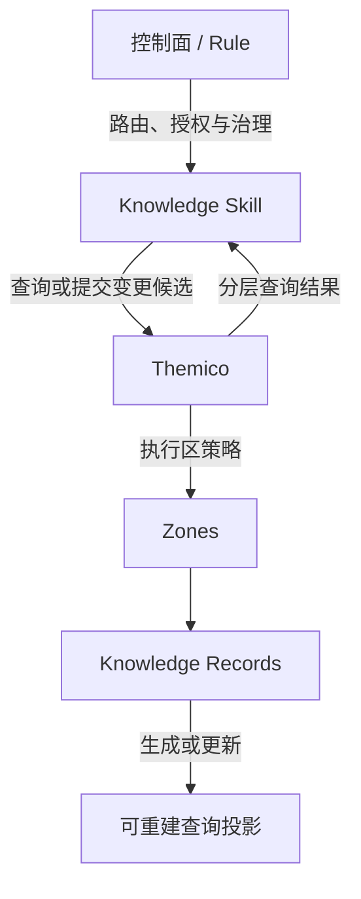
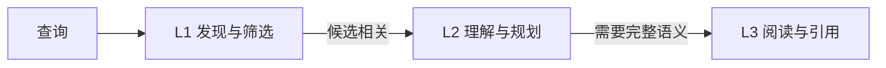

# Themico 顶层设计 Spec

## 1. 产品定位

Themico 是一个重新设计、独立实现的本地知识库，用于保存、治理和检索供人类与 Agent 共同使用的知识。

Themico 不依赖 OpenViking 或其他知识库。外部项目只能作为设计经验来源，不构成 Themico 的架构、运行时或存储后端。

Themico 关注的核心问题不是通用 Agent Memory 或文档 RAG，而是：

- 不同类型的知识具有不同的变化规律和治理要求；
- Agent 需要以统一方式发现、理解和深入读取知识；
- 人类需要能够直接阅读和审阅完整知识；
- 正式知识必须经过明确治理，不能由 Agent 推断自动成为事实；
- 知识的权威内容与检索投影必须清晰分离。

## 2. 核心原则

### 2.1 独立知识库

Themico 自己拥有知识模型、区治理、分层表达、关系、发布和查询合同，不以其他知识库作为必需依赖。

### 2.2 本地优先

知识应能够在本地保存、审阅、备份和恢复。核心能力不依赖外部托管服务、LLM、Embedding 服务或向量数据库。

### 2.3 人类与 Agent 共享知识

同一条知识既要支持 Agent 高效检索，也要保证人类可以直接阅读完整语义。不能只保存适合机器查询但难以人工审阅的数据。

### 2.4 受治理写入

Agent 可以检索知识、分析知识并形成知识变更候选，但不能绕过治理流程直接把推断写成正式知识。

### 2.5 渐进读取

Agent 应先发现相关知识，再读取结构化概览，只有确有需要时才加载完整内容，避免默认加载全部知识。

### 2.6 权威与投影分离

完整知识和治理信息构成权威记录；用于发现、摘要和加速查询的内容属于可重建投影。投影失效不能改变权威知识。

## 3. 顶层架构



各层职责如下：

- **控制面 / Rule**：决定何时查询知识、何时允许形成变更候选，以及是否已经取得所需授权。
- **Knowledge Skill**：理解知识语义，生成或更新分层内容，解释查询结果。
- **Themico**：执行确定性的校验、治理、发布、关系维护和查询。
- **Zone**：定义一类知识的生命周期和治理方式。
- **Knowledge Record**：统一的知识单元，具有 L1、L2、L3 三层表达。
- **查询投影**：从权威记录生成，可被重建，不成为独立权威。

## 4. 区模型

“区（Zone）”是 Themico 管理不同知识生命周期和治理策略的核心边界。

区不是普通目录、标签或领域分类。只有当知识的变更方式、保留策略或治理要求不同，才应划分为不同区。

所有区使用相同的 Knowledge Record 和 L1/L2/L3 协议。区只定义治理差异，不发展独立的数据模型。

### 4.1 项目知识区

项目知识区保存当前有效的项目上层知识，例如：

- 架构；
- 领域划分；
- Bounded Context；
- 核心业务链路；
- 已批准的设计规则。

项目知识具有易变性。新知识可以替代旧知识，但历史必须保留，默认查询只返回当前有效内容。

### 4.2 项目经验区

项目经验区保存可复用经验，例如：

- 失败经验；
- 失败诊断与风险警告；
- 失败后成功的恢复经验；
- 开发经验；
- 已验证实践；
- 特定条件下的成功模式。

失败与成功不是新的区，也不使用独立数据模型。它们是项目经验区中的经验种类，仍使用统一 Knowledge Record 与 L1/L2/L3 协议。

一条失败经验应保留失败发生的背景、观察到的现象、已知或未知原因、证据以及适用条件。后续出现有效修正或恢复结果时，应追加独立的恢复或成功经验，并与原失败建立显式关系，而不是重写失败记录。这样既保留“为什么失败”，也能表达“后来如何成功”以及成功是否真正解决了同一问题。

项目经验以追加为主。发现旧经验不准确或不再适用时，应通过新的更正或替代记录表达，而不是静默覆盖原始经验。

### 4.3 跨区关系

不同区的知识可以建立显式关系，例如：

```text
项目知识 ── 来源于 ──▶ 项目经验
项目经验 ── 适用于 ──▶ 项目知识
项目经验 ── 质疑 ───▶ 项目知识
```

跨区读取必须显式发生。项目经验不能因为文本相关而自动混入项目知识查询，从而被误认为当前项目事实。

## 5. 统一 Knowledge Record

Knowledge Record 是 Themico 的最小知识单元。

所有区中的知识都采用相同的基础结构：

```text
Knowledge Record
├── 身份与分类
├── 生命周期
├── 来源与授权
├── 知识关系
├── L1：发现
├── L2：理解
└── L3：完整内容
```

不同知识通过种类、标签和关系表达差异，不通过创建新的区级数据结构表达。

每条 Knowledge Record 具有稳定身份。知识发生变化时，应通过可追溯的修订或新记录表达，不能失去历史来源。

## 6. L1/L2/L3 分层模型

L1/L2/L3 表示同一条知识的读取深度，不表示项目、领域、流程等业务层级。

项目、Domain、Bounded Context、业务流程和经验记录都各自拥有自己的 L1、L2 和 L3。



### 6.1 L1：发现与筛选

L1 是最精简的知识表达，用于：

- 大范围检索；
- 快速判断相关性；
- 识别知识所属区和种类；
- 判断知识是否当前有效；
- 定位后续 L2 内容。

L1 使用适合 Agent 批量读取和筛选的结构化格式表达。

### 6.2 L2：理解与规划

L2 是结构化概览，用于：

- 理解知识目的和核心结论；
- 了解适用场景；
- 查看关键关系；
- 判断是否需要读取 L3；
- 支持 Agent 规划后续行动。

L2 使用易于 Agent 解析、校验和检索的结构化格式表达。

### 6.3 L3：完整阅读与引用

L3 保存完整知识语义，用于：

- 人类直接阅读和审阅；
- Agent 深入理解；
- 表达完整流程、理由、规则、约束和示例；
- 作为正式引用内容。

L3 使用 Markdown 表达，以保证人类可读、易读，并支持图形、结构化章节和代码示例。

### 6.4 分层权威关系

L3 是完整语义来源；知识的身份、生命周期、来源、授权和关系是结构化治理来源。

L1 和 L2 中用于摘要与导航的内容属于从完整知识形成的投影。投影必须绑定其来源，来源变化后旧投影应被视为失效。

Themico 负责识别投影是否仍然有效，但不负责调用模型生成新投影。新投影由 Skill 或 Agent 形成候选，再由 Themico 校验和发布。

## 7. 知识关系

Themico 支持知识之间的显式、有方向、有类型的关系，用于表达：

- 包含与归属；
- 依赖；
- 上下游；
- 约束；
- 来源；
- 适用范围；
- 质疑与更正；
- 替代；
- 失败后恢复；
- 通过其修正；
- 同一问题的后续成功；
- 一般关联。

关系是 Knowledge Record 的组成部分，不依赖外部图数据库。

首个设计只要求有限深度、可解释的关系遍历，不设计通用图查询语言。

## 8. 知识生命周期

### 8.1 项目知识

```text
形成变更候选
→ 核验项目事实
→ 完成人工或控制面要求的批准
→ 发布新的当前修订
→ 保留被替代的历史修订
```

项目知识必须始终能够回答：

- 当前有效内容是什么；
- 它替代了什么；
- 来源是什么；
- 由什么授权发布；
- 历史上如何变化。

### 8.2 项目经验

```text
形成新经验候选
→ 核验来源、证据与适用背景
→ 判断它是失败、恢复、成功实践或其他经验种类
→ 完成人工或控制面要求的批准
→ 追加新记录
→ 需要时与已有经验建立更正、替代或失败后恢复关系
```

单次失败不会因为被系统观察到而自动成为正式经验。失败经验必须经过价值判断，证明其具有清晰背景、可追溯证据和复用价值。偶发噪声、无法核验的推断、敏感原始内容或仅对一次会话有意义的信息不应发布为正式知识。

失败之后出现成功结果时，成功不会覆盖原失败。Themico 应能够显式表达：

```text
失败经验
├── 后续由某项修正恢复
├── 后续出现同一问题的成功结果
├── 原因得到确认或仍保持未知
└── 在特定条件下仍可能复现
```

恢复或成功经验必须引用其验证证据，并说明与原失败的适用条件是否一致。仅仅“后来任务成功”不足以证明某项修正解决了原失败；无法证明因果时，只能记录时间上的后续关系或一般关联。

项目经验不能自动升级为项目知识。经验可以成为项目知识变更的来源，但仍需经过项目知识区自身的治理流程。

### 8.3 撤回与失效

正式知识默认不物理删除。错误、不再适用或被替代的知识通过明确状态和关系表达，并保留可追溯历史。

只有数据治理明确要求清除的敏感内容，才进入受控物理删除流程。

## 9. 查询模型

Themico 查询遵循渐进读取：

```text
限定目标区
→ 在 L1 中发现候选
→ 对相关候选读取 L2
→ 按需读取 L3
→ 按显式关系扩展
```

查询必须支持：

- 指定一个或多个区；
- 指定读取层级；
- 根据知识种类、状态和标签过滤；
- 读取当前内容或显式读取历史；
- 按需遍历关系；
- 显式控制是否跨区；
- 返回可解释的查询轨迹。

查询轨迹用于说明：

- 搜索了哪些区；
- 找到了哪些 L1 候选；
- 加载了哪些 L2 或 L3；
- 是否经过关系扩展；
- 为什么返回最终结果。

## 10. 存储与索引原则

Themico 使用本地、开放、人类可检查的文件保存知识。

顶层格式原则为：

- L1 和 L2 使用结构化、易于 Agent 检索和校验的格式；
- L3 使用 Markdown；
- 变更历史和审计信息必须可追溯；
- 查询投影必须能够从权威记录重建；
- 索引损坏不能导致权威知识丢失。

首个设计不要求 SQLite、向量数据库或其他数据库。基础查询可以通过文件扫描和运行时内存索引完成。

未来如果真实规模证明基础检索不足，可以增加可选派生索引，但不得改变知识格式、权威关系、区治理和 MCP 合同。

## 11. 写入治理

Themico 不向 Agent 提供绕过治理的通用文件写入、任意删除或原始数据库操作。

写入链路为：

```text
Skill / Agent 形成 Knowledge Record 候选
→ Themico 校验结构和区策略
→ 控制面提供所需授权
→ Themico 发布正式知识
→ 更新分层投影和查询状态
```

Themico 只判断候选是否满足结构、策略、授权和一致性要求，不判断知识内容本身是否正确。内容正确性由 Skill、事实核验和 Human Review 保证。

## 12. MCP 边界

Themico 通过领域化 MCP 工具提供能力，工具分为：

- 区发现；
- 分层知识查询；
- 关系遍历；
- 历史读取；
- 知识变更校验；
- 经授权的知识发布；
- 一致性检查；
- 查询投影重建；
- 区导出与备份。

MCP 不暴露任意路径文件操作或绕过区策略的写入能力。

## 13. 与 Themis 的边界

### Control Rule

负责：

- 决定何时查询 Themico；
- 决定目标区和读取深度；
- 决定是否允许形成知识变更候选；
- 路由知识 Review；
- 提供发布所需授权。

### Skill

负责：

- 理解知识语义；
- 搜索代码和正式来源以核验当前事实；
- 生成 L1/L2/L3 候选；
- 解释知识查询结果；
- 形成更正、替代或新增提案。

### Themico

负责：

- 执行统一区和 Knowledge Record 合同；
- 校验分层内容；
- 管理当前知识和历史；
- 保存来源、授权和关系；
- 检查投影有效性；
- 提供分层查询；
- 保证正式写入可追溯。

Themico 不负责 Themis 的生命周期、Specification、Planning、Review、Implementation 或 Verification。

## 14. 非目标

首个 Themico 设计不包含：

- OpenViking 或其他知识库依赖；
- 代码仓库扫描；
- 自动架构推断；
- 自动知识摄取；
- 自动经验晋升；
- 内置 LLM 或 Embedding 服务；
- 向量数据库；
- GraphRAG；
- 通用 Agent 对话记忆；
- 多租户和云同步；
- 通用图数据库；
- Web 管理界面；
- 复杂存储引擎；
- 实现语言、目录结构、字段 Schema 和具体接口签名。

## 15. 顶层验收条件

Themico 的后续详细设计必须证明：

1. 项目知识和项目经验可以通过区使用不同生命周期策略管理；
2. 不同区仍使用相同 Knowledge Record 和 L1/L2/L3 协议；
3. Agent 可以从 L1 渐进读取到 L3，而不是默认加载完整知识；
4. 人类能够直接阅读和审阅 L3 Markdown；
5. 项目知识更新后保留历史，并能确定唯一当前内容；
6. 项目经验的更正不会静默覆盖原始经验；
7. 失败经验可以保留原始失败背景和证据，后续恢复或成功以新经验和显式关系表达；
8. 单次失败和后续成功都不能绕过价值判断、核验与授权自动成为正式经验；
9. 无法证明修正与成功存在因果关系时，不能把时间上的后续误写为“通过其修正”；
10. 跨区查询和关系扩展必须显式发生；
11. Agent 推断不能绕过授权直接成为正式知识；
12. 查询投影可以从权威记录重建；
13. 核心能力无需 SQLite、向量数据库、外部知识库或模型服务；
14. Themico 可以独立于 Themis 使用，但能通过 MCP 被 Themis 控制面和 Skill 调用；
15. 后续实现细节不能改变本 Spec 定义的区治理、三层读取和权威边界。

## 16. 待审阅的顶层决策

1. **产品定位**：Themico 是独立、受治理的本地知识库，不是通用 Agent Memory 或 RAG 系统。
2. **区的定位**：区是知识生命周期和治理边界，不是普通分类目录。
3. **统一区模型**：所有区共享相同 Knowledge Record 和 L1/L2/L3 协议。
4. **分层语义**：L1 用于发现，L2 用于理解，L3 用于完整阅读和引用。
5. **表达方向**：L1/L2 使用机器友好的结构化表达，L3 使用 Markdown。
6. **权威关系**：完整语义和治理信息构成权威，摘要、导航和索引属于投影。
7. **知识变更**：项目知识替换当前内容并保留历史；项目经验追加并通过关系更正，失败与后续恢复或成功也通过独立经验及显式关系表达。
8. **查询原则**：查询默认限定区并渐进加载，跨区读取必须显式发生。
9. **模型边界**：Themico 不内置模型，不自动生成或判断正式知识。
10. **存储边界**：顶层设计不依赖 SQLite、向量数据库或外部知识库，具体存储实现留给后续设计。
