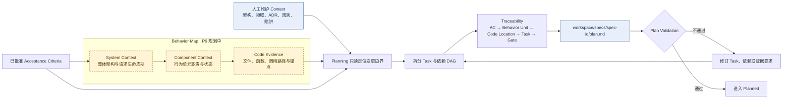
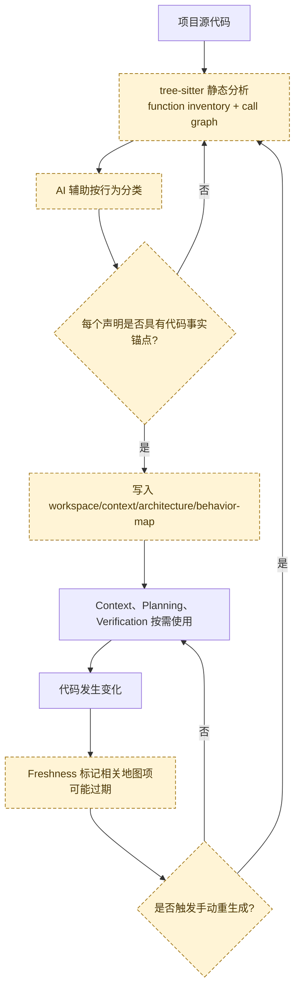
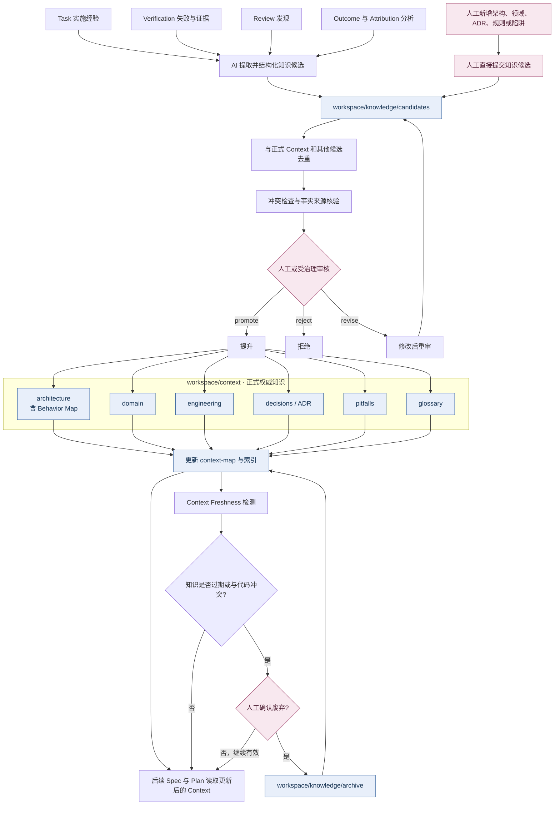
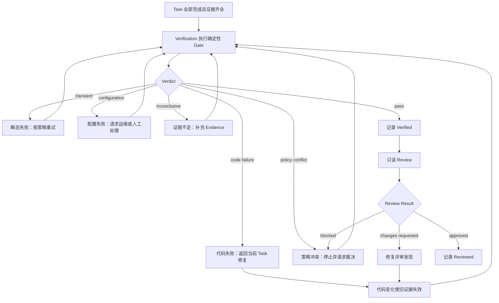
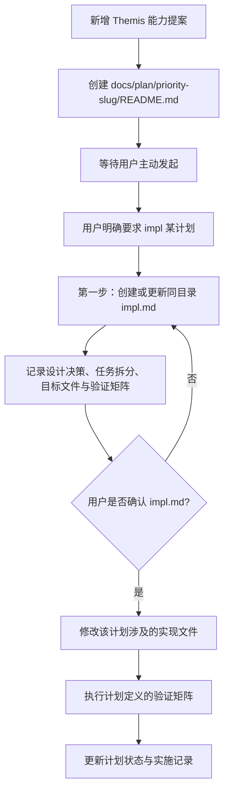
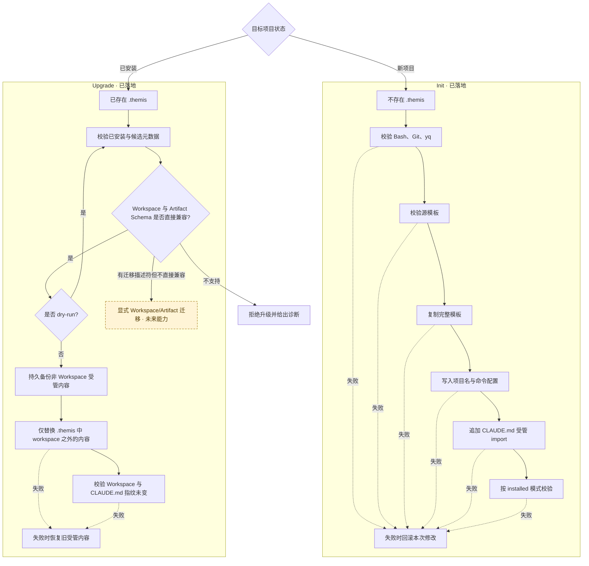

# Themis 完整工作流程

本文描述 Themis 从安装、需求进入、上下文加载、需求追问、规范与计划、任务实施、验证评审、交付结果、归因分析，到人机混合知识治理与后续升级的完整工作流程。

> 图中“已落地”表示当前仓库已有契约、模板、指引或脚本支持；“规划中”表示已进入后续设计但尚未形成可执行运行时。P5 已提供 Prompt、策略、Draft Spec 契约与人工批准证据；P8 尚未提供确定性状态迁移执行器。缺少规划中能力时，Themis 必须停留在当前阶段并明确报告，不得虚构状态、证据或执行结果。

## 状态与所有权图例

| 标记 | 含义 |
|---|---|
| 已落地 | 当前已有模板契约、顶层指引、Init、Upgrade 或模块边界定义 |
| 规划中 | 已设计但尚未实现的自动化能力、Agent、Command、Skill 或确定性脚本 |
| Core | 定义规则、协议、策略和控制能力，不保存项目内容 |
| Workspace | 保存项目配置、上下文、Spec、Plan、状态、证据、结果与知识治理数据 |
| 人工门禁 | 需求批准、冲突裁决、知识提升、迁移授权等不能由模型自行越过的决策 |

## 端到端总流程

```mermaid
flowchart TD
    START([用户或项目发起工作])

    subgraph INSTALL[安装与加载边界 · 已落地]
        I0{项目是否已经安装 Themis?}
        I1[Init 校验 Bash、Git 与 mikefarah/yq v4]
        I2[校验源模板契约]
        I3[复制 templates/.themis 到项目 .themis]
        I4[写入 Workspace manifest 项目配置]
        I5[向项目 CLAUDE.md 追加受管 import]
        I6[项目加载 Themis Guidance 与 Orchestrator]
        IF[Init 失败：回滚本次修改]
    end

    subgraph ROUTING[请求识别与上下文准备]
        R0{是否为受管理的项目变更?}
        R1[只读解释、调查或研究]
        R2[Orchestrator 读取持久工件与状态]
        R3[Context 加载项目事实、规则与已有知识]
        R4{上下文是否缺失、冲突或过期?}
        R5[报告冲突并请求补充或人工裁决]
    end

    subgraph SPEC[Draft → Specified 证据契约]
        S0[创建或继续 Draft Spec]
        S1[Step 0：意图发现与根因确认 · P5]
        S2[Step 1：范围、Pre-mortem 与复杂度确认 · P5]
        S3[Step 2：上下文、约束、证据与 Option Zero · medium/high · P5]
        S4[Step 3：方案取舍与分段 Acceptance Criteria · P5]
        S5[Step 4：对抗验证 · P5]
        S6[写入或更新 workspace/specs/spec-id/spec.md Draft]
        S7[Spec 自检：结构、假设、证据与攻击处置]
        S8{用户是否明确批准 Draft Spec?}
        S9[记录批准证据；Spec 仍保持 Draft]
        S10[[P8 规划中：校验 Gate 并记录 Specified 状态]]
        S11([P8 未实施：停止于 Draft，不得进入 Planning])
    end

    subgraph PLAN[Specified → Planned]
        P0[Planning 读取已批准 Spec 与 Context]
        P1[Behavior Map 逐层定位行为与代码 · P6 规划中]
        P2[拆分会话级 Task、依赖 DAG 与完成标准]
        P3[建立 AC → Task → 代码位置 → Gate 追踪]
        P4[写入 workspace/specs/spec-id/plan.md]
        P5{AC 覆盖、依赖、粒度和证据要求是否完整?}
        P6[[记录 Planned 状态迁移]]
    end

    subgraph IMPLEMENT[Planned → Implemented]
        T0[选择依赖已满足的当前 Task]
        T1[仅加载当前 Task 所需 AC、约束与代码]
        T2[实施限定范围内的代码或文档变更]
        T3[保存 Task evidence 与执行状态]
        T4{Task 完成标准与证据是否满足?}
        T5{Plan 是否仍足够且未超出 Spec?}
        T6{还有未完成 Task?}
        T7[[记录 Implemented 状态迁移]]
    end

    subgraph VERIFY[Implemented → Verified]
        V0[Verification 读取 Gate 与有效策略]
        V1[通过 Adapter 执行 Lint、Build、Test 等 Gate]
        V2[保存 workspace/runs 与 workspace/evidence]
        V3[分类瞬态、代码、配置或策略失败]
        V4{Verdict}
        V5[按策略重试]
        V6[请求运维或人工解决]
        V7[[记录 Verified 状态迁移]]
    end

    subgraph REVIEW[Verified → Reviewed]
        W0[Review 只读检查 Spec、Plan、Diff 与证据]
        W1[记录 correctness、安全、性能、维护性等发现]
        W2[写入 review.md 与 review evidence]
        W3{评审结果}
        W4[[记录 Reviewed 状态迁移]]
    end

    subgraph OUTCOME[交付、结果与归因]
        O0[交付或部署]
        O1[记录 success、rework、defect、incident 或 rollback]
        O2[Attribution 关联 Spec、Task、Commit、Run、部署与 Outcome]
        O3[分析返工、缺陷逃逸和验证薄弱点]
    end

    subgraph KNOWLEDGE[人机混合知识治理]
        K0[AI 从执行、失败、评审和 Outcome 提取知识候选]
        K1[写入 workspace/knowledge/candidates]
        K2[去重、事实锚定与冲突检查]
        K3{人工或受治理审核}
        K4[Promote：提升为正式 Context]
        K5[Reject：写入 rejected]
        K6[Revise：修改后重新提交]
        K7[更新 context-map 与正式知识索引]
        K8[Context Freshness 检测过期知识或 Behavior Map]
        K9{确认已过期?}
        K10[归档到 workspace/knowledge/archive]
    end

    A0{归档条件是否全部满足?}
    A1[[记录 Archived 状态迁移]]
    NEXT([后续需求复用更新后的 Context])

    START --> I0
    I0 -- 否 --> I1
    I1 --> I2
    I2 --> I3
    I3 --> I4
    I4 --> I5
    I5 --> I6
    I1 -. 失败 .-> IF
    I2 -. 失败 .-> IF
    I3 -. 失败 .-> IF
    I4 -. 失败 .-> IF
    I5 -. 失败 .-> IF
    I0 -- 是 --> I6

    I6 --> R0
    R0 -- 否 --> R1
    R1 --> NEXT
    R0 -- 是或不确定 --> R2
    R2 --> R3
    R3 --> R4
    R4 -- 是 --> R5
    R5 --> R3
    R4 -- 否 --> S0

    S0 --> S1
    S1 --> S2
    S2 --> S3
    S3 --> S4
    S4 --> S5
    S5 --> S6
    S6 --> S7
    S7 -- 不通过 --> S4
    S7 -- 通过 --> S8
    S8 -- 否，修订 --> S4
    S8 -- 是，人工门禁 --> S9
    S9 --> S10
    S10 -. 未实施 .-> S11
    S10 -- 已实施且 Gate 通过 --> P0
    P0 --> P1
    P1 --> P2
    P2 --> P3
    P3 --> P4
    P4 --> P5
    P5 -- 否 --> P2
    P5 -- 是 --> P6

    P6 --> T0
    T0 --> T1
    T1 --> T2
    T2 --> T3
    T3 --> T4
    T4 -- 否 --> T2
    T4 -- 是 --> T5
    T5 -- Plan 不足但仍在 Spec 内 --> P0
    T5 -- 超出已批准 Spec --> S0
    T5 -- 足够 --> T6
    T6 -- 是 --> T0
    T6 -- 否 --> T7

    T7 --> V0
    V0 --> V1
    V1 --> V2
    V2 --> V3
    V3 --> V4
    V4 -- 瞬态失败 --> V5
    V5 --> V1
    V4 -- 代码失败 --> T0
    V4 -- 配置或策略问题 --> V6
    V6 --> V0
    V4 -- 证据不足 --> T3
    V4 -- Pass --> V7

    V7 --> W0
    W0 --> W1
    W1 --> W2
    W2 --> W3
    W3 -- changes requested --> T0
    W3 -- blocked --> R5
    W3 -- approved --> W4

    W4 --> O0
    O0 --> O1
    O1 --> O2
    O2 --> O3
    O3 --> K0
    W1 -. 评审模式 .-> K0
    V3 -. 失败陷阱 .-> K0
    T3 -. 执行经验 .-> K0

    K0 --> K1
    K1 --> K2
    K2 --> K3
    K3 -- promote --> K4
    K3 -- reject --> K5
    K3 -- revise --> K6
    K6 --> K1
    K4 --> K7
    K7 --> K8
    K8 --> K9
    K9 -- 否 --> A0
    K9 -- 是，人工确认 --> K10
    K10 --> K7
    K5 --> A0

    A0 -- 否 --> K0
    A0 -- 是 --> A1
    A1 --> NEXT
    NEXT --> R0

    classDef current fill:#e8f3ec,stroke:#247047,color:#153b28;
    classDef planned fill:#fff4d6,stroke:#9a6b00,color:#4f3800,stroke-dasharray:5 3;
    classDef human fill:#f8e8ef,stroke:#9d3f68,color:#4f2035;
    classDef data fill:#e8effa,stroke:#315f9b,color:#173453;

    class I0,I1,I2,I3,I4,I5,I6,IF,R0,R1,R2,R3,R4,R5,S0,S1,S2,S3,S4,S5,S6,S7,S8,S9,P0,P2,P3,P4,P5,P6,T0,T1,T2,T3,T4,T5,T6,T7,V0,V1,V2,V3,V4,V5,V6,V7,W0,W1,W2,W3,W4,O0,O1,O2,O3,K0,K1,K2,K3,K4,K5,K6,K7,K8,K9,K10,A0,A1,NEXT current;
    class S10,S11,P1 planned;
    class S8,K3,K9 human;
    class S6,S9,P4,T3,V2,W2,O1,K1,K7,K10 data;
```



## 生命周期与工件

当前默认生命周期采用：

```text
Draft → Specified → Planned → Implemented → Verified → Reviewed → Archived
```

| 阶段 | 控制模块 | 主要门禁 | Workspace 持久工件 |
|---|---|---|---|
| Draft | Orchestrator、Specification、Context | P5 追问、对抗验证与批准证据完整；P8 前不记录状态迁移 | `specs/<spec-id>/spec.md` Draft、批准/攻击证据 |
| Specified | P8 状态执行器（规划中） | 确定性验证 P5 声明式门禁并记录迁移 | 已批准 `spec.md`、`state/transitions/`（P8） |
| Planned | Planning | AC 全覆盖、Task DAG 合法、证据要求明确 | `plan.md`、`state/tasks/` |
| Implemented | Orchestrator、实施者 | 全部 Task 满足完成标准并有证据 | 项目源码、Task evidence、会话状态 |
| Verified | Verification | 所有阻塞 Gate 通过且证据充分 | `runs/<run-id>/`、`evidence/`、`verify.md` |
| Reviewed | Review | 无未解决的 critical/major 问题，评审证据完整 | `review.md`、`evidence/review/` |
| Archived | Orchestrator、Knowledge | Outcome 与知识处理完成，无阻塞项 | `outcomes/`、知识治理记录、迁移历史 |

> P8 的待实施设计中曾采用“Review → Verification”的顺序，但当前 Guidance、Orchestrator 与 Workspace 文档均以“Verification → Review”为基线。在 P8 实施设计明确解决该差异前，本流程遵循当前基线。

## 规划与变更定位流程

Planning 只定义和校验 Plan，不执行 Task；行为地图只提供事实锚定的定位依据，不直接修改代码。



### Behavior Map 的事实生成与刷新



首版计划采用“手动触发重生成 + 新鲜度标记”，不承诺全自动增量同步。行为地图是 Context 派生数据；缺失时 Planning 回退到源码搜索，但不得把低置信度推断伪装成事实。

## 人机混合知识记录与治理

正式项目知识只有一个权威位置：`workspace/context/`。`workspace/knowledge/` 保存候选、审核、拒绝和归档等治理过程，不形成第二套正式知识库。



### 人与 AI 的职责边界

| 环节 | AI 可执行 | 必须由人工或治理门禁确认 |
|---|---|---|
| 候选发现 | 从执行、验证、评审和 Outcome 中提取模式 | 可补充遗漏或直接提交候选 |
| 结构化 | 生成标题、类型、来源、证据引用和建议归类 | 确认内容没有误解业务语义 |
| 去重与冲突 | 检索相似记录、标记潜在冲突 | 决定哪一条事实有效以及是否合并 |
| 提升 | 根据审核结果执行移动和索引更新 | 决定 `promote`、`reject` 或 `revise` |
| 废弃 | 根据代码变化和新鲜度标记提出候选 | 确认知识确实不再适用 |
| 正式 Context | 可读取并引用 | 未经审核不得直接写入观察性结论 |

## 验证、评审与返工闭环



任何代码变更都会使之前的验证证据失效，必须重新执行相关 Gate。Review 不能以主观信心代替 Verification 的命令输出；证据不足只能得到 `inconclusive` 或 `blocked`，不能得到通过。

## Themis 源仓库自身的计划执行协议

`docs/plan/` 管理的是 Themis 框架本身的模块计划，与安装后项目在 `workspace/specs/<spec-id>/plan.md` 中保存的工程 Plan 不同。



计划文档不是实现授权；`impl.md` 未经确认前不得修改目标实现文件。

## 安装与升级维护流程



Init 只用于尚未安装 Themis 的项目；Upgrade 不加载 Init 环境校验，也绝不复制、删除、修改或恢复 `.themis/workspace/`。存在迁移描述符不等于允许自动迁移，未来迁移能力仍必须经过显式用户授权、备份、验证与回滚流程。

## 当前实现边界

| 能力 | 当前状态 |
|---|---|
| P0 Init 环境校验 | 已落地 |
| P1 模板、Schema、版本和目录契约 | 已落地 |
| P2 顶层 Guidance 与生命周期路由规则 | 已落地 |
| P3 Init 安装与失败回滚 | 已落地 |
| P4 非 Workspace 受管内容升级、备份与回滚 | 已落地 |
| P5 自适应需求追问、Draft Spec 与批准证据契约 | 已落地；确定性 `Specified` 状态执行器留待 P8 |
| P6 Behavior Map、事实提取与变更定位 | 规划中，仅目录占位已存在 |
| P7 跨模块集成审计 | 分析已完成，不是运行时执行层 |
| P8 专用 Agent、Command、Skill 与确定性 SDD 脚本 | 规划中，尚未实施 |
| 自动 Attribution、知识提升和废弃执行器 | 仅有架构与边界定义，尚未实施 |
| Workspace 与 Artifact Schema 迁移执行器 | 尚未实施，Upgrade 当前会拒绝 |

## 关键不变规则

1. Core 定义能力，不保存项目内容。
2. Workspace 保存项目内容，不实现控制逻辑。
3. 生命周期状态以持久工件、机器状态和证据为准，不以对话声明为准。
4. 未批准 Spec 不进入实施；未满足证据门禁不声明 Task 完成。
5. 缺少证据不是成功证据；无法验证不能判定通过。
6. Review 只读，Verification 只陈述 Gate 事实，Attribution 只记录关联关系。
7. AI 可生成知识候选，但未经审核不得直接写入正式 Context。
8. Upgrade 绝不覆盖 Workspace；Schema 迁移必须显式授权。
9. 规划中的 Agent、Command、Skill 或 Shell 执行器在文件不存在时不得假定可用。

## 相关文档

- [Orchestrator](core/kernel/orchestrator.md)
- [Specification](core/kernel/specification.md)
- [Planning](core/kernel/planning.md)
- [Context](core/kernel/context.md)
- [Verification](core/kernel/verification.md)
- [Review](core/kernel/review.md)
- [Attribution](core/kernel/attribution.md)
- [Knowledge](core/kernel/knowledge.md)
- [Workspace 概述](workspace/overview.md)
- [实施计划索引](plan/README.md)
- [P5 需求追问](plan/50-requirement-questioning/README.md)
- [P6 Behavior Map](plan/60-behavior-map/README.md)
- [P8 多 Agent 架构](plan/80-multi-agent-architecture/README.md)
